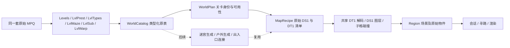

# 第一幕地图：原始数据、现状与后续实现

地图不是第三方 JSON。地形布局一直来自 MPQ 的 DS1，像素及子格碰撞来自 DT1；原来的问题是把三个房间／户外模板当作独立关卡使用，并根据文件名猜瓦片类型。OpenDiablo2 提供的是对象编号到外观的对应表，不是地图布局。

## 当前交付

2026-09-22 接入用户提供的 `assets/mpq2`，原始五个 MPQ 保留。自动识别旧试玩表与资料片命名字段表，分别使用 `classic-1.04-txt-v1` 和 `lod-named-txt-v1` 适配器。后者是结构标识，不能由此推断原包具体补丁版本。

第一幕 39 个关卡（含牛场）全部进入目录；**13 个完整预设关卡的地形可进入探索，随机迷宫和户外生成尚未实现**。完整预设地形不代表怪物、任务、开门、宝箱及出口行为已经完成。

后续的怪物生成阶段已接入区域人口原表、群组／随从和固定首领；未实现怪物以保留真实身份的沉沦魔替身出现，详见 [怪物生成](MONSTER_POPULATION.md)。当前采用 DS1 场景空间适配，真正 DRLG 房间人口分区、任务和出口仍未完成。

| Levels.txt ID | 地形 | 可选择的变体 |
| --- | --- | --- |
| 1 | 罗格营地 | 0–3，北／东／南／西布局 |
| 13 | 洞窟二层 | 0 |
| 14 | 地下通道二层 | 0 |
| 15 | 地洞二层 | 0 |
| 16 | 深坑二层 | 0 |
| 20 | 遗忘之塔入口 | 0 |
| 25 | 高塔地窖五层 | 0–1 |
| 26 | 修道院大门 | 0 |
| 27 | 外侧回廊 | 0–2 |
| 32 | 内侧回廊 | 0 |
| 33 | 大教堂 | 0 |
| 37 | 地下墓穴四层 | 0 |
| 38 | 崔斯特瑞姆 | 0 |

`F2` 打开地图目录，点击进入有资源且已实现装载的地图；`PgUp / PgDn` 或底部按钮翻页。它是当前的场景选择功能，不宣称原版传送点解锁、传送费用或连续地理连接已实现。

```powershell
.\build\bin\d2x.exe --level 38
.\build\bin\d2x.exe --level 25 --variant 1
.\build\bin\d2x.exe --level 27 --variant 2
.\build\bin\d2x.exe --maps
.\build\bin\d2x_assets.exe assets/mpq2 maps
.\build\bin\d2x_assets.exe assets/mpq2 maps 37
```

变体编号保留 File1…File6 的原始槽位减一，不压缩空槽；没有对应文件时明确报错。旧 `--map` 只接受原表能定位的完整第一幕预设，任意文件名不再隐式决定关卡身份或 LevelType。`--region` 仍可指定当前已装载场景下标，新增资源会改变下标，推荐用稳定的 `--level`。

以前的沉沦魔营地、墓地、东西向洞穴分别保留为 Def 50、108、55 的 `[TEMPLATE]`，不再冒充整个埋骨之地或邪恶洞窟。可以明确指定原表 Def 和瓦片类型预览其他房间；精简包只收录当前场景所需资源，更多房间请指定完整源目录：

```powershell
.\build\bin\d2x_assets.exe assets/mpq2 presets "Act 1 - Cave"
.\build\bin\d2x.exe --mpq assets/mpq2 --preset 55 --level-type 3
```

场景已改用 [MPQ 怪物生成](MONSTER_POPULATION.md)，不再填入任意数量的敌人；未实现的敌对类型按用户授权使用现有沉沦魔替身，保留真实身份。原 DS1 的可识别非敌对静态外观按原坐标放置，其他未知单位记录诊断。箱子外观存在不等于可操作和掉落规则已经实现。非营地的初始位置是最大可行走连通区中的场景查看位置，尚非原版关联出口落点。

## 原数据如何进入引擎



- `Levels.txt` 提供关卡 ID、生成类型、尺寸、LevelType、Vis/Warp、物件组、主题和传送点数据；Vis 并不包含完整户外邻接关系。
- `LvlPrest.txt` 提供完整关卡或房间的 DS1 槽位、Dt1Mask、FillBlanks 等字段。**存在 DS1 不意味着它是完整关卡**，必须结合 DrlgType、LevelId 和生成代码。
- `LvlTypes.txt` 按原始 32 个槽位与 Dt1Mask 位对应选 DT1。废弃旧 DS1 中可能过时的依赖路径及目录名猜测。
- `LvlMaze.txt` 的房间数量、尺寸、Merge，`LvlSub.txt` 的替换模板和概率，以及 `LvlWarp.txt` 的选择区域、偏移、方向已导入。暂未执行生成逻辑。资料片同一个 Warp ID 可有 l/r 方向，按组保存，不覆盖记录。
- 解析并保留 DS1 替换标签及对象 flags；隐藏瓦片可参与碰撞，绘制与占用分别判断。补载引擎共有的 Blank / InvisWal / Warp DT1，修复旧洞穴的 212 个“缺失格”误报。
- DT1 图像不可变共享，场景只存索引和共享所有权。碰撞与绘制使用同一变体选择；使用 DT1 rarity 权重，目前位置散列仍只是稳定预览方式，不是原引擎房间随机序列。
- 原表缺列、未知引用、缺少所需 DS1/DT1 或未解析瓦片明确拒绝，不替换成自制地板。试玩表中的两个 `#REF!` 保留诊断；零 ID、空槽和资料片 Expansion 分隔行分别处理。
- 关卡使用 Levels.txt ID，模板使用 `10000 + Def` 的独立范围。资源指纹和规则版本已更新，旧四场景存档拒绝读取，不将旧区域号误配到新地图。

## 完成第一幕还需要的工作

1. **原版迷宫生成器。** 实现房间图、方向匹配、种子推进、Merge、主题房替换、上下层楼梯和特殊房；依次覆盖洞穴／地穴、高塔、兵营／监牢、地下墓穴。读取 Rooms 后随意生成若干相邻房间不等于原版算法。
2. **第一幕户外生成器。** 血腥荒地至泰摩高地、埋骨之地和牛场需要原引擎的区域布局、边界、道路、河流／桥梁、洞口和特殊预设安排，再执行 LvlSub 地形替换。不能把所有野外替换成同一块草地或人工 JSON。
3. **关卡连接与原生单位。** 建立实际入口、Vis/Warp 双向对应、门的状态和碰撞；按原规则放置怪物、精英、NPC、物件组与箱子，再接任务条件。
4. **世界生命周期。** 生成结果按种子和版本保存身份，分区惰性载入，离开后保留单位／物件／掉落状态；同时用原版房间种子替换预览瓦片选择。

这些是分开的交付范围，本次只完成预设地形与数据装载基础。新完整资源已解决当前已知的第一幕文件缺项，接下来优先做生成器，无需继续为了这些已知路径下载另一套 MPQ。

## 研究依据与实际检查

参考 [D2MOO DrlgDrlg](https://github.com/ThePhrozenKeep/D2MOO/blob/5596f5cb6c5251a0a07c6637d26458b06099d516/source/D2Common/src/Drlg/DrlgDrlg.cpp)、[DrlgRoomTile](https://github.com/ThePhrozenKeep/D2MOO/blob/5596f5cb6c5251a0a07c6637d26458b06099d516/source/D2Common/src/Drlg/DrlgRoomTile.cpp) 和 [DrlgMaze](https://github.com/ThePhrozenKeep/D2MOO/blob/5596f5cb6c5251a0a07c6637d26458b06099d516/source/D2Common/src/Drlg/DrlgMaze.cpp)。其带版本标记的逆向实现用于核对数据与代码边界，并非本项目已经移植了 DRLG；也不据此宣称试玩 1.04 逐种子等价。许可保留于 `docs/licenses/D2MOO.txt`。

使用正常 Windows 构建、资源查询、游戏启动和截图检查，不编写测试脚本、测试用例或专用测试程序。完整源 MPQ 的 13 个预设地形及三个保留模板实际装载无未解析瓦片。Linux 继续使用标准 C++20/CMake 路径，尚未实际编译运行。场景切换的完整键鼠流程、所有碰撞边缘和门／屋顶特殊语义尚未逐项覆盖。
