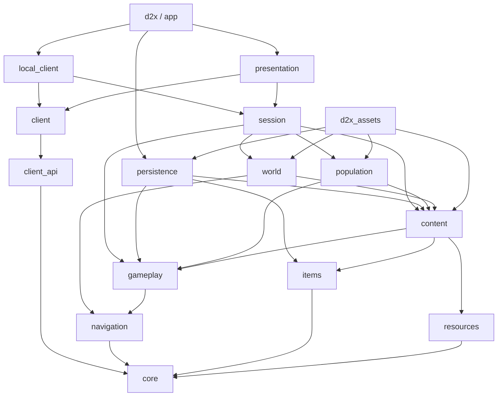

# 代码结构与依赖总览

依据：2026-10-03 当前源码、[CMakeLists.txt](../CMakeLists.txt) 与 [项目基线](../BASELINE.md)。本文维护当前代码结构；分模块构建／冒烟的准确范围以对应基线和专题文档为准。

项目采用 C++20，以 `GameSession` 外观及其私有 `GameSessionImpl` 协调内容、地图、玩法与库存。鼠标移动／受控人物显示、库存、角色／技能UI及NPC对白／菜单／任务提示／日志已接客户端契约与本地适配；商店／佣兵查询及其余表现入口仍在迁移。角色保存值、成长和学习／选择规则已抽出，完整活角色所有权与单位拆分尚未完成。**阅读依赖时应以 CMake 目标为准，目录名不等于库边界。**实施与验证状态见 [会话](baseline/SESSION.md)、[客户端](baseline/CLIENT.md)、[库存](baseline/INVENTORY.md)、[角色](baseline/CHARACTER.md)、[NPC／任务](baseline/NPC_QUEST.md)基线。

公共战斗单位现在由 `combat/identity.hpp`、`relations.hpp`、`unit.hpp` 和 `damage_request.hpp` 分别表达身份、关系、能力视图和请求。技能直接复用 `CombatUnit`；具体人物／佣兵／怪物指针及绑定逻辑移入 `simulation/unit_records.*`，不从技能端口返回。删除重复技能单位、转换函数和抗性查询代理；本批已通过 Windows Release 与三职业简单冒烟，未打包，详见[单位基线](baseline/UNITS.md)。

## 1. 模块分工

下表路径均相对 `src/`；目标完整名称为 `d2x_` 加表内名称，应用目标除外。

| 目录 / CMake 目标 | 主要职责 | 优先阅读 |
| --- | --- | --- |
| `core/` / `core` | ID、坐标、字节、随机数与指纹；仅头文件接口库 | `id.hpp`、`math.hpp`、`random_seed.hpp` |
| `resources/` / `resources` | MPQ 访问、TXT 解析及 DS1／DT1／DCC／DC6／COF 等文件解码 | `archive.*`、`formats.*`、`dcc.cpp`、`data_table.*` |
| `content/` / `content` | 把原表转换为物品、技能、怪物、NPC、世界等只读定义；保留原表供适配查询；物品及角色／技能显示计算使用显式输入 | `classic_data.*`、`lod_data.cpp`、各领域子目录 |
| `world/navigation.*`、`room_activation.cpp` / `navigation` | 碰撞网格、寻路和房间空间索引，不读取 MPQ | `Grid`、`RoomLayout` |
| `world/`（除导航和人口计划）/ `world` | 地图配方、预设／迷宫／野外生成、资源拼接、静态物件和出口连接 | `region_catalog.cpp`、`region.*`、`map_assembly.*`、`maze/`、`outdoor/` |
| `world/population.*` / `population` | 内容与地图 → 怪物生成计划；不分配实体 ID | `planPopulation`、`PopulationPlan` |
| `gameplay/items/` / `items` | 物品与容器状态、装备、转移、数量和耐久事务 | `InventoryService`、`operations.hpp`、`equipment*.cpp` |
| `gameplay/` 中模拟与规则目录 / `gameplay` | 角色、战斗、技能、怪物 AI、状态效果、消耗品、掉落及第一幕任务规则 | `character/progression.*`、`character/learning.*`、`simulation/`、`model/`、`combat/`、`skills/`、`monsters/` |
| `gameplay/session/`、`gameplay/npc/` / `session` | 命令分发、区域生命周期、内容查询、NPC 服务、任务与奖励、库存及保存协调 | `session.hpp`、`session.cpp`、`session_*.cpp`、`npc/` |
| `persistence/` / `persistence` | 原 D2S v96 编解码、内容校验、文件锁、替换与备份 | `save_codec.hpp`、`d2s_*.cpp`、`save_file.cpp` |
| `contracts/`、`client/*_client.hpp` / `client_api` | 人物／库存／角色／任务／NPC 投影、窄领域意图及可替换客户端入口 | `ActorView`、`InventoryView`、`CharacterView`、`QuestView`、NPC 视图及五个 `I*Client` 接口 |
| `client/inventory_view.cpp` / `client` | 库存值查询与占格命中，不链接会话 | `InventoryView` 查询函数 |
| `client/local_*_client.*` / `local_client` | 绑定本地受控人物，映射本人及可见场景视图，转发原命令／预览 | `LocalActorClient`、`LocalInventoryClient`、`LocalCharacterClient`、`LocalQuestClient`、`LocalNpcClient` |
| `presentation/` / `presentation` | 屏幕命中与手势、面板、场景绘制、GPU／音频资源及展示状态 | `controller.*`、`scene_view.*`、`scene_assets.*`、功能子目录 |
| `main.cpp`、`app/` / `d2x` | 参数、角色前端、窗口、设备输入、固定步主循环、保存入口、本机调试与崩溃记录 | `app/application.cpp`、`app/input.cpp`、`app/debug/` |
| `asset_tool.cpp` / `d2x_assets` | 独立资源查询、导出、预览、地图／掉落报告及存档摘要工具 | `asset_tool.cpp` |

需要特别区分：`gameplay/session` 和 `gameplay/npc` 编入 `d2x_session`，可依赖内容与地图；`d2x_gameplay` 才是隔离 MPQ、窗口和 GPU 的规则库。第二幕任务目前主要在 `session_act_two.cpp` 协调，`quest/id.hpp` 单独定义任务身份；`quest/state.hpp` 保存两幕共十二项、三难度任务记录。客户端日志投影不包含这份任务簿。

## 2. 实际依赖方向

箭头表示左侧目标依赖右侧目标。下图列出内部直接链接；`presentation`、`session` 等名称均省略 `d2x_` 前缀。



外部依赖集中在少数目标，版本／提交固定于 [Dependencies.cmake](../cmake/Dependencies.cmake)：

| 依赖 | 直接链接目标 | 用途 |
| --- | --- | --- |
| StormLib（`storm`）| `d2x_resources`，`PRIVATE` | MPQ 读取与打包 |
| raylib | `d2x_presentation`（`PUBLIC`）、`d2x_assets` | 窗口、绘图、音频和资源预览 |
| nlohmann/json 3.11.3 | `d2x`，`PRIVATE` | 客户端设置及调试协议 |
| Windows `advapi32`、`dbghelp` | `d2x`，`PRIVATE` | 本机管道权限与崩溃记录 |

内部链接大多为 `PUBLIC`，消费者会获得传递依赖；新增 `local_client → session` 为实现依赖 `PRIVATE`，`client_api` 只依赖 `core`。这里是链接图，并非所有头文件包含关系；例如 `CharacterSaveData` 位于 `gameplay/session/`，存档库包含这个值类型，但不链接 `d2x_session`。

`content → gameplay` 是原表适配为规则类型的依赖，`gameplay` 不反向读取内容。`persistence → content` 用于按当前物品／技能等定义校验存档。`resources` 负责原文件读取，`content` 负责规则含义适配，两者分工不同。

## 3. 状态归属与运行流程

| 状态 | 管理者 | 边界 |
| --- | --- | --- |
| 窗口、设备、MPQ 档案、当前存档路径 | `app` | 档案借给会话和表现层；GPU／音频对象先于设备销毁 |
| 内容目录、区域地图、静态物件、非当前区域状态、会话随机流 | `GameSession` | 按需加载当前区域与直接连续邻区，已访区域缓存保留 |
| `WorldState`：玩家、当前 `AreaState`、弹体、怪物与临时效果 | `Simulation`，由会话独占 | 借用会话内稳定的 `Grid`／`RoomLayout`，不持有档案或 GPU |
| 物品实例与容器归属 | `InventoryService`，由会话持有 | 转移通过事务；会话提供访问权限、角色需求和世界碰撞查询 |
| 死亡掉落结算记录 | 会话内 `LootSystem` | 按实体 ID 防重复结算，使用真实怪物身份 |
| 面板、相机、手势、展示计时、GPU／音频缓存 | `SceneController`、`SceneView`／`SceneAssets` | 可修改 UI 状态；已迁移的人物／库存／角色界面读值视图、提交意图，其余经会话兼容入口 |
| 角色保存值数据 | `CharacterSaveData`／`CharacterRecord` | 显式采集持久字段；值类型不再包含完整运行人物，活世界和临时动作不入 D2S |

一次普通操作经过：

```text
app/input.cpp 读取设备 → FrameInput
  → SceneController 命中／手势 → GameSession::submit(GameCommand)
  → GameSession::tick 分发并校验 → Simulation / InventoryService
  → 更新状态、结算死亡与任务 → GameEvent → SceneView 展示
```

`app/application.cpp` 用时间累积器以 25 Hz 调用会话；`tick(0)` 也可提交命令并发布事件，不推进正常时间。连续移动还通过 `tick` 的方向参数传递，应用启动／读档使用 `setRunning` 恢复偏好，因此当前入口并非全部只经过命令队列。

地图链是 `WorldCatalog → planWorld / MapRecipe → loadRegion → Map / Grid / WorldObject`；怪物链是 `planPopulation → pendingSpawns → 附近房间实例化`。切区把当前 `AreaState` 移回会话缓存，再把目标区状态交给模拟，避免同时保留两份活状态。区域加载由会话切换入口触发，不是房间级后台流式加载。

保存链是 `GameSession::characterSave → encodeSave → writeFileAtomically`；读取先 `decodeSave`，再由 `GameSession::restore` 校验并建立新局。格式与边界见 [SAVES.md](SAVES.md)。Windows 文件替换分支位于 `persistence/save_file.cpp`，属于文件 I/O；D2S 编码及纯玩法不需要 Win32。

鼠标地面移动先经过 `IActorClient → LocalActorClient`，再转为原会话命令；人物空间与动作显示通过 `ActorView` 回到表现层。库存手势经过 `IInventoryClient → LocalInventoryClient` 预览／提交，原事务结果和本人 `InventoryView` 回到表现层。角色学习／分配／选择／绑定经过 `ICharacterClient → LocalCharacterClient` 与角色规则，`CharacterView` 回到角色面板、技能树／菜单和 HUD。角色／库存视图按权威版本缓存。键盘固定步、攻击施法、NPC／任务／地图及地面交互仍有兼容链，不能将当前表现目标当成已经完全独立的联网客户端。

技能当前入口已收窄为 `SkillRuntime`、按单位 ID 的来源求值及权威世界／武器端口；具体行为不再实现 `Simulation` 成员，内容导入、学习元数据、求值结果、运行值和表现描述分开。怪物生成头已拆为生成指令，完整词缀留在活动怪物，奖励只传值快照。当前文件分工和本轮验证见 [技能基线](baseline/SKILL_RUNTIME.md) 与 [怪物基线](baseline/MONSTERS.md)。

## 4. 修改工作的落点

| 工作 | 通常需要协同的模块 |
| --- | --- |
| 原表字段／资源解码 | `resources → content`；只有文件格式变化才改解码器 |
| 新地图或出口 | `content/world → world → session_exits`，表现层只读地图 |
| 怪物或技能 | `content/monsters、skills → gameplay → session`；图像／声音接 `presentation/actors、world、audio` |
| 物品、装备或 NPC 交易 | `content/items、npc → items → session/npc`；界面接 `presentation/inventory、npc` |
| 任务 | `quest/state` 与任务规则、`session` 触发／奖励、日志／对白；涉及持久字段再同步 `persistence` |
| 纯 UI | `presentation`，需要新行为时新增命令／会话校验，避免直接修改玩法状态 |
| 角色保存 | `character_save.hpp → session_character_save / session_restore → persistence/d2s_*` |

多人协作时按领域文件分工；`session.hpp`、`model/*`、`CMakeLists.txt` 与存档接口由集成方统一修改。MPQ 参数继续动态导入，已核实的固定引擎规则与内容字段分别记录；未核实资源或规则明确暂缓。

## 5. 后续基础重构建议

可分步执行的模块职责、接口契约、迁移入口和完成标准见 [技术改造方案](TECHNICAL_REFACTOR_PLAN.md)。后续实施以该方案的阶段依赖为准；下表保留局部整理建议，不代表已发现运行故障。

| 顺序 | 当前依据 | 建议与边界 |
| --- | --- | --- |
| 1 | 库存／技能旧根层控制器已删除，CMake 使用各子目录实际实现 | 后续整理先核对引用与编译入口；不把未列入 CMake 的头文件当作废弃文件 |
| 2 | `session.cpp` 同时负责大量回调注入、区域加载和命令分发；私有 `GameSessionImpl` 通过 `friend` 访问模拟／库存内部 | 先按初始化、区域生命周期、命令分发拆实现文件，再按事务收窄写接口；保持随机数消耗、命令处理和死亡结算顺序 |
| 3 | `controller.cpp` 集中处理多种面板与场景手势，已有库存／技能子目录可延续 | 将独立面板处理移到对应功能目录；鼠标消费到松开、目标锁定和面板关闭顺序继续共用总控制器 |
| 4 | `ClassicData` 同时暴露原表和大量领域定义，`session.hpp`／`SceneAssets` 携带较多公共类型 | 优先提供物品、技能、怪物的窄查询入口，逐步把原表解释收回内容适配层；按实际收益使用前置声明，不先拆大量新库 |
| 5 | 保存值已抽出，但运行 `PlayerState` 仍混合成长与动作；`ActOneQuest`／`actOneQuests` 名称已承载两幕任务 | 继续拆角色服务和运行单位，并统一通用任务命名；保持原 D2S 映射，不静默迁移旧档，语义变更同步规则指纹与文档 |
| 6 | CMake 的同一目标多次追加源码，大多内部依赖仍为 `PUBLIC` | 按目标／领域集中源码清单，逐项区分公开接口与实现依赖；收窄链接可见性前核对静态库和最终可执行文件需求 |

角色、怪物、主动技能、被动和光环的本地参考证据与进一步拆分边界见 [参考项目设计比较](ARCHITECTURE_REFERENCE.md)。其中技能来源、参数与当前行为执行已实际迁移，完整通用单位／多玩家生命周期仍待实施；当前状态以模块基线为准。

## 6. 单机与联机的后续边界（尚未实施）

当前 `WorldState.player`、区域激活和命令入口仍围绕单一操控玩家，不能直接作为多人客户端模型。服务端拥有各玩家的完整角色／任务／物品状态；客户端只维护本人的必要界面数据与其他可见单位的公开视图。技能等级和加成由权威侧来源模块准备，客户端提交操作意图。

建议用同一客户端会话接口提交操作、读取投影：单机连接进程内权威游戏服，联机连接远端游戏服。D2X 自有后端可以复用当前规则；现有 D2GS 也可作为独立协议适配路线，但不能假定其宿主源码包含全部玩法或已与当前地图兼容。具体职责、来源证据与路线取舍见 [单机、联机与现有 D2 游戏服](MULTIPLAYER_ARCHITECTURE.md)。UI 应逐步依赖小型命令／视图头文件，减少对 `session.hpp`、完整 `PlayerState` 和 `Simulation` 的编译依赖。

进一步的接口约束见 [模块与接口基线](baseline/ARCHITECTURE.md)；专题入口：[数据生命周期](baseline/DATA.md)、[地图](ACT1_MAPS.md)、[怪物生成](MONSTER_POPULATION.md)、[物品模型](ITEM_MODEL.md)、[经典 HUD](CLASSIC_HUD.md)、[开发与交接](baseline/DEVELOPMENT.md)。
