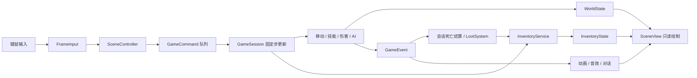

# 架构与扩展

项目将原来的 `game.cpp`、`world.cpp` 拆分为有明确依赖方向的模块，建立状态、身份、命令和事件边界。第一幕关卡目录与预设地形已改为原表驱动，详见 [地图架构](ACT1_MAPS.md)。物品、拾取、包裹、腰带与私人箱已接入；原版掉落与地图箱子规则仍待实现。

## 模块边界

| 目录 / 构建目标 | 职责 | 依赖 |
| --- | --- | --- |
| `src/core` / `d2x_core` | 二进制字节、等距坐标、实体 ID | C++ 标准库 |
| `src/resources` / `d2x_resources` | MPQ 挂载、格式解码、原始对象预设 | StormLib；不依赖图形 |
| `src/world/navigation.*` / `d2x_navigation` | 子格碰撞、A*、路径平滑 | core |
| `src/world/map.*`、`region*` / `d2x_world` | 关卡装载计划、共享 DT1、碰撞与只读场景组装 | content、navigation |
| `src/world/population.*` / `d2x_population` | 原表与碰撞网格到可复现刷怪计划；不分配实体 ID、不引用渲染器 | content、gameplay |
| `src/gameplay` / `d2x_gameplay` | 配置定义、运行状态、移动、技能、伤害、怪物 AI、掉落规则与随机数 | navigation；不链接 raylib/StormLib |
| `src/gameplay/items` / `d2x_items` | 物品定义/实例、容器、格子与事务规则 | core 与共享区域类型；不依赖图形或 MPQ |
| `src/content` / `d2x_content` | MPQ 原表到类型化物品／怪物／TC／关卡目录；试玩及资料片表适配 | resources、items |
| `src/persistence` / `d2x_persistence` | 值快照编码、格式版本、校验、文件替换与备份 | gameplay、items；不依赖图形或 MPQ |
| `src/gameplay/session*` / `d2x_session` | 地图生命周期、命令分派、旅行与交互、死亡结算与寻路拾取协调 | gameplay、world、content、population |
| `src/presentation` / `d2x_presentation` | GPU 资源、音效、场景、HUD、UI 控制器 | session、raylib |
| `src/app` / `d2x` | 参数、设备输入、窗口生命周期、25 Hz 主循环 | presentation、persistence |
| `src/asset_tool.cpp` / `d2x_assets` | 枚举、提取、图集导出、资源打包、原表刷怪计划查询 | content、world、population、raylib；不依赖会话运行 |

依赖获取单独放在 `cmake/Dependencies.cmake`，继续固定 raylib/StormLib 提交版本，保持 Windows/Linux 的 CMake 构建路径。没有新增测试目标、测试用例或测试脚本。

怪物生成新增 `MonsterCatalog → PopulationPlan → Simulation` 边界，详情见 [怪物生成](MONSTER_POPULATION.md)。原始怪物身份与 `MonsterKind` 实现分别保存，死亡／掉落请求使用原身份。实现注册表和存档／规则指纹需要在新增真实怪物行为时同步更新。随机空间目前使用整个 DS1 的适配器，不能当作原 DRLG 房间划分。

## 一次操作如何执行

`SceneController` 只处理屏幕命中、菜单和操作意图。移动、攻击、施法、旅行、NPC 交互和重置均提交 `GameCommand`，在固定步更新开始时按顺序执行。持续方向输入以 `Vec` 传给同一更新入口，不读取设备状态。世界暂停时不推进模拟，也不积累需要追赶的时间。

`Simulation` 私有持有 `WorldState`；`GameSession::state()` 仅提供 const 访问。界面不能直接扣血、耗蓝或增删怪物。绘制方法全部为 const，动画切换发生在 `SceneView::advance()`，不再因绘制频率改变战斗状态。

`GameEvent` 保存当前固定步的事实，`beginTick()` 清空上一步事件。应用在每次会话更新后立即调用视图的 `advance()`，避免同一渲染帧包含多个逻辑步时漏掉音效。掉落在会话更新内处理、先于视图反馈，不依赖 HUD 是否可见；会话先复制当前死亡事件，再追加物品事件，避免失效引用。不要跨逻辑步保留事件 span，也不要在追加事件时继续使用旧的 span。

## 状态、身份和地图生命周期

- `PlayerState` 保存玩家属性、移动和技能状态；旅行时保留生命、法力、耐力、冷却和玩家 ID，只清除未完成动作并调整到入口。
- `AreaState` 保存当前地图的怪物、投射物、效果和击杀数。`GameSession` 保存离开地图的状态，返回时恢复，离开期间不推进该地图。已打开世界箱子的状态将属于此处；地面物品由会话 InventoryState 根据区域 ID 统一管理。
- `Region` 保存地图定义、只读地图内容与场景物件；地图不再在每次旅行时深拷贝。静态区域数据在会话初始化完成后不再扩容，模拟借用其碰撞网格。
- `EntityId` 是会话内单调分配的 64 位 ID，零表示无目标。玩家、怪物、场景物件和投射物都使用 ID；攻击目标和投射物所有者不再使用 vector 下标。显式重置区域生成新怪物 ID，不复用死亡实体 ID。
- `EnemyDied` 仅在生命从正值转为零时产生，携带死者 ID、击杀者 ID、怪物类型、地图 ID 和坐标。`LootSystem` 额外记录已结算死者 ID，重复事件不会再次消耗随机数或生成物品，不受尸体绘制或数组重排影响。
- `R` 仍是显式恢复角色、重新生成当前区域的操作。普通旅行不再隐式回血或刷新怪物。旅行或重置后，丢弃同一批里仍指向原场景的后续命令。

会话已支持持久化：`SessionSnapshot` 保存各区域、玩家、物品、容器、ID 游标、内容指纹、随机状态和死亡结算记录；不包含 GPU／网格指针和临时访问权。读取先完整验证，再无抛出提交。格式与恢复边界见 [存档](SAVES.md)。

## 数据与表现

`definitions.*` 集中当前 MVP 的技能、怪物和角色规则，HUD 与战斗共用技能费用和冷却。地图定义迁移到 `WorldCatalog`，`WorldPlan` 决定场景及身份，`MapRecipe` 描述真实资源依赖，`Map` 处理图层与碰撞。当前预设地形已接入，未来迷宫／户外生成器复用该边界；详见 [第一幕地图](ACT1_MAPS.md)。快捷栏单独绑定技能 ID，技能规则仍待原表完整适配。

`SceneAssets` 拥有贴图和音效；`Graphics` 负责索引图上传和 COF 多组件合成；`UiPainter` 持有当前视图的字体，已移除全局字体指针。窗口、音频设备、渲染目标使用明确的析构顺序，异常退出也会先释放场景资源，再关闭设备。资源解码器及原始预设保留第三方来源说明。

角色的 COF/DCC 动画在加载时合成并上传，渲染期仅选择方向和帧。墙体、角色和物件继续按等距深度排序。资源缺失的物件保留模型数据，但不绘制悬空名字，也不参与屏幕点击。

下一阶段的模块和实施顺序见 [物品系统接入方案](ITEMS_NEXT.md)。

## 物品与容器

`GameSession` 拥有独立的 `InventoryService`，对外只提供 const 视图和命令入口。它与 `Simulation` 共用实体 ID 分配器，物品和容器不随区域切换或角色恢复而重建。占格只从实例位置推导，成功操作返回变化事件，校验失败保持原状态。详情见 [模型说明](ITEM_MODEL.md)。

`LootSystem` 只生成物品代码、数量和散落偏移，不持有 MPQ、地图、容器或 GPU。`session_loot.cpp` 将结果落到有效地形上，调用可信创建入口，并管理可取消的拾取目标。`InventoryService::collect` 统一规划堆叠与剩余占格，完整容纳后才提交；表现层只提交 `PickupItem{id, revision}`。

`SceneAssets` 预加载明确的物品图形清单，与掉落规则分离，资源导入无需先击杀怪物。`loot_view.cpp` 从权威位置查询地面物品，落地动画计时只属于表现层；名字布局同时供绘制和点击命中使用。返回区域时既有物品直接绘制静止帧，不重播掉落或重新创建实例。

包裹界面拆为 `inventory_panel`（状态、布局、拖放意图）、`inventory_controller`（手势和命令）及 `inventory_view`（绘制）。拖动只持有 ID/版本和抓取偏移，不将实例移到临时容器。`InventoryService::preview` 是移动/交换/拆分/合并实际执行时使用的只读校验；`GameSession::previewInventory` 再加入地图访问条件，供红绿预览与正式提交共同使用。

`InventoryApplied` 为成功命令提供回执，包括同位置移动这类无变化操作。界面同时只保留一个等待回执的请求，收到成功或 `InventoryRejected` 后才接受下个库存提交。来源版本变化、旅行、暂停、死亡、失焦和关闭面板都会取消未提交手势。包裹打开只拦截相关输入，不暂停模拟；世界更新与库存命令仍由同一个固定步处理。具体操作见 [包裹界面](INVENTORY_UI.md)。

腰带穿戴使用 `BeltEquipment` 容器，仍以实例位置为唯一归属。普通交易入口拒绝访问该装备槽；`items/belt.cpp` 在私有库存快照上规划穿脱和缩容溢出，成功后一次提交。`beltSpace` 单独表达按类优先的入带选择，不改变通用矩形放置规则。

`session_consumables.cpp` 协调 `UseItem`／`UseBeltColumn`，先验证、消耗并补位，再向 `Simulation` 应用药效。`potions.cpp` 在固定步更新玩家的生命／法力恢复队列和耐力计时；这些状态可序列化，且不引用 UI 或 MPQ。新命令及事件、资源来源和效果边界见 [腰带与物品使用](BELT_AND_CONSUMABLES.md)。

## 私人储物箱接入后的边界

`world/region.cpp` 负责资源到只读场景的组装，`GameSession` 不再负责展开 DS1 物件预设。场景物件携带位置、访问点、交互类型和同内容版本下的来源标识；图形没有 GPU 对象。bank 的操作距离从当前 MPQ objects.txt 读取。

`session_interaction.cpp` 统一靠近／交互／取消和距离校验，保存临时 `StorageAccess`。库存预览和提交均根据当前位置重新计算授权，关闭界面发出 `CloseStorage`；死亡、旅行和离开范围同样撤销。临时访问与持久物品状态分离，未来存档不得直接恢复未经验证的授权。

`TransferItem` 通过 `planTransfer` 完整规划兼容堆叠和剩余占格；预览丢弃计划，提交使用同一计划结果。拾取复用该规则，但仍限制自身的地面来源／包裹目标。没有重复堆叠算法，也没有先部分转移再检查剩余空间。

`ContainerGrid` 仅保存容器 ID 和网格几何，包裹、箱子和腰带以不同描述加入可见容器列表。命中、抓取偏移和目标矩形统一计算；包裹和箱子共用 `container_view.cpp`，面板纹理仍各自绘制。以后新增容器应提供描述和授权规则，不复制控制器的大段分支。

地图箱子本轮暂缓，没有新增自定义箱子投放或掉落分支。具体操作及资源条件见 [私人储物箱](STORAGE.md) 和 [MPQ 资源](MPQ_RESOURCES.md)。

## MPQ 数据与存档边界

物品目录已由 `content/classic_data.cpp` 在启动时读取 MPQ 构建；旧编译目录已移除。原表保留重复列，常用字段导入类型化可选参数。适配器限定 1.04 格式，未知版本不静默套用。怪物表及旧 TC 也已读取，但尚未完成执行算法；`LootSystem` 只记录已结算死亡，不生成猜测的掉落。

存档文件格式与领域校验分离：codec 负责字节、长度、版本和 CRC；会话负责身份、世界及引用；物品服务负责所有权、矩形和腰带容量。UI 不获得可变状态入口；只允许 GameSession 在完整验证后替换内部状态。需要演进格式时增加明确的文件版本与迁移路径，不直接把 C++ 结构体写入磁盘。
