# 角色、怪物与技能的参考设计

依据：2026-10-03 本地 `reference/` 源码阅读。本文比较结构与调用边界，不认证原版参数、功能完整度或运行表现；未构建、运行检查或修改玩法。以下“建议”是面向 D2X 的设计推导，不代表参考项目已经采用同一架构。原规则与参数继续以当前 MPQ 和已核实证据为准。

## 1. 参考价值与限制

已核对本地提交：D2MOO `5596f5c`、Diablerie `9e42ef2`、OpenDiablo2 `7f92c57`、DGEngine `ae6dcab`、OpenD2 `0578244`。来源和许可见 [THIRD_PARTY.md](THIRD_PARTY.md)。只引用本地入口，不把参考代码、其附带数据或资源复制进源码。

| 项目 | 观察到的结构 | 可借鉴之处 | 不宜据此推断 |
| --- | --- | --- | --- |
| D2MOO | 通用单位结构、玩家／怪物专属数据、技能函数表、单位属性列表和周期事件 | 原执行机制、技能来源、被动和光环的生命周期 | 不提供现代 C++ 封装或编译隔离；仍有全局表、单位反向查询和类型分支 |
| Diablerie | `Entity → Unit`；玩家聚合多个组件，怪物使用独立控制器；技能执行接收 `Unit` | 共用单位能力，控制器与单位分离，事件通知表现系统 | Unity 单位仍混合动画、移动、战斗；本地技能实现简化，未找到可采用的完整被动／光环执行链 |
| DGEngine | `LevelObject → PlayerBase → Player`；组合库存／属性／法术；`Spell` 与 `SpellInstance` 分离 | 定义和实例分离，通用查询接口代替具体玩家类型 | 偏 Diablo I／通用引擎；查询和纹理耦合仍存在，不能当作 D2 光环实现 |
| OpenDiablo2 | 空间实体通过接口和嵌入复用；`HeroState`、`HeroSkill` 分离；技能按 ID 恢复定义 | 小接口、角色成长状态、保存技能 ID 与点数 | `MapEntity` 是含绘制的地图接口；本地施法链仍绑定玩家，网络分支转发施法包，不是完整权威战斗系统 |
| OpenD2 | 本轮查看到技能表结构、被动／光环字段和包说明 | 字段布局交叉证据 | 未找到足以采用的角色／怪物／被动／光环完整执行设计 |

`dgengine-core` 提供通用 `Queryable` 等基础接口；本轮没有找到其独立的 D2 技能／被动／光环执行模块。`d2s-validation` 是存档验证依赖，不作为玩法架构参考。

## 2. 角色与怪物：共用单位，分开控制来源

### D2MOO：通用结构加专属数据

[`D2UnitStrc`](../reference/d2moo/source/D2Common/include/Units/Units.h) 用单位类型区分玩家、怪物、物件、飞弹、物品和地砖；通用部分携带身份、路径、属性列表、技能列表、主人等信息，专属部分通过玩家／怪物等数据指针表达。它是带类型标记的组合结构，不是角色和怪物继承同一个 C++ 虚基类。

[`AITACTICS_UseSkill`](../reference/d2moo/source/D2Game/src/AI/AiTactics.cpp) 将怪物选定的技能和目标交给动作流程；公共技能执行再处理通用单位。值得参考的是“控制决策与执行分离”，而非照搬整个单位大结构及原内存布局。

### Diablerie：公共 Unit 与独立控制器

[`Entity`](../reference/diablerie/Assets/Scripts/Diablerie/Engine/Entities/Entity.cs) 是 Unity 抽象基类，[`Unit`](../reference/diablerie/Assets/Scripts/Diablerie/Engine/Entities/Unit.cs) 提供移动、生命、阵营、动作和 `UseSkill`。[`Player`](../reference/diablerie/Assets/Scripts/Diablerie/Engine/Player.cs) 聚合 Unit、Equipment、Inventory、CharStat；它本身不是 Unit 子类。[`MonsterController`](../reference/diablerie/Assets/Scripts/Diablerie/Game/AI/MonsterController.cs) 获取 Unit，决定目标并调用相同的 `UseSkill`。

[`Events`](../reference/diablerie/Assets/Scripts/Diablerie/Engine/Events.cs) 发布单位初始化、技能开始和死亡事件，声音等系统订阅事件。此处体现组件组合与观察者机制；不是完整 ECS，也不是每种怪物各建一个子类。

**D2X 建议：**提供通用单位能力接口或访问视图，隐藏 `PlayerState*`／`Enemy*` 等具体实现；角色输入、怪物 AI、佣兵 AI 分别产生动作请求。角色成长、库存归属、怪物决策保留在各自模块，公共单位接口不承担它们。渲染资源不进入玩法单位接口。

## 3. 主动技能：共享定义与行为处理器

D2MOO 的 [`SkillStartFunc`／`SkillDoFunc`](../reference/d2moo/source/D2Game/include/SKILLS/Skills.h) 接收游戏、通用单位、技能 ID 和等级。[`Skills.cpp`](../reference/d2moo/source/D2Game/src/SKILLS/Skills.cpp) 按原表的起手／执行函数号选择处理器，多个技能可共用一个函数。这可以理解为数据驱动的行为分派／策略注册，不需要“一项技能一个派生类”。

[`D2SkillStrc`](../reference/d2moo/source/D2Common/include/D2Skills.h) 同时记录定义指针、等级、运行参数、来源 `nOwnerGUID` 和充能。`D2Common_10954` 在 [`D2Skills.cpp`](../reference/d2moo/source/D2Common/src/D2Skills.cpp) 中按来源维护技能实例；技能不是只能来自角色学习。注意：执行和公式仍查询单位属性，不能说它实现了“调用方传入全部加成”的隔离。

Diablerie 的 [`SkillInfo.Do(Unit, Unit, target)`](../reference/diablerie/Assets/Scripts/Diablerie/Engine/Datasheets/SkillInfo.cs) 也是公共单位入口，但导入记录兼有 UI 信息和执行分支，并直接访问装备、声音、世界生成；不适合整体搬入纯玩法库。

DGEngine 的 [`Spell`](../reference/dgengine/src/Game/Spell/Spell.h) 保存定义、公式与资源，[`SpellInstance`](../reference/dgengine/src/Game/Spell/SpellInstance.h) 保存定义引用、等级和通用 `Queryable` 来源，[`PlayerSpells`](../reference/dgengine/src/Game/Player/PlayerSpells.h) 管理拥有／选中的实例。定义／实例分离有参考价值；通过来源反向查询公式参数和把纹理放入定义，不符合本轮希望进一步收窄的边界。

**D2X 建议：**保留原技能 ID 和已核实行为家族；权威侧调用方确定本次等级、协同、进攻加成、来源和消耗方式，不信任客户端提交的结算参数。技能处理器只接收执行参数、施法者 ID 与窄世界接口。起手／引导状态归施法者的动作模块，飞弹／召唤物归世界模块；具体参数取值和消耗阶段保持原规则。

## 4. 被动：来源明确的属性贡献与能力

D2MOO 的 [`SKILLS_RefreshSkill`](../reference/d2moo/source/D2Common/src/D2Skills.cpp) 查找被动状态对应的属性列表：没有有效技能或等级时移除；有等级时创建／更新 `PassiveStat` 与计算结果，记录技能及等级。它还处理光环状态对被动贡献的抑制。

[`D2GAME_RefreshPassiveSkills`](../reference/d2moo/source/D2Game/src/SKILLS/Skills.cpp) 遍历单位技能刷新被动；[`ItemMode.cpp`](../reference/d2moo/source/D2Game/src/ITEMS/ItemMode.cpp) 中存在装备相关刷新调用。可借鉴的是随来源变化刷新贡献，而不是每个固定步重新解释所有被动。

[`D2StatListStrc`](../reference/d2moo/source/D2Common/include/D2StatList.h) 表达来源、状态、技能／等级、属性和移除回调。公共技能代码另有单位事件回调表，供护盾、反伤、装备触发等响应使用。属性贡献与事件反应需要分开表达，不能把所有效果都简化成属性相加。

**D2X 建议：**权威侧调用方提交已解析的被动贡献，公共效果／属性系统按来源更新或移除，并重新派生属性。适用时，事件型能力向战斗反应系统登记有生命周期的处理器。学习、装备变化和等级计算属于来源模块；效果系统不回查角色技能树。武器类型条件、抑制和同类覆盖按原表与已核实规则处理。客户端接收必要的派生值和可见效果，不管理其他玩家的被动来源。

## 5. 光环：发射实例、周期筛选、目标效果

D2MOO 的 [`SKILLS_SrvDo065_BasicAura`](../reference/d2moo/source/D2Game/src/SKILLS/SkillPal.cpp) 分开本人状态与目标状态，计算范围和属性，再通过通用筛选回调处理目标；目标获得状态属性列表。`SKILLS_CurseStateCallback_BasicAura` 负责状态移除时的清理和被动刷新。

[`Skills.cpp`](../reference/d2moo/source/D2Game/src/SKILLS/Skills.cpp) 的周期技能流程处理当前技能光环；`D2GAME_MONSTERS_AiFunction10` 查询装备 `STAT_ITEM_AURA`，取得等级后调用同一技能执行入口。这证明光环执行机制能接不同来源，不只由圣骑士右键控制。

可以理解为：发射者拥有光环实例，周期查询合格目标，再给目标刷新有期限的效果；停止刷新后，目标效果按规则到期。该描述来自上述普通光环路径，不代表所有光环都只有属性效果：原代码还分出伤害、尸体处理等路径。

**D2X 建议：**权威侧 `AuraInstance` 记录发射者、来源、已解析参数和下次周期；选择技能、怪物强化、装备光环分别注册／更新／注销实例。`AuraSystem` 使用单位／空间／关系接口筛选目标，并提交到公共效果或战斗系统。来源移除、死亡、跨区、同类覆盖、叠加和免疫处理分别按对应规则执行，不统一猜定。目标状态的拥有者与光环发射来源必须可区分；客户端兴趣范围只影响同步，不决定目标加成或光环是否推进。

## 6. 面向当前项目的拆分边界

以下模块名是建议，不是已实现的新类；图中技能与战斗是权威侧内部流程，单机可在同一进程运行：

```mermaid
flowchart TD
    input["经验证的角色操作／怪物 AI／装备来源"] --> prepare["权威侧准备等级、加成、来源与消耗策略"]
    prepare --> active["主动技能：施法流程与效果处理器"]
    prepare --> passive["被动：属性贡献／条件能力"]
    prepare --> aura["光环：发射实例与周期系统"]
    active --> ports["单位、导航、飞弹、召唤接口"]
    active --> combat["公共战斗与效果系统"]
    passive --> combat
    aura --> ports
    aura --> combat
    combat --> events["领域事件 → 按接收者筛选 → 客户端表现"]
```

| 当前入口 | 建议职责归属 | 边界要求 |
| --- | --- | --- |
| `session_skills.cpp` 的学习、有效等级、选择 | 角色技能／来源模块 | 上游传入等级与加成；装备来源单独准备 |
| `casting.cpp` 的起手、引导与中断 | 通用动作／施法流程 | 显式施法者，不依赖完整 `PlayerState` 或 `Simulation` |
| `casting.cpp` 的效果分支及各技能文件 | 按行为家族划分的处理器 | 每个处理器只依赖必要的世界接口 |
| `aura.cpp` 的周期与目标状态 | 光环系统加公共战斗反应 | 分开发射来源、目标效果与反伤／治疗消费者 |
| 被动与装备／状态派生计算 | 属性贡献与能力系统 | 按来源维护，保持抑制、条件与原计算顺序 |
| `effects/state.*` | 继续作为公共效果基础 | 已有来源、到期、互斥与 `AuraLevel` 策略，优先复用 |
| `Simulation` | 固定步编排、世界生命周期 | 调用模块，不声明所有具体技能的私有实现 |
| `GameSession` | 操作验证、来源协调与组装 | 不作为技能、角色与界面的共同大接口 |

公共单位接口适合抽象基类或适配视图；当前参考不能证明某一种方式一定编译更快。编译隔离还取决于小头文件、隐藏私有状态、避免返回完整世界／内容对象，以及处理器不包含 `session.hpp`／`simulation.hpp`。不要把这些依赖全部搬进新的通用基类。

OpenDiablo2 的 [`HeroState`](../reference/opendiablo2/d2core/d2hero/hero_state.go)、[`HeroSkill`](../reference/opendiablo2/d2core/d2hero/hero_skill.go) 及 [`HydrateSkills`](../reference/opendiablo2/d2core/d2hero/hero_skill_util.go) 支持角色数据和技能定义分离，保存技能 ID 与点数后重新关联定义；但 D2X 仍必须保持原 D2S v96 编码，不能照搬其 JSON 保存方式。它的 [`MapEntity`](../reference/opendiablo2/d2common/d2interface/map_entity.go) 含绘制接口，[施法客户端](../reference/opendiablo2/d2networking/d2client/game_client.go) 按玩家生成效果，[服务端施法分支](../reference/opendiablo2/d2networking/d2server/game_server.go) 转发包，这些不作为完整权威联机的模板。

实施时先建立窄接口与角色技能参数准备，再迁移主动技能处理器、被动贡献和光环实例；复用已有战斗／效果规则，保持状态唯一归属、事件先后、随机数消耗与存档语义。当前没有据此改写代码。

单机／联机复用、本人私有状态与远端单位视图、现有 D2GS 和协议可用范围见 [联机设计边界](MULTIPLAYER_ARCHITECTURE.md)。公共玩法单位接口不能成为客户端获取所有玩家任务、库存和完整存档的入口；复用现有游戏服也是可选路线，尚未选定或验证。
