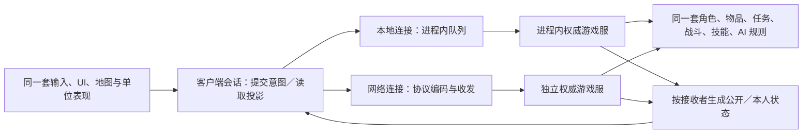

# 单机、联机与现有 D2 游戏服

本文是设计建议，尚未实施。当前代码仍为单操控角色世界，没有网络协议、远端玩家副本或独立服务端。本轮只更新文档，不构建、运行、部署或修改存档。参考结构见 [设计比较](ARCHITECTURE_REFERENCE.md)，当前依赖见 [代码结构](ARCHITECTURE.md)。

具体模块迁移入口、阶段依赖与交付标准统一见 [系统解耦技术改造方案](TECHNICAL_REFACTOR_PLAN.md)，本文保留状态归属与游戏服路线比较。

## 1. 状态归属：服务端完整，客户端按用途接收

联机采用服务端权威：游戏服拥有本局玩家、怪物、物品和世界的真实状态；持久化服务负责保存角色数据。客户端保存展示、操作和必要预测的副本，不承担其他玩家的完整角色管理。

| 数据 | 权威归属 | 自己的客户端 | 其他玩家的客户端 |
| --- | --- | --- | --- |
| 任务记录、背包、仓库、金币、已学技能 | 服务端角色／物品模块；持久部分交存档层 | 对应界面需要的状态与操作结果 | 默认不发送；任务世界变化或交易报价另作公开投影 |
| 装备实例、词缀、充能及来源 | 服务端物品与属性模块 | 按本人的装备界面和操作需要同步 | 装备外观所需信息；不发送完整装备／背包结构 |
| 位置、朝向、动作、死亡、可见效果 | 服务端单位与动作模块 | 权威结果及必要的预测校正 | 可见范围内用于绘制和交互的单位副本 |
| 队伍、公共传送门、任务造成的物件变化 | 服务端关系与世界模块 | 按交互／队伍规则接收 | 按规则筛选，不复制每人的全部任务历史 |
| AI、伤害、掉落、真实随机流、被动与光环判定 | 服务端模拟 | 结果与表现参数，不接收全部内部状态 | 只接收与自身或可见场景有关的结果 |
| 面板、手势、相机、音效／GPU 缓存 | 客户端 | 本地拥有 | 不同步 |

队伍任务共享资格和世界触发条件由服务端读取各玩家记录并判断。客户端收到门打开、日志更新或可用交互等结果，无须维护其他玩家的任务簿。生命等信息的公开程度按已核实的显示／队伍规则确定，本文不指定未经核实的原版可见字段。

建议分开服务端 `CharacterState`／单位运行态、客户端公开 `ActorView` 与仅本人的 `OwnCharacterView`。名称只是方案：不要把当前 `PlayerState`、`WorldState` 或 `CharacterSaveData` 直接序列化广播，也不要给远端玩家构造字段大多为空的 `PlayerState`。玩法的公共战斗单位接口与客户端的展示视图分别定义，后者不暴露任务、库存和写入真实生命值等能力。

## 2. 单机与联机复用：同一客户端，替换连接端

单机启动本地权威游戏服与一个客户端，不必真的开套接字。局域网房主可同时运行游戏服和自己的客户端；独立服务端只运行前者。连接实现不同，操作验证、规则结算、状态投影和客户端消费路径相同，避免单机 UI 通过额外捷径直接写真实状态。

复用纯玩法库、内容适配和客户端表现，不要求各进程拥有全部数据。联机客户端不加载其他玩家存档，不运行远端玩家任务／背包事务，也不把怪物 AI 和权威技能再结算一遍。后续移动预测或技能预演可以调用必要的共用计算，但不能提交真实伤害、掉落或物品变更。客户端兴趣范围只筛选同步；服务端区域调度应结合各玩家及仍需推进的世界活动，不能根据某一个客户端的可见范围停止光环、飞弹或战斗。

单机暂停由本地宿主控制；联机打开菜单不能暂停共享世界。断线、加入和保存按角色生命周期处理，不能调用当前 `restore` 重建所有人的世界。D2S 编码可继续复用；联网角色由谁托管、是否允许导入本地角色需明确模式，不能将每帧同步当作整份存档传输。

## 3. 通用技能仍由权威侧准备参数

此前“调用方传入技能等级和加成”的调用方指**权威侧的角色、怪物 AI 或装备来源模块**。客户端提交想用的技能、目标与必要的物品引用；服务端从连接身份确定操作者，检查来源、学习／充能资格、费用、时序及目标，再准备等级与加成、调用通用技能模块。客户端传来的伤害、等级和装备加成不能当作真实结算参数。

- 主动技能共用参数与行为处理器；人物、怪物、充能装备分别准备参数和消耗。来源失效、中断及执行时复验由权威流程处理，扣资源与效果按原规则发生。
- 被动由服务端按学习、装备和状态变化维护带来源的贡献／反应能力；本人收到需要显示的派生值，其他客户端只收到可见效果。
- 光环由服务端维护发射实例、周期筛选、关系与目标效果；客户端显示可见状态，不独立决定哪些玩家获得加成。同一效果不能因多个客户端看见光环而重复执行。

内部领域事件经过接收者筛选才成为客户端消息，避免把结算、物品或随机信息完整广播。协议也不能直接暴露当前全部 `GameCommand` 变体；调试、恢复存档等管理操作不属于普通玩家操作。连接层负责编码和传输，玩法不依赖套接字、MPQ 档案或 GPU。

## 4. 原版私服有哪些现成资料

2026-10-03 核对项目自身 README、配置与本地参考；只作可行性依据，尚未安装或验证互通。

| 项目／部分 | 已核实能力 | 对 D2X 的意义 |
| --- | --- | --- |
| [PvPGN](https://github.com/pvpgn/pvpgn-server) | 开源 Battle.net 兼容服务；明确 D2GS 不属于自身 | 可研究账号／大厅服务，不等于战斗模拟 |
| [D2CS 配置](https://github.com/pvpgn/pvpgn-server/blob/master/conf/d2cs.conf.in)、[D2DBS 配置](https://github.com/pvpgn/pvpgn-server/blob/master/conf/d2dbs.conf.in) | 游戏控制／分配与角色数据服务分开，配置关联 D2GS 和角色保存目录 | 私服是多个职责组合，不是一个服务包办全部功能 |
| [D2GS 工作说明](https://github.com/RElesgoe/d2gs) | 有宿主源码；加载 `D2Server.dll`，再调用 `D2Game.dll`／`Fog.dll` 等运行游戏 | 可复用既有游戏服；宿主源码不等于完整、独立于原版二进制的玩法源码 |
| [diablo2-protocol](https://github.com/MephisTools/diablo2-protocol) | 1.13／1.14 协议工具及登录、选角、建局例子；README 仍列包验证待完成 | 可研究连接和编码，不是完整图形客户端或所有版本协议认证 |
| [本地 D2MOO](../reference/d2moo/README.md) | 1.10f 逆向重实现，重点 D2Common／D2Game；仍要求原版二进制，不能完整直接替换各 DLL | 重要规则／包处理证据，不能视为现成的跨平台独立游戏服 |
| [本地 OpenD2](../reference/opend2/README.md) | 尝试连接原 TCP/IP 游戏；README 描述能连接但卡在加载，尚无服务端 | 客户端重写路线有参考，但连接成功距离可玩仍有工作 |

资料存在，但当前证据不足以认定已有一个可直接替换当前玩法、完整匹配当前 MPQ 的独立服务端。尤其要区分客户端到游戏服的协议与 D2CS／D2DBS 到 D2GS 的服务间协议。

## 5. 两条路线，先保留边界再选后端

| 路线 | 可以复用 | 必须承担的工作／限制 |
| --- | --- | --- |
| D2X 客户端 + 既有 D2GS | 游戏服已有角色、AI、技能、任务、物品规则；账号服务视模式复用 | 固定版本与模组，实现客户端协议与状态还原、动作／效果表现、地图／碰撞兼容；离线单机也需本地宿主，或另用 D2X 玩法后端 |
| D2X 客户端 + D2X 权威游戏服 | 当前纯玩法、物品事务、任务、MPQ 适配和 D2S；单机／房主／独立服共用 | 补齐多角色、多区域、权威命令、状态投影与传输；既有规则尚未完整复刻 |

“只做客户端”是可行的产品路线：若优先连接某个已有私服，可以减少自行重做权威玩法的范围。但它不自动满足跨平台、离线单机与自主修改规则的需要，也不能用本地近似地图假定原服碰撞一致。原服兼容可能要求客户端按服务端种子精确重建地图，或另有地图适配方案；当前地图仍有原 DRLG 随机流差异，须逐项核对，不能预先承诺互通。

建议先让 UI 依赖客户端会话的操作与投影接口。本地 D2X 后端和远端 D2GS 适配器都能接入该边界；它们采用不同协议、不同权威实现，不能仅切换服务器地址就视为兼容。接入外部游戏服时，D2X 技能模块只用于本地／自有权威后端；客户端表现由服务端消息驱动，不并行执行另一套权威规则。

这也解决编译依赖问题：客户端头文件不包含服务端完整角色、物品、技能处理器或 `Simulation`；实现通过前置声明／不透明实现隔离。协议值类型与内存状态分开，角色、怪物、技能实现依赖各自的小接口，不共用一个包揽所有能力的基类。仅把成员实现拆到更多 `.cpp`，仍保留大公共头文件，不能消除重编扩散。

若优先考虑现有私服，先确定目标游戏服、补丁／模组、MPQ 与离线宿主方式，核对连接流程、包字段以及地图／动作兼容范围，再决定是否收缩自有服务端开发。当前没有做互通验证，不能据资料数量估算已完成比例。

两条路线都需要先分离权威状态与客户端视图、收窄角色／技能接口及实现头。选择 D2X 后端后再建立本地连接并推进多角色／多区域；选择 D2GS 后端则推进协议适配。原服包没有携带的字段不能假造。网络生命周期还需区分实体进入／离开、会话代次、权威帧与消息顺序；重连重建副本，避免重复消耗物品或施加效果。
