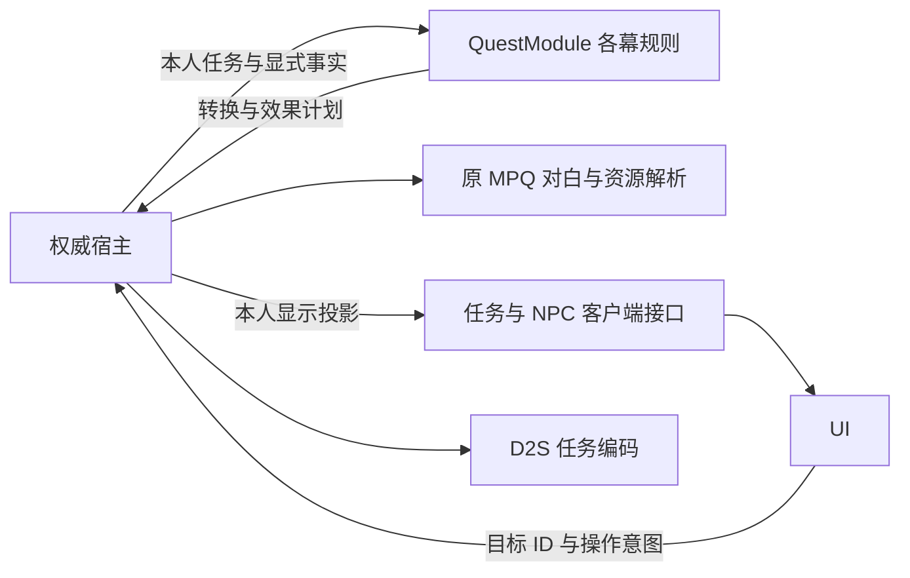

# 任务系统与各幕扩展

更新：2026-10-04。五幕共27项日志任务已接入主要源码流程，第三至第五幕按15项逐一核对reference后实施，详见[逐项基线](LATER_ACT_QUESTS.md)。本批已通过Windows Release构建及有限冒烟，覆盖与修复见逐项基线的冒烟范围；未重打包。下方第二幕冒烟证据仅对应此前提交。

## 所有权与入口

角色 `quests` 保存三难度任务记录，`questPreludes` 保存独立欢迎记录，`npcIntroductions` 保存普通 NPC 初见。三者含义不同，不由 UI 推算或互相转换。第一幕未读反应仍由本局宿主持有，读档不重放。没有建立第二套全局玩家任务簿。

| 文件 | 职责 |
| --- | --- |
| `gameplay/quest/id.hpp`、`catalog.hpp` | 稳定任务 ID、幕、日志位置、原幕内任务号、图像槽、原 D2S 槽与完成阈值；显示顺序、资源顺序和磁盘槽分别声明，不含文本键或资源路径 |
| `quest/state.hpp`、`acts/act_*_state.hpp` | 共用记录／任务簿与各幕具体阶段分离 |
| `quest/prelude.hpp` | 非日志欢迎定义及角色记录；目前仅原 A2Q0 杰海因欢迎 |
| `quest/module.*`、`acts/rules.hpp` | 按幕登记 NPC 查询、交谈转换、区域进入、死亡及日志选择；第一至第五幕均登记规则 |
| `acts/*_npc.cpp` | 稳定 NPC 类别、本人记录及携带物事实 → 有序对白请求和独立提示资格；不查 session、MPQ、库存服务或 UI |
| `acts/*_conversation.cpp` | 下一记录与奖励种类；权威重新准备事实，实际奖励成功才提交 |
| `acts/*_events.cpp` | 进入区域／死亡事件规则，保留日蚀、首杀资格及有序世界效果 |
| `acts/*_log.cpp` | 原描述键、剩余数及真墓图案资格；不解析文字、地图种子或画面资源 |
| `session_quest_dialogue.cpp`、`session_quests.cpp` | 准备窄事实，按 NPC 实体 ID 解析原文本、确认欢迎／消息，连接奖励执行；不包含五幕的对白大分支 |
| `content/npc/npc_dialogue.*` | 原文本与 Sounds 身份解析；按原 NAME 的 ActIntro 选择独立欢迎，普通 Introduction 分开；无声音的书籍也保留源文件幕别 |
| `content/quest/quest_data.*` | 统一准备任务标题／对白键／图像路径及法杖／克林姆配方、任务物品和奖励基础池；宿主与客户端复用解析结果 |
| `client/local_quest_client.cpp`、`local_npc_client.cpp` | 复制本人日志／NPC 投影；本地适配准备真墓图案，不向 UI 传种子 |
| `contracts/quest.hpp`、`presentation/hud/quest_*` | 投影提供各幕实际列表及每项的幕／位置／图像；绘制、选择、更新通知和动画不再按 ID 除以或模六 |
| `persistence/d2s_quests.*` | 原任务位、初见位及支持的记录校验；主 `d2s_codec.cpp` 只编排读写 |

区域进入按第五幕到第一幕顺序调度，死亡按第一幕到第五幕顺序产出计划，保持旧两幕相对顺序。死亡规则读取转换前的记录快照；宿主按效果顺序提交，每次死亡重新准备事实。奖励发放失败不消耗领取资格，物品替换／多件授奖先成功再提交任务。

## MPQ 数据与规则的边界

`QuestContentCatalog` 在内容加载时统一绑定原 `qstsaNqM` 标题、`aNnpc.txt` 的 QUEST 记录与 `aNqM.dc6`。键和路径命名约定属于原格式适配，幕内原任务号来自 reference 身份；MPQ 没有完整任务目录或执行脚本，不能从日志位置猜任务号。缺标题、对白或原图明确报缺失，不用键名代替文字或生成替代图。描述阶段到 STATE／原描述键的关系仍由各幕规则选择。

`StaffRecipeContent` 从当前 `cubemain` 的启用配方和 Weapons／Misc 的任务标记、物品类型准备：解析真实产物编码，将两个原输入按 `staf` 杖身和 `amul` 杖头归位，卷轴由同任务标记的 `ques` 项取得，并按原 `pSpell=7` 方块功能排除方块。材料列调换不改变语义；缺失、歧义和不支持的配方明确拒绝。仅 A2Q2 使用已核对的原任务标记10，不能把这一映射推广到所有任务。合成、拾取进度、掉落、孔口交付／消耗、凯恩提示与日志共用这份数据，不再分别写 `msf/vip/hst/tr1`。

对白字段名按ASCII忽略大小写解析；a5npc中的A4Q2资料片结尾按QUEST幕别归属第四幕，同名组追加而不丢弃；a4npc中注释形式的原WAV路径也参与Sounds绑定。欢迎按原 NAME 的 `ActIntro` 记录、MPQ 解析的说话者和幕别选择，不再在玩法定义中固定 `jerhyn_act2_intro`。是否参与 A2Q0／A3Q0、NPC 角色、触发区域、确认位及奖励顺序仍是 reference 规则。第一幕特殊物品身份、原 D2S 编码中的零售物品码和部分物件协调仍有固定规则绑定；本批不宣称全部系统可任意替换 MPQ 或已经完全数据驱动。

杰海因不是原 DS1 的普通怪物预设：`world/region.cpp` 按 MPQ Objects 的 `InitFn=18/19` 识别到达／宫殿标记，使用标记位置和 MonStats 的真实中立身份、图形及交互能力建立 NPC。`WorldObject.npcInitFn` 保留原回调身份；宿主依据欢迎及现有任务记录只显示一个位置，初次交谈结束后再切换。复用两个位置记录保持实体 ID 稳定，不新增保存字段。原守卫生成、完整 GUID 生命周期、自由位置算法及移动演出未完整移植。

## 第二幕提示与保存

| NPC／条件 | 源码行为与 reference 依据 |
| --- | --- |
| 杰海因初到幕 | 独立 A2Q0 未确认时提示，使用当前 MPQ `jerhyn_act2_intro`；交谈确认原槽8位0，不启动七座古墓。`A2Q0_ActiveFilterCallback`／`Callback11_ScrollMessage` |
| 阿特玛 | 罗达门特未开始或击杀待确认时提示，确认后消失，技能书资格保持。`A2Q1_ActiveFilterCallback` |
| 凯恩 | 完整法杖优先；否则按方块、卷轴、杖头、杖身的未确认资格选择原话题。已确认保留手动回看，不反复亮提示。`A2Q2_CheckItemsAndState`／`Callback11_ScrollMessage` |
| 卓格南／杰海因 | 依据现有日蚀／宫殿阶段选择自动对白及提示，普通初见不使所有 NPC 亮提示。`A2Q3`／`A2Q4` active filter |
| 召唤者及结尾 | 继续沿用本人待确认阶段；泰瑞尔在都瑞尔房间的提示不再被城镇总开关挡住。`A2Q5`／`A2Q6` active filter |

提示资格、默认对白与是否推进分别表达。有回顾话题不等于亮感叹号；缺原对白时不造文字或强行显示。交谈中、任务隐藏或人物死亡时不显示。图像、速度及高度仍来自原叠层／MonStats2，未重做图标；D2MOO `A2Intro_ActiveFilterCallback` 不为所有普通初见显示任务提示。

D2S继续v96，原十二项的内部ID与槽不变，新十五项追加ID12–26，使用各自原槽；不加私有字段：

- A2Q0 原槽8位0按难度导入／导出，其他位保留。不会从普通初见或古墓阶段猜出欢迎已确认。旧项目档未写该位时，会再次提供一次欢迎，随后正常保存；没有迁移或改写旧档的动作。
- A2Q2 卷轴确认对应 LEAVETOWN 位3；方块、杖头、杖身、完整法杖分别对应 CUSTOM2 位6、ENTERAREA 位4、CUSTOM1 位5、CUSTOM6 位10。材料对白同时确认 LEAVETOWN，完整法杖同时确认其他材料；编码只维护已解释的位。
- 当前运行规则指纹为 `quest-rules-v18-later-acts`，不写 D2S；自动地图固定原表指纹与揭示规则不变。

## 各幕扩展方式

采用 D2MOO `Quests.cpp` 登记回调、各幕独立规则及 active／status filter 的分工，独立适配为值事实和结果计划。不引入通用虚拟任务基类，具体任务可复用已有纯阶段函数。

1. 核对该幕 MPQ 文本／原图和物件／物品身份及 reference 规则，在 `QuestId`／`catalog.hpp` 追加实际实现的任务，声明幕、显示位置、原幕内任务号／图像槽和磁盘槽，内容层据此绑定真实 MPQ。保持已有 ID 稳定；第四幕只有三项日志任务。
2. 在 `acts/` 添加阶段类型和 NPC／交谈、进入／死亡、日志选择函数，向 `module.cpp` 与 CMake 登记。现有 session 查询及 UI 不再追加按幕的大 switch。
3. 真实奖励或专用物件需要新事务时，增加明确效果及权威执行入口；规则只请求效果。持续演出／计时仍需该幕自己的运行时实现，不混入永久角色记录。
4. 在 `d2s_quests.*` 添加有依据的原位编码、校验和属性／技能奖励计数；欢迎放 `prelude.hpp`，无原位依据不保存。未实现的保存语义继续明确拒绝，不能丢字段。
5. 同步幕基线、存档支持度与规则指纹。内容导入已保留五幕 `qstsaNq` 原字符串，仅已登记任务进入日志。

联网时可由服务端准备请求操作者的记录和事实，复用规则、执行奖励并提交本人进度；客户端接收本人日志和可见 NPC 提示／对白，不持有其他玩家完整任务簿、背包或奖励资格。本轮仍为单玩家宿主，未实施网络或队伍共享。

## 此前第二幕验证与限制

2026-10-04 按用户授权完成简单冒烟，未新增测试脚本、用例或程序，使用现有游戏、资源工具和调试管道。启动发现方块与卷轴共享任务标记导致歧义，已按原功能字段排除；城镇缺杰海因则补接原初始化标记。修改后 Release 游戏／资源工具链接通过。

| 范围 | 实际结果 |
| --- | --- |
| 普通音频启动 | 临时女巫两帧启动退出0、stderr空；最终源码的独立普通进程读档也退出0、stderr空 |
| 杰海因 | 初到提示为真，原叠层截图已查看；交谈确认欢迎，A2Q6保持0；结束交谈后到达位置隐藏、宫殿位置显示，无双重可见人物 |
| 阿特玛 | 提示为真，交谈将 A2Q1 从0推进到1；独立重进后不再提示 |
| 凯恩方块 | 通过已有开发入口取得原方块；携带时提示为真，原方块对白出现，A2Q2阶段1／内部确认位3；交谈结束及重进后提示为假 |
| 原 D2S 保存 | 临时档同进程保存／读取及独立进程读取成功；原槽8为0x0001、槽9为0x0004、槽10为0x004C，欢迎和方块确认保留 |
| 日志与退出 | 第一／第二幕原面板及切幕原图／罗达门特标题截图已查看；两个持有退出码的最终实例均退出0、stderr空，其余交互实例正常响应quit且stderr空 |

构建日志为 `artifacts/quest-module-build-20261004.log`、`quest-module-build-fix-20261004.log` 和 `quest-module-build-npc-fix-20261004.log`；运行、诊断、截图及临时档在 `artifacts/quest-module-smoke-20261004/`，不纳入源码提交。未重打包、未改用户角色档；`dist/current` 为旧包。未运行完整任务、法杖合成／交付、全部材料确认、泰瑞尔结尾或Linux回归。该历史批次尚未登记第三至第五幕；原全局任务阶段、队伍资格、GUID 反应列表、任务物品丢失／重获时的全部确认位清理，以及第二幕结尾各 NPC 的独立未读反应，尚未完整移植。现有阶段投影不等于完整 D2Game 事件状态。

本地证据：固定 D2MOO `5596f5c` 的 `QUESTS/Quests.cpp`、`ACT2/A2Q0.cpp`、`A2Intro.cpp`、`A2Q1.cpp` 至 `A2Q6.cpp`，以及 `Quests.h` 原槽和 `D2Constants.h` 原位。杰海因位置依据 A2Q4 的 `InitializeJerhynStartObject`／`InitializeJerhynPalaceObject`／`InitializeJerhynMonster` 与当前 Objects 原初始化字段。原欢迎／任务文字和 Sounds 身份已核对当前 MPQ 的 `data/local/docs/eng/a2npc.txt` 与 `data/global/excel/sounds.txt`；法杖关系已只读核对当前 `cubemain.txt`、`weapons.txt`、`misc.txt`，不纳入原表导出或参考仓库。许可和仓库范围见[资料来源](THIRD_PARTY.md)。
## 第三至第五幕执行入口

- `session_quest_inventory.cpp`统一协调持有任务物品后的进度；`session_cain_items.cpp`只保留凯恩卷轴与戒指事务。
- `session_later_act_objects.cpp`协调祭坛、箱子、杠杆、强制球、熔炉、封印、NPC和门户；古代人、俘虏、王座五波分别在 `session_ancients.cpp`、`session_prisoners.cpp`、`session_baal.cpp`。
- `session_quest_rewards.cpp`执行兑换、点数、符文及职业Rare奖励；`session_quest_items.cpp`执行打孔／署名。客户端共用NPC物品选择界面，分别提交带目标及物品版本的意图，宿主重新复验权限。
- 原A1–A4跨幕记录使用槽7／15／23／28，与击杀任务分开；技能点总量计入衣卒尔，属性点计入古书，黄金鸟生命／安亚抗性由实际领取或使用位重建。详细位定义及本局状态限制见[存档](SAVES.md)。

MPQ提供原身份、素材、属性、配方和文本，无法替代reference里的事件脚本。任务号、Operate／Init回调含义、奖励次数和原格式位是已核对的引擎规则，不伪装成MPQ字段。仍使用单人权威宿主，未实现多人队伍资格、共享掉落和远端投影。
