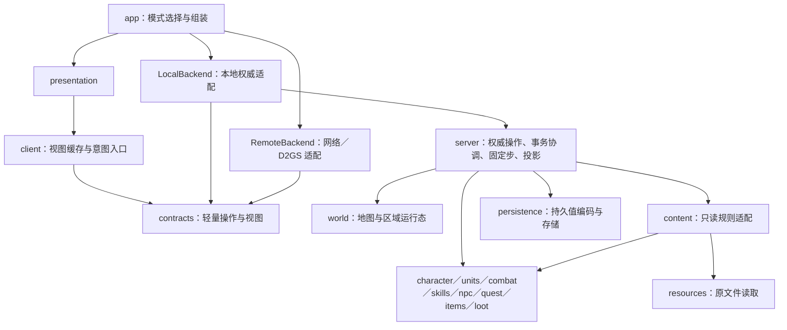

# 系统解耦与单机／联机技术改造方案

依据：2026-10-04 当前代码、[项目基线](../BASELINE.md)、[代码结构](ARCHITECTURE.md)、[参考项目设计](ARCHITECTURE_REFERENCE.md)和[联机边界](MULTIPLAYER_ARCHITECTURE.md)。本文维护当前进度与后续实施规范；未标为已实施的接口、目录和阶段仍为建议。代码事实、所有权和验证范围以对应模块基线为准。

当前进度如下。阶段按依赖推进，已完成的基础切片不代表整个阶段完成。

任务扩展源码（2026-10-04）：新增轻量任务目录及按幕 `QuestModule`，第一／第二幕 NPC、交谈、区域／死亡事件与日志规则已分文件，宿主只准备事实并执行效果。记录统一命名 `quests`，UI 读取实际任务列表与显示位置，D2S 任务编码独立；补第二幕 A2Q0 欢迎和材料确认。任务文字／原图统一由内容层绑定 MPQ，法杖配方、材料角色及卷轴从原表解析，宿主与显示共用；欢迎按原 ActIntro 记录选择。Windows Release 与简单 NPC／临时存档冒烟通过，补原地图标记生成杰海因并修正卷轴排除方块；源码纳入本次提交，未重打包，原运行包不覆盖本批。第三至第五幕可按[任务系统接入说明](QUEST_SYSTEM.md#接入第三至第五幕)逐幕登记；任务物件演出、全局／队伍资格及完整跨服务事务仍为剩余范围。

| 阶段 | 当前已实施 | 剩余范围／事实入口 |
| --- | --- | --- |
| P0 会话公共头 | `GameSession` 不透明外观、私有 `GameSessionImpl` 与调用方显式包含 | 完整状态查询仍保留兼容入口；模拟器尚未全面隔离，见[会话基线](baseline/SESSION.md) |
| P1 客户端契约 | 人物、库存、角色／技能、NPC／任务、商店／佣兵及自动地图／出口／传送点显示和手势；地图图形源读取接口 | 世界单位／物件／弹体、光照和其他资源／交互仍待迁移，见[客户端](baseline/CLIENT.md)、[地图](baseline/MAP.md)、[NPC／任务](baseline/NPC_QUEST.md) |
| P2 角色与保存 | `CharacterRecord` 保存值、成长、学习／选择／绑定规则、显式有效等级计算及活角色组合 | 活角色已分资料／资源／移动／动作／临时技能，操作者及多玩家上下文仍由单玩家世界组织，见[角色基线](baseline/CHARACTER.md) |
| P3 物品与来源 | 唯一物品状态／事务保留；第四项借用装备、独立需求／贡献／派生规则及已有授予／等级来源已接入并构建 | 多所有者上下文、friend 原子写入收口及真实装备充能／触发消费待实施，见[库存基线](baseline/INVENTORY.md) |
| P4 单位边界 | 怪物身份／生成／活动词缀、公共能力／内部记录分离；公共资源／移动／动作、玩家／佣兵控制和活角色组合已迁移 | 完整单位／区域所有者及更多 AI／物件能力适配待实施，见[怪物](baseline/MONSTERS.md)、[单位](baseline/UNITS.md) |
| P5 通用技能 | 当前已实现技能的 S1–S5 执行迁移；纯求值、来源、主动／武器／诅咒／持续／召唤请求、被动反应及光环 | 装备充能／触发、多玩家来源和未实现技能待接；见[技能基线](baseline/SKILL_RUNTIME.md) |
| P6 地图与区域 | 第六项解码地形／活导航组合、稳定区域资源缓存与休眠战斗状态、加载／切换编排及地图 UI／资源接口已接源码 | 随第七项构建和有限地图冒烟通过；世界物件与单位显示、光照及完整多区域所有权仍待拆，见[地图基线](baseline/MAP.md) |
| P7 NPC／任务与奖励协调 | 第七项接触／计划与奖励、第八项死亡结算，以及本轮按幕任务模块／目录、独立欢迎及任务编码 | 先前基础切片已构建／有限冒烟；本轮模块／NPC与保存亦已构建／有限冒烟，完整任务物件／跨服务事务和后续幕仍待接，见[任务系统](QUEST_SYSTEM.md)、[NPC／任务](baseline/NPC_QUEST.md)与[奖励](baseline/REWARDS.md) |
| P8 本地宿主基础切片 | 第九项命令／固定步分工、模拟阶段、绑定连续输入和 25 Hz 时钟；会话实现依赖收口 | 已构建／有限冒烟；完整查询／组装回调／friend 写入与操作者所有权待迁移，见[会话基线](baseline/SESSION.md) |
| P9–P10 | 保留本地单机权威路径 | 自有多人／D2GS 后端暂缓 |

九项基础切片收尾：第九项将会话命令／固定步、模拟阶段及本地连续输入分开，保留原 25 Hz 和 `tick(0)` 顺序，表现目标收窄会话链接；见[会话基线](baseline/SESSION.md)。第八项死亡／经验／掉落包括：独立 `EnemyDied` 与 NOTC 快照、首杀／死亡任务计划、经验／死亡波纯计算和顺序协调，由本地宿主执行任务物件、交付掉落和成长；生成值与库存实例拆头，旧混合实现已迁移删除，见[奖励基线](baseline/REWARDS.md)。第七项保留 NPC／任务／奖励协调：显式 `NpcAccess`、区域 NPC 路径和轻量交互几何；现有第一／第二幕交谈与进入区域规则产出计划，宿主先交付奖励再提交本人记录；卷轴翻译／灌注在库存草稿中完成消耗、创建、随机和 ID 准备。第六项地形／区域所有权及地图 UI／资源接口继续保留。入口和剩余边界见[NPC／任务基线](baseline/NPC_QUEST.md#npc任务与奖励协调第七项)与[地图基线](baseline/MAP.md)。

验证分开记录：本轮第八／九项完成 Windows Release 游戏与资源工具链接和简单移动、技能击杀、NPC、奖励及临时 D2S 恢复冒烟，见[会话收尾](baseline/SESSION.md#九项重构联合收尾与冒烟)。第六／七项通过 Windows Release 游戏／资源工具链接，以及阿卡拉分配／日志、卷轴翻译／重复交谈、阿特玛与区域入口、购买／移动结束交谈后拒绝、开发旅行及自动地图简单冒烟；未认证全部奖励、灌注、任务、存档往返或 Linux。前三项及第四／第五项的既有覆盖分别见角色、单位和 NPC／任务基线。九项基础切片已提交源码与文档，随后 2026-10-04 自动地图保存批次将其纳入 `dist/current`，并新增客户端 `AutomapExploration` 与应用侧 `.d2xmap` 保存连接，见[地图基线](baseline/MAP.md)；未新增测试程序，未改 D2S v96、保存语义、指纹、MPQ 或用户档，未实施多人或测量增量编译耗时。

目标：减少修改 `session.hpp`／`simulation.hpp` 引起的编译扩散，让人物、怪物、NPC、地图、技能、物品、库存、掉落和 UI 有明确职责；单机继续可用，后续联网通过外层适配接入。优先采用组合、领域服务、纯函数与小接口；不全面改写为 ECS，不为每种怪物／技能建立继承类，也不引入通用服务定位器或跨模块全局状态。

## 1. 改造起点与必须保留的基础

| 改造前事实与入口（历史起点） | 改造方向 |
| --- | --- |
| [`GameSession`](../src/gameplay/session/session.hpp) 拥有内容、区域、库存、掉落和交互，公开返回 `ClassicData`、`WorldState`、`InventoryService` | 分开宿主组装、权威操作与客户端查询；公共头不暴露内部服务 |
| [`Simulation`](../src/gameplay/simulation/simulation.hpp) 声明大量角色、技能、AI 和弹体函数；分散的技能 `.cpp` 仍实现它的成员 | 将具体系统变成独立实现，模拟器保留固定步编排 |
| [`PlayerState`](../src/gameplay/model/state.hpp) 混合成长、任务、库存相关记录与动作／战斗；`WorldState` 只有一个玩家和一个当前区 | 分开持久角色与运行单位；移除隐式“当前玩家”的领域接口 |
| [`CombatUnit`](../src/gameplay/combat/unit.hpp) 已提供公共战斗视图，但携带具体玩家／佣兵／怪物指针 | 保留公共伤害链，逐步收窄为能力与数据访问端口 |
| [`Region`／`WorldObject`](../src/world/region.hpp) 混合地图资源、物件定义、NPC 路径和动态操作状态 | 分开只读地形／定义、权威区域状态和客户端表现 |
| [`InventoryService`](../src/gameplay/items/inventory.hpp) 已有唯一位置、版本、权限、规划与提交 | 继续复用，补全多所有者上下文和窄查询，不重写第二套库存 |
| [`session_loot.cpp`](../src/gameplay/session/session_loot.cpp) 同时处理任务推进、首杀判断、生成及结算 | 抽出明确的死亡结算协调，保持旧资格快照和执行顺序 |
| [`SceneView`](../src/presentation/scene_view.hpp) 直接持有会话；绘制／资源实现包含会话头并查询整份状态 | 改用分领域视图、公开资源元数据与命令入口 |
| [`CharacterSaveData`](../src/gameplay/session/character_save.hpp) 包含整个 `PlayerState`，编码器实际只写部分持久字段 | 改为持久值对象，继续保持原 D2S v96 映射与未知字段保留 |

本节描述启动改造时的状态，不是当前实现清单；会话私有布局、角色保存值、技能执行与公共单位指针等已迁移项以上方进度表为准。

已成立的方向继续保留：MPQ → 类型化内容、生成计划 → 实例、UI → 命令、公共战斗／效果、物品事务、存档编码与文件 I/O 分离。`docs/baseline/DATA.md` 有明确标为历史的旧存档内容；当前保存规则以 [SAVES.md](SAVES.md) 和代码为准。

## 2. 目标职责：人物、角色、控制器分别表达

“人物／单位”指场景中的可移动、可执行动作对象；“角色”指玩家持久成长与所有权记录；“控制器”决定发出什么动作。这三者不要求合并成一个基类。

| 模块 | 拥有与处理 | 提供的边界 | 不承担 |
| --- | --- | --- | --- |
| `core`／公共契约 | ID、坐标、简单枚举、操作与视图值类型 | 小型头文件 | 完整角色、技能定义、资源或服务对象 |
| 角色 `character` | 职业、成长、学点、任务记录、钱包、角色身份；属性派生 | `CharacterService`、角色／装备属性输入 | AI、绘制、网络或背包布局 |
| 单位 `units` | 实体运行态、资源、动作、效果、阵营、主人与区域归属 | 单位读端口、动作请求、战斗端口 | 所有玩家任务／仓库、MPQ 读取 |
| 怪物 `monsters` | 真实身份、生成、AI 决策与专属行为 | AI 参数、动作／施法请求 | UI、玩家学习规则、私有库存 |
| NPC `npc` | 移动、交互资格、对白选择、商店／鉴定／雇佣业务 | `NpcService`、交易／对白结果 | 直接写玩家私有状态或持有 GPU |
| 技能 `skills` | 定义求值、通用施法流程、主动行为、被动贡献与光环 | 已解析施法参数与窄世界端口 | 查询 `PlayerState`、技能树、完整装备／怪物对象 |
| 战斗／效果 `combat`／`effects` | 关系、命中、承伤、状态、反应、死亡事实 | 伤害／效果请求与结果 | 掉落抽取、角色磁盘保存 |
| 物品 `items` | 定义与实例、原属性、品质、数量／耐久／充能 | 只读物品查询、可信创建／修改接口 | 替人物推断学点或管理面板 |
| 库存 `inventory` | 容器、所有权、位置、交换／合并／装备事务 | 带操作者的事务与只读投影 | 第二份可变物品实例或命中公式 |
| 掉落 `loot` | TC／品质生成、随机流、限量记录、一次结算 | 已解析 `LootContext` → 掉落计划 | 回查 UI、默认使用本机角色 |
| 任务 `quest` | 按角色的进度与奖励资格、共享世界触发规则 | 转移／奖励计划与世界变更请求 | 所有权不明的全局任务簿 |
| 地图／世界 `world` | 地形、碰撞、房间、出口、区域运行态、物件状态 | 导航、空间查询、区域转换与地图视图 | GPU 或以本机相机决定权威推进 |
| 内容适配 `content` | MPQ 原表 → 类型化规则／表现定义 | 分领域只读目录 | 活世界状态；玩法不反向读取 MPQ |
| 权威宿主 `server` | 组装服务、可信操作者、固定步、跨领域事务与投影 | 操作提交、宿主生命周期 | 面板、设备输入、纹理 |
| 客户端 `client` | 公开单位副本、本人的界面数据、操作结果、连接状态 | 只读查询与意图提交 | 其他玩家完整角色或权威伤害／物品结算 |
| 表现 `presentation` | 输入命中、面板、地图／单位／技能动画、声音和 GPU | 消费视图与表现消息 | 修改真实状态或调用内部服务 |
| 网络／存档适配 | 网络编码／连接；D2S 编码／文件保存分别实现 | 契约 ↔ 字节；持久值 ↔ 文件 | 将 C++ 内存布局直接当协议／存档 |

所有玩家的数据在权威侧存在，但每个客户端只接收自己的必要任务／库存视图和其他可见单位的公开状态。交易报价、队伍状态、门开启等单独投影，不因此发送全部私有数据。

## 3. 依赖与目录方案



图示是目标依赖，不是当前 CMake。客户端资产加载另走只读表现目录和资源适配，不能因画技能图标而获得权威会话。单机 `LocalBackend` 与客户端可以同进程，通过值消息／稳定只读投影通信，不必序列化或开套接字；它也不能绕过权限与领域事务。

建议目录先沿用现有组织，仅增加必要边界：

```text
src/contracts/            # 分领域意图、查询结果、表现消息；只依赖轻量公共类型
src/client/               # 视图缓存、backend 接口、本地／远端适配
src/gameplay/character/   # 成长、角色记录、学习／选择、属性派生
src/gameplay/units/       # 公共运行态、动作、单位访问端口
src/gameplay/{combat,effects,skills,monsters,npc,quest,items,loot}/
src/world/               # 地图定义／资源配方与区域状态分开
src/server/              # 会话组装、可信命令、世界编排、投影；由旧 session 逐步迁入
src/{content,resources,persistence,presentation,app}/
```

`inventory` 可以先保留在 `gameplay/items` 中按文件划分，不为目录整齐单独重写服务或立即建库。现有 `model/definitions.hpp`、`model/state.hpp`、`skills/spec.hpp` 按真实消费者拆分，禁止重新集中成同样大的 `contracts/all.hpp`。兼容适配仅保留在迁移边界，不能复制整份状态形成两个权威拥有者。

## 4. 公共接口与状态生命周期

### 4.1 客户端入口

以下是形状示意，不是可直接落库的最终声明：

```cpp
// 分文件定义值类型；无 PlayerState、GameSession、Archives 或 GPU 类型。
struct MoveIntent { Vec destination; };
struct SkillIntent { int skillId; Vec target; EntityId targetUnit; };
struct InventoryIntent; // 用物品句柄／版本及操作表达，不传权限对象。
struct ActorView;       // 外观、区域、位置、朝向、动作及可见状态。
struct OwnCharacterView;
struct InventoryView;
struct PlayerIntent;    // 包装分领域操作；完整定义放独立契约头。
class ClientModel;

// 后端实现位于 LocalBackend / RemoteBackend 的 .cpp。
class IClientBackend {
public:
    virtual ~IClientBackend() = default;
    virtual void submit(const PlayerIntent& intent) = 0;
    virtual void pump(ClientModel& destination) = 0;
};
```

`PlayerIntent` 是分领域操作的有限集合，与管理操作分开；客户端查询可按人物、地图、库存、技能／任务、NPC 拆接口或视图，不增加一个含上百方法的总接口。异步提交返回后，权威操作结果再更新视图；本地模式遵守相同语义。库存预览只是提示，正式执行仍复验，失败返回领域错误供 UI 显示。

若内部用 `variant` 聚合操作，完整聚合头只给调度／适配实现包含；UI 通过分领域提交适配使用小型操作头，避免修改一个技能命令就让所有面板重新编译。公开查询同样按用途组织，不能只把 `state.hpp` 换成同样庞大的 `client_state.hpp`。

快照按权威步生成、客户端按变更更新和渲染插值，不每个渲染帧复制地图／背包。借用视图或 `span` 的有效期必须明确到本次读取／投影版本，禁止跨步保留裸指针。地图资产以区域／内容版本句柄缓存；旧场景引用释放后才能卸载。网络消息不携带指针、内部容器下标或 `std::variant` 内存。

### 4.2 权威角色与单位

| 建议状态 | 生命周期及所有者 |
| --- | --- |
| `CharacterRecord` | 角色持久字段与原生未知段保留信息；角色服务拥有，存档层编码 |
| `PlayerContext` | 本局操作者、角色记录引用、单位 ID、所在区、容器 ID、临时交互／拾取／出口请求；权威宿主拥有 |
| `UnitRuntime` | 位置、动作、生命／法力／耐力、状态与战斗随机流；单位／动作系统拥有 |
| `MonsterRuntime`／`NpcRuntime` | 专属身份、AI／路径／交互状态；关联单位或物件，而非附带整个角色记录 |
| `RegionRuntime` | 怪物、弹体、掉落索引、动态物件和碰撞变更；区域系统拥有，每区只有一份 |
| `ClientModel`／`ViewState` | 权威投影副本／本地 UI 状态；客户端拥有，不能反向写权威状态 |

临时兼容 `PlayerState` 的阶段必须引用或适配已有字段，迁移一个字段才改变其唯一所有者，不能同时双写新旧结构。角色持久身份、连接身份与本局 `EntityId` 分开；当前本局 ID 继续使用既有分配器，进入新局不承诺跨局稳定。

公共单位优先是组合结构加访问端口；需要可替换实现时使用小抽象接口。规则特例以能力／分类明确表达，不把玩家中毒、怪物免疫、尸体与召唤寿命强行统一。Hydra 等零生命但独立活动的单位不能用 `hp > 0` 概括存在性。门、箱、祭坛和地面物品也不必继承可战斗单位。

### 4.3 技能输入与物品来源

技能分为只读定义、一次执行参数、施法动作、持续效果／光环实例。权威侧的角色、怪物或装备来源模块准备等级、协同和修正，再交给通用执行。客户端只提交意图；不会通过网络提交可信等级、伤害或装备属性。

技能来源记录施法者、控制归属、原技能 ID、来源标识和消耗策略。装备充能／触发技能保留物品句柄与版本；扣资源、弹药／充能、起手和释放的阶段按原规则处理，来源变化时按规则复验。不是所有参数都统一起手快照：哪些在起手确定、哪些在命中读取，以原行为为准。

`resolveSkill` 已接受显式 `SkillEvaluationInput`，等级、协同及专精修正由来源准备；现有行为处理器通过 `ISkillWorld`／`ISkillWeaponWorld` 获取单位查询、伤害、导航、飞弹、召唤和物件能力。后续按真实消费者继续收窄端口，避免扩成新的总会话接口。召唤处理向世界提交生成请求，不直接操作 `Enemy` 容器。被动按来源刷新属性／反应能力，光环由权威侧维护发射实例和目标效果；客户端只负责已授权的预演和表现。

### 4.4 跨领域协调

纯计算用值输入／结果；改变一个领域通过其服务；跨领域操作由权威应用服务显式规划、验证、提交。事件用于已经发生的事实与表现通知，不能用不确定的订阅顺序决定物品消费、任务奖励或交易提交，也不需要分布式事务框架。

死亡结算由 [`settleMonsterDeaths`](../src/gameplay/rewards/death_settlement.cpp) 协调，[本地适配](../src/gameplay/session/session_deaths.cpp)提交，须保留关键顺序：先取得旧任务阶段对应的首杀资格，再推进任务并按既有顺序产生奖励／普通掉落。死亡事实保存真实身份、区域、来源／击杀归属、MF／GF 和随机上下文；UI 消息不携带这些内部事实。已结算 ID 保持本局唯一，断线重连不能清空它；新局重置仍遵守现有保存规则。

学习奖励、NPC 购买、方块合成、任务物品提交等涉及多个状态，失败时应保留原状态，成功后再发布变更。回调可以作为小接口的实现手段，但不得捕获一个隐式本机角色后在所有玩家路径复用。

## 5. 分阶段执行清单

按小范围提交推进，每批同时更新调用方和文档，不让迁移后的接口与旧旁路长期并存。下表给出依赖；每阶段的完成标准是静态审阅目标，不能自动视为已编译或已实机验收。

| 阶段 | 前置 | 可交付范围 | 完成标准 |
| --- | --- | --- | --- |
| P0 公共头隔离 | 当前代码 | `GameSession` 不透明实现、领域值头整理 | 私有成员／实现函数变化不要求修改公共会话头；不宣称全部消费者已隔离 |
| P1 客户端契约与适配 | P0 | 操作、投影、旧会话本地适配；逐面板迁移 | 表现层不再查询完整会话／世界／库存服务 |
| P2 角色与持久值 | 完整角色接口依赖 P1；独立保存值可在 P0 后先准备 | 成长、属性、学点、保存值；显式角色上下文 | 角色接口不依赖会话／模拟器；D2S 语义保持 |
| P3 物品与库存边界 | P1、P2 | 多所有者上下文、装备贡献、窄查询 | 单份物品状态和事务保留；来源／权限明确 |
| P4 单位、动作与控制器 | P2 | 公共运行能力、玩家／怪物／佣兵／NPC 决策分离 | 公共动作可指定单位，消费者不访问具体类型指针 |
| P5 通用技能／被动／光环 | P3、P4 | 先主动行为，再贡献与光环 | 技能执行不包含角色／怪物完整状态或会话／模拟器头 |
| P6 地图与区域归属 | P1、P4 | 地图资源／运行状态／表现分离；显式区域服务 | 区域状态唯一，导航引用稳定，切区不重刷 |
| P7 NPC、任务与掉落协调 | P2、P3、P5、P6 | 交互应用服务、奖励／首杀结算、宿主瘦身 | 有操作者与明确执行顺序，规则不反向查询 UI |
| P8 权威宿主与本地连接 | P1–P7 | 本地游戏服、客户端连接、固定步投影 | 单机所有正式操作经过同一权威入口 |
| P9 D2X 多人／传输 | P8；选定自有后端 | 多玩家／区域调度、协议、连接、同步 | 私有与公开投影分开；重连不重置共享世界 |
| P10 既有 D2GS 适配 | P1；目标版本明确 | 独立远端后端；互通范围按包与地图核对 | 不运行第二套权威规则，不假定所有字段／版本兼容 |

P0–P8 改善当前系统并建立可复用的本地玩法路径；P9 与 P10 是后端路线分支，**不要求两条都实现**。如果明确只做原服客户端，可以优先 P1／P10 并缩减不再使用的自有玩法改造。联网路线应在进入 P9 前决定，不能因预留接口就默认需要实现完整账号、大厅、数据库集群。

### P0：降低头文件改动传播

- 入口：`session.hpp`、`simulation.hpp`、`model/{definitions,state,commands,events}.hpp`、`skills/spec.hpp`、`CMakeLists.txt`。
- 将会话私有字段和实现声明迁到 `Impl`，构造／析构放 `.cpp`；内容目录、区域、库存和临时请求不出现在公共对象布局。此阶段现有 `state()` 等可暂留适配。
- 按消费者拆值类型；不把大型内联查询移到另一个公共头。`Simulation` 的不透明化与系统抽出逐项进行，不为消除一个 include 复制数据。
- 审阅完成条件：检查 public include 的实际闭包、所有调用点与析构完整类型要求；增量编译收益未测量前不写百分比。

### P1：先迁移一条完整操作链，再覆盖所有 UI

- 入口：`presentation/controller.*`、`scene_view.*`、`scene_assets.*`、`presentation/{inventory,hud,npc,actors,world}`。
- 先接“移动意图 → 本地适配 → 当前会话 → ActorView → 场景绘制”，沿用现有模拟；随后依次接库存、人物／技能面板、NPC／任务、地图／出口。
- `SceneAssets` 改用表现目录／外观信息／地图资源句柄；技能提示、物品名、装备组件不再通过 `session.content()` 获得全部原表。
- 将 `GameEvent` 拆成内部事实与客户端消息，补足 actor／接收者语义；手势消费、面板关闭、目标锁定顺序保留。
- 完成后公共表现代码不包含 `session.hpp`、`simulation.hpp`、完整 `model/state.hpp` 或 `InventoryService`；本地适配实现可以包含它们。

当前 NPC／任务切片：`IQuestClient` 提供本人显示结果；`INpcClient` 提供对白、菜单、任务提示、货架／单项提示／报价与佣兵详情／候选，转发窄服务意图。任务阶段／旗标、携带材料、隐藏赌博结果和地图种子只在本地适配中解释；完成事件按每次转换携带完成标志。第六项地图／出口／传送点与地形图形源已迁移；世界任务物品命中、单位／物件显示和其他资源目录仍待拆，交易和任务跨领域事务属于 P7。

### P2：角色成长、学点与保存边界

- 入口：`character/attributes.*`、`session_character_stats.cpp` 的 `refreshCharacter`／`equipmentActor`、`session_skill_sources.cpp`／`session_skills.cpp`、`session.cpp` 的经验／学点分支、`character_save.hpp`、`session_character_save.cpp`／`session_restore.cpp`、`persistence/d2s_*`。
- 拆 `CharacterRecord`、属性派生与角色技能学习／选择服务；任务奖励输入显式表达，不默认读本机任务簿。
- 容器实例仍由库存服务拥有，角色只关联容器／所有权；装备结果由实例与内容定义计算，不额外持有可变装备副本。
- `PlayerContext` 先覆盖单个玩家，但全部新入口显式接收上下文；施法动作和运行资源逐步移到单位态。
- 纯数据移动不能改变 D2S 位、原生未知段、物品掷值、佣兵恢复等语义。派生值重算，临时效果不入档；不增加私有磁盘格式或自动迁移。

### P3：物品、背包与装备贡献

- 入口：`items/{state,operations,inventory,equipment*}.*`、`session_inventory.cpp`／`session_item_snapshot.cpp`／`session_consumables.cpp`／`session_gold.cpp`、`content/items/equipment_*`。
- 保留现有 `ItemInstance`、唯一 `ItemLocation`、`ItemHandle` 版本和规划／提交；多玩家通过容器 owner 和 `InventoryAccess` 区分，客户端不能提交权限对象。
- 装备模块提供需求／属性贡献／技能来源；库存模块处理位置、装备组合、数量、充能与耐久。属性需求闭包、替换旧装备排除、武器组规则保持原顺序。
- UI 改用本人库存／地面物品投影，拖拽保留版本，确认成功才修改可见权威库存；预览通过统一规则或服务器反馈，不能当授权结果。
- 同时清理会话对库存私有状态的 `friend` 写入；替换为原子领域操作或限定的快照恢复入口，不暴露万能可写 `state()`。

当前第四项已完成已有装备需求／贡献／派生与技能来源的代码迁移，调用方及 CMake 同步，并随第五项通过 Windows Release 与代表性佣兵装备路径。角色刷新、保存恢复、佣兵及装备预览使用借用装备；内容层不再实现战斗贡献规则。未重做全装备／来源或存档回归；此切片不包括新增充能／触发玩法，也未收口全部 friend 写入和多所有者权限，完整 P3 继续按上方范围实施。

### P4：共用单位，分开控制策略

当前基础切片已分离 `MonsterIdentity`、生成指令与活动词缀，目录及 AI 声明使用窄类型；死亡／掉落／经验共享原结算时机的奖励值快照，诊断战斗查询按单位 ID 取当前词缀。怪物拆头与技能批次曾通过 Windows Release 和冒烟；后续公共视图与内部记录绑定已分离，并通过本批 Windows Release 与简单冒烟。最新续批已抽出公共中毒／开放伤口固定步结算与药剂／佣兵恢复队列，借用状态能力替代对应具体记录访问；Windows Release 通过，部分中毒／饮药现场后按用户要求暂停冒烟，未提交或打包。后续按用户选择已完成第一项公共资源／效果推进：自然生命／法力、耐力、怪物／召唤物与佣兵恢复、减速期限及移除效果后的耐力处理已归 units；效果集合到期复用原 CombatEffectSet。后续第二项公共动作／控制也已迁移：共用路线移动、秒／帧时钟、速率重算与取消，玩家／佣兵纯控制与本地适配分开，怪物原事件执行从 AI 主流程分出；第三项活角色组合已迁移，怪物状态独立拆头，保存映射／技能来源准备和客户端适配同步接入；前三项按本轮授权通过 Windows Release 与简单冒烟，并修复首次野外读档的暂停渲染贴图源遗漏。多玩家／区域所有权、所有 AI 能力适配与宿主仍待迁移，暂不实施多人联机。完整单位能力、跨区查找、具体执行与客户端投影仍未完成，见 [怪物基线](baseline/MONSTERS.md) 和 [单位基线](baseline/UNITS.md)。

- 入口：`combat/{identity,relations,unit,damage_request}.*`、`simulation/unit_records.*`、`player/movement.cpp`、`combat/{attacking,weapon_attack}.*`、`monsters/*`、`npc/{movement,hireling}.*`、`Simulation` 的单位查询与更新。
当前 `CombatUnit` 是权威调用内的短期能力视图，包含借用的资源／效果指针及属性快照；内部 `RuntimeCombatUnit.records` 负责具体记录绑定，二者不创建第二份活动单位。`skills/world_values.hpp` 只保留尸体／光环值，未重新复制战斗模型。未封顶抗性取值归纯 `rawResistance`，原减伤、冷时长及截断位置保持。公共能力指针不能作为网络字段，也不返回给可写客户端。

- 单位注册／查找通过 ID 和区域，派生属性由来源模块提供；身份、阵营、主人、队伍和外观继续独立。
- 将公共移动、动作、资源和持续效果推进抽出；玩家意图、怪物 AI、佣兵 AI、NPC 原路径分别调用。不同家族仍按数据与已核实专属处理器分派。
- 具体 `PlayerState*`／`Enemy*`／`HirelingState*` 已收在内部 `RuntimeCombatUnit.records`，公共 `CombatUnit` 不再携带这些指针；完整动作／控制适配仍需迁移。特有规则用明确能力或分类保留，中立 NPC 不转为敌人。
- 任何扩容、切区或删除后重新按 ID 查询，不让单位视图／引用跨越容器修改；召唤 owner、转换归属和死亡收益保持原规则。

### P5：技能按行为迁移，不按职业复制

- 入口：`skills/spec.hpp`／`cast_spec.hpp`／各行为参数头、`resolve.*`／`summon_resolve.*`／`projectile_path.*`／`casting.cpp`／各效果文件／`aura.*`、`effects/state.*`／`skills/reactions.cpp`、`session_skills.cpp` 及 `Simulation` 技能回调。
- 先分角色学习／来源准备与通用执行；角色、AI、装备适配器准备同一种已解析输入。大型技能定义按行为家族拆头，原技能 ID 不变。
- 按“直接伤害／普通飞弹 → 范围／持续／引导 → 武器技能 → 召唤／物件操作”逐批迁移；具体先后以共享动作和端口是否齐备为准。每批同时迁移动作中断、消耗与表现消息。
- 再迁被动属性贡献／事件反应，最后光环发射实例、周期目标筛选与效果到期。来源注销、死亡、跨区、覆盖与抑制按原规则清理，不能统一猜定。
- 技能公共执行不查询学点、角色任务或完整装备，也不依赖 `Enemy`；目标类别／抗性通过公共战斗能力，生成通过世界端口。停止反向捕获整份会话的查询回调。

当前已迁移：技能处理器不再实现 `Simulation` 成员，玩家 Blaze／Thunder Storm 已从怪物文件移出；武器技能／突进、飞弹专属命中、状态反应、光环与原生怪物效果均通过权威端口执行。剩余是完整单位／来源所有权、装备充能／触发及未来多玩家接入；原生怪物动作保留已有参数与事件规则，不能直接套用玩家法力／FCR。

头文件优化不以降低引用数为唯一目标。稳定的小型值契约与接口可以广泛共享；基础伤害、怪物战斗／AI 值、状态和技能表现描述已拆头，`monster_spawn.hpp` 仅保留生成指令，公共单位不再传递具体状态记录。后续重点是 `model/state.hpp`、`simulation.hpp` 的真实所有权与消费者依赖，不重复建立技能模型或用新的聚合大头替代旧头。源码证据和共享边界见 [通用技能基线](baseline/SKILL_RUNTIME.md#公共头的共享合理性)。

| 批次 | 可交付范围 | 完成标准与前置 |
| --- | --- | --- |
| S1 定义与求值 | 分开学习／显示元数据、行为定义和已解析输入；光环／被动求值归技能领域 | 等级、协同与加成由来源传入；纯求值不含会话、模拟器、完整人物／怪物、原表或 GPU；原 MPQ 适配留在内容层 |
| S2 单位能力与来源 | 按单位 ID 提供施法所需动作／资源能力；角色／怪物准备相同输入，装备准备来源资格／消耗 | 完成 P4 的最小能力切片与需要的 P3 来源边界；唯一运行态、借用寿命、起手／释放复验明确，后续重新求值不绑定当前玩家 |
| S3 普通主动行为 | 抽出起手／释放及普通飞弹行为，同时迁移一条玩家和一条怪物既有调用链 | 共同处理器不含 `PlayerState`／`Enemy`／`Simulation`；保留原动作事件、角色／怪物差异、资源消耗、命中与随机顺序 |
| S4 其他主动行为 | 按持续／范围／引导、武器、诅咒、召唤／物件逐批迁移 | 按需提供空间、战斗、生成和物件端口；每个来源支持范围明确，移除对应旧旁路及模拟器内具体实现声明 |
| S5 被动与光环运行 | 来源贡献／事件反应、发射实例、周期筛选、目标效果与清理 | 同一生命周期适配玩家、怪物及已支持装备来源，保持原抑制／覆盖／消耗／死亡／离区规则；原效果系统继续复用 |

充能装备不是独立施法单位：来源引用装备实例，施法者是其携带者。S1–S5 已迁移当前已实现技能及其既有玩家／怪物调用链，该执行迁移批次通过 Windows Release 与代表性技能冒烟；后续公共单位清理也已通过 Windows Release 与三职业简单冒烟。表中未来装备来源、消耗事务与多玩家生命周期仍是前置工作，未自动开放新技能。单机和自有联网复用权威执行；远端客户端不提交可信等级、伤害或加成。

### P6：地图资产、权威区域和客户端视图

第六项基础切片已接入并随第七项通过构建及有限地图冒烟：解码地形、固定区域资源槽位、休眠战斗状态、本地加载／切换编排及客户端地图／资源接口分别承担职责。UI 不再解释原出口记录、传送点排序或连续地面图；资源接口不返回权威网格／物件。当前仍一个活区在模拟器中推进；世界单位／物件绘制、屋顶／光照与完整物件组件继续保留兼容入口，不能称完整 P6 或全客户端隔离完成，见[地图基线](baseline/MAP.md)。

- 入口：`world/{region,map,map_assembly,room_activation,population}.*`、`session_exits.cpp`／`session_objects.cpp`、`presentation/world/*`。
- 将只读地图定义／资源配方、动态物件／NPC／碰撞变更、客户端瓦片／光照／自动地图缓存分开；`WorldObject` 不再同时承担所有职责。
- 当前区查询改为按角色／区域显式查询。每个区域只有一份运行态，不为每个玩家复制一份怪物、物件或掉落；两玩家可引用同一区。
- 模拟借用网格和房间索引必须有稳定所有者／句柄；地图卸载、对象开门和任务拆墙后的碰撞重算，在权威步骤完成再投影。
- 此阶段可保持单玩家激活策略；多人房间激活与调度在 P9 实施。客户端相机／兴趣和服务端模拟激活是不同接口，不能把 `active()` 改名后继续混用。

### P7：NPC、任务、掉落与跨领域事务

第七项已完成接触／NPC 路径、现有交谈和进入区域转换计划、奖励执行及卷轴／灌注原子替换，入口、验证与限制见[NPC／任务基线](baseline/NPC_QUEST.md#npc任务与奖励协调第七项)。第八项死亡事实／首杀任务计划、经验／死亡波计算、掉落规划与顺序协调已接入并随收尾构建／有限冒烟，见[奖励基线](baseline/REWARDS.md)；下列完整阶段目标不因切片完成而全部标记已实现。

- 入口：`npc/*`、`quest/*`、`session_interaction.cpp`／`session_quest_dialogue.cpp`／`session_quests.cpp`／`session_act_two.cpp`、`session_loot.cpp`、`loot/*`、`content/{items,monsters}/*loot*`。
- NPC 移动进入单位／区域推进；交互服务显式接收操作者、NPC、距离和访问状态。商店、赌博货架哪些共用、哪些按玩家，须按原规则核实，不随拆分猜定。
- 各任务规则读角色记录与世界事实，产出奖励／物件变更计划；私人进度与共享门状态分开。第二幕协调逐项抽出，不把第一幕 API 直接删除后失去现有调用。
- 独立死亡结算协调保存首杀资格快照、经验／佣兵归属、任务奖励与 TC 生成顺序；`LootSystem` 保留去重、限量与随机流。
- 掉落接收真实怪物身份和已解析击杀上下文，不查“当前角色”。多人 NoDrop／资格缩放属于后续规则核实，不能以模块拆完宣称已完成。
- NPC 交易、合成和任务物品提交通过明确应用服务协调库存与角色，失败不先扣钱／删除物品；对外消息只公布允许显示的结果。

### P8：权威组装、本地宿主与固定步

第九项本地基础切片已收尾并构建／简单冒烟：会话命令／步进和模拟阶段分开，连续方向／跑步意图经客户端绑定合法玩家 ID，应用使用独立 25 Hz 累积器；原中立调试步进、零时间事务和暂停顺序继续保留。初始化回调、兼容查询与 friend 写入尚未全面迁移，不称完整 P8；见[会话基线](baseline/SESSION.md)。

- 入口：残余 `session.*`、`simulation.*`、`app/application.cpp`／`input.cpp`、`app/debug/*`、存档调用与 CMake。
- 将旧会话逐步收为权威宿主与应用服务，`Simulation` 只编排系统；初始化依赖由 `app`／宿主工厂显式注入，不由领域服务创建其他领域服务。
- 本地连接绑定合法玩家上下文；键盘方向、走跑等现有 `tick` 旁路变为明确定义的玩家输入。恢复存档、创建／关闭世界、调试命令属于宿主接口，普通玩家意图不可调用。
- 固定步顺序逐条以 `GameSession::tick` 和 `Simulation::tick` 为准：记录现有命令、效果、技能、AI、死亡、任务、拾取／交互和切区的实际顺序后迁移，不按模块列表随意重排。继续保留 25 Hz 和既有 `tick(0)` 语义，暂停策略单独由宿主决定。
- 权威状态先保持单线程拥有；后台加载／网络只能交付不可变数据或队列，不能直接修改世界。每个固定步结束发布稳定投影／操作结果，客户端缓存再更新。
- 单机读档可以建立新世界，但不能作为未来“加载另一个玩家”的实现；角色恢复与世界重建接口分开。

### P9：D2X 自有联机，按角色和区域推进

- 只有选定自有游戏服后实施。增加玩家注册／退出／重连、每玩家请求状态、区域归属及跨区迁移；全局时间一致，各区域拥有独立运行态。
- 服务端命令封套由连接映射确定 actor，携带请求序号／会话上下文；检查区域、目标、权限、来源版本和动作资格，不相信包内自报玩家 ID。重复或旧请求不能重复消费／领奖。
- 服务器维护多观察者房间激活与需要继续推进的活动；两玩家不同区不会反复替换同一个 `state_.area`。光环、召唤、飞弹、门户和掉落归属按已核实规则处理。
- 协议先实现进入世界、实体进入／更新／离开、本人角色／库存／任务、操作结果与表现消息；明确版本、消息边界、快照基线、权威帧和事件去重。不要直接序列化 C++ 结构。
- 本人私有数据与场景兴趣分开订阅，远端角色只公开必要状态。客户端菜单不暂停世界；断线保存由服务器处理，不运行客户端本地全局 `restore`。
- 网络解析／连接实现仅在外层；客户端预测先暂缓，之后只复用需要的移动／公式计算，不另行结算 AI、伤害或掉落。

### P10：原版 D2GS 兼容路线

- 先明确目标补丁／模组、MPQ、账号／角色托管方式与离线宿主需求。参考来源见 [联机设计](MULTIPLAYER_ARCHITECTURE.md#4-原版私服有哪些现成资料)，现成协议代码可提供证据，不直接纳入玩法库。
- 在 P1 的后端边界加入 D2GS 协议适配，按连接、角色初始化、地图、单位动作、技能效果、物品／库存、NPC／任务分别核对数据是否足够。不能因机器人能登录移动就宣称完整图形客户端可用。
- 客户端状态从原服消息生成；服务端未发送的字段保持未提供或通过明确支持的查询取得，不在本机猜造。UI 必须能够表达等待／不支持，而非默认读取不存在的完整角色。
- 原种子地图重建、碰撞、方向／动作节拍和规则版本需独立核对；当前 DRLG 适配不能自动与原服互通。服务端 DLL 的平台限制留在宿主，不带入公共玩法／客户端接口。
- 该路线不用本地 D2X 规则同时结算网络世界。保留本地后端时，两种模式共用 UI／契约，不承诺两种权威实现行为完全一致。

## 6. C++20／CMake 实施约束

- 先隔离头文件和所有权，再按稳定边界拆目标；无需一个类一个库。可逐步形成 `d2x_contracts`、`d2x_client`、`d2x_local_backend`、`d2x_server`、可选协议目标；现有 `items`／`gameplay`／`navigation` 优先复用。
- `d2x_presentation` 最终依赖客户端查询／表现目录，不公开链接权威会话；本地后端单独链接权威服务，由应用选择。仅联网客户端的组装路径不应强制链接本地服务端。
- `PUBLIC` 只用于公共头实际需要的依赖；实现依赖用 `PRIVATE`，但核对静态库最终链接需求。raylib 可出现在表现层公开类型中，不能进入规则／契约；Win32 仅留平台适配。CMake 不因目录改名而遗漏旧消费者。
- 公开 API 不返回 `ClassicData&`、`WorldState&`、`InventoryService&`、可写容器或内部 `Enemy*`。可替换边界使用抽象接口，内部固定实现优先具体服务和纯函数；不为每个 getter 加虚函数。
- `unique_ptr<Impl>` 对象的构造／析构在实现定义；使用明确的借用寿命，避免默认 `shared_ptr` 所有权网。内容只读目录可以共享，但不能借此让活状态多处可写。
- 属性／掉落／技能求值不引入 socket、设备、GPU 或文件句柄。UI 错误文案与资源翻译在客户端，领域结果使用类型化错误；不要把 `state_.message` 作为未来唯一结果通道。
- 状态修改提交成功再公布结果；无原表／未核实规则继续明确暂缓，不通过重构填入自造参数。学习、品质、掉落、覆盖、多人资格等规则变化应独立成批，不能夹带在接口迁移中。

## 7. 分步交付与人工验收

每批交付应写明：入口及职责迁移、删去的旧旁路、状态唯一拥有者、公共依赖变化、规则／随机顺序是否保持、未完成范围。保留临时适配时标明退出条件；下一批不扩展旧大接口。跨领域公共接口、CMake 和存档由实施集成方统一收尾，避免同时修改。

遵守 [AGENTS.md](../AGENTS.md)：**不编写测试脚本、测试用例或专用测试程序；默认不构建、运行检查或打包。**此前技能及前三项公共单位／活角色批次按当轮授权完成构建和简单冒烟；第四／第五项按后续授权完成 Windows Release 与有限交易／佣兵装备冒烟。第六项原按要求暂不验证，已随第七项后续授权完成 Windows Release 与有限交谈／卷轴／交易接触和地图显示冒烟。第八／九项后续按本轮授权共同构建／简单冒烟，并收尾提交源码／文档；实际范围见会话与奖励基线。未打包。下表是各模块验收重点，实际覆盖只以对应基线证据为准；记录结果时注明源码批次与包版本，不能复用旧证据认证新改动。

| 改造范围 | 使用既有入口的验收重点 |
| --- | --- |
| UI／本地连接 | 移动、面板手势、目标选择、暂停／零步提交、操作结果与错误提示 |
| 角色／保存 | 升级／学点／重置、装备派生、原 D2S 独立产物保存恢复；不覆盖用户档 |
| 物品／库存 | 过期句柄、满包、交换／合并、两组武器、充能／数量、失败状态保留 |
| 单位／技能 | 玩家、怪物、佣兵、召唤共用动作；中断、死亡、来源移除、被动／光环到期 |
| 地图／交互 | 出口和连续边界、返回不重刷、门／拆墙碰撞、NPC 服务与任务物件 |
| 任务／掉落 | 首杀与后续击杀、真实身份、资格／奖励顺序、重复死亡不补发、暂缓规则 |
| 联机分支 | 同区与异区玩家、远端可见状态、私有库存隔离、跨区／退出／重连、重复请求 |

### 下一步执行顺序

1. **P4 单位与 P2 活角色所有权**：以 `simulation/unit_records.*` 为适配边界，公共周期伤害、自然资源／耐力、恢复队列和减速期限已抽出，效果集合到期复用既有领域实现；公共移动／动作时钟与玩家／佣兵控制已拆，怪物事件执行与家族决策分开，NPC 路径共用移动能力；活角色已组合拆分、怪物 AI 改含独立状态头，前三项已构建与简单冒烟。下一步完善怪物 AI 与世界物件的能力适配；完整多玩家／区域拥有者仍待实施。先保留原存储和固定步顺序，随后按 ID／区域建立唯一所有者；不让技能重新读取完整状态。
2. **P3 物品与技能来源**：第四项装备贡献／需求／派生与已有授予／等级来源已拆并随第五项构建；后续收口容器 owner／friend 库存事务，再按核实规则接真实充能／触发及消费时机。权威侧复验等级、来源、物品版本与资格，客户端只提交使用意图。
3. **P1 剩余表现与 P6 区域**：第五项交易／佣兵和第六项地图投影／手势、地图资源入口及区域基础所有权已接入；第六项已随第七项通过构建及有限地图冒烟。后续迁移世界单位／物件绘制、屋顶／光照和其他资源查询，完善物件组件与显式多区域生命周期，保持导航借用稳定。
4. **P7／P8 跨领域事务与宿主**：第七项已拆交互几何、NPC 路径、任务交谈／进入区域计划、奖励执行和物品替换；第八项已接死亡／经验／掉落顺序协调，保留首杀资格、随机流与发布顺序；第九项已分离宿主命令／步进、模拟阶段与绑定连续输入，均已构建／有限冒烟。后续继续收窄复杂任务物件、跨服务事务及宿主回调，单机通过本地权威适配复用同一规则。
5. **联机路线**：前置边界成立后选择 P9 自有游戏服或 P10 原版 D2GS 适配。服务端拥有完整角色／任务／库存；客户端仅接收本人必要私有投影与其他可见单位的公开状态。

每项完成后更新对应已有基线，明确删除的旁路和仍保留的适配。完整多玩家所有权、装备充能／触发消费和网络不因当前装备／技能基础迁移完成而自动视为已实现。
