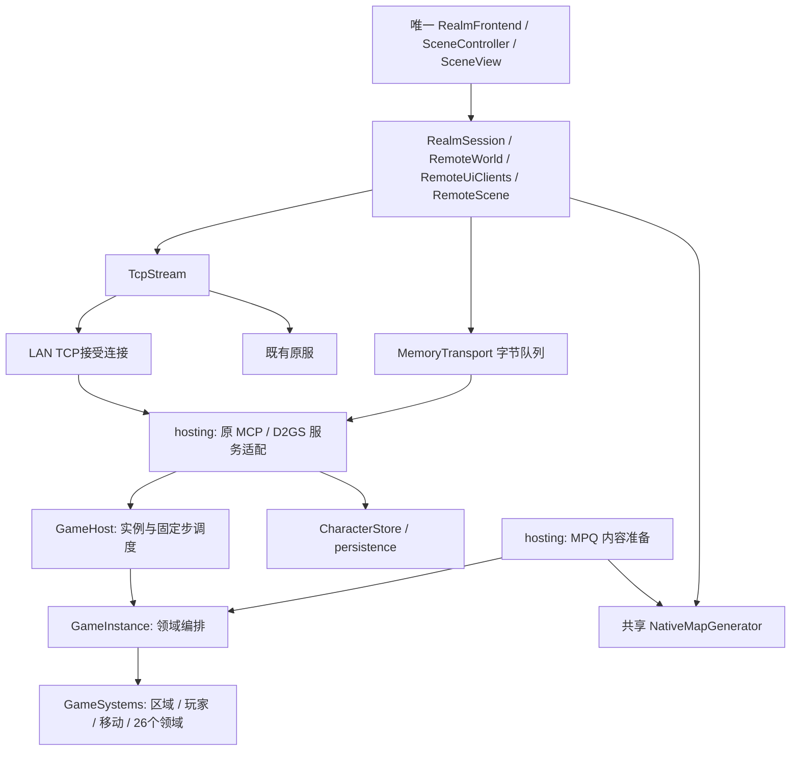

# 自研游戏内核与独立服务端计划

更新：2026-10-08。本页是唯一功能总计划；源码与运行包的区别见[基线](../../BASELINE.md)。本批已完成Windows Release构建、打包及有限冒烟；覆盖与未认证范围统一维护在基线。

## 产品目标与协议约束

自行实现权威游戏内核，依次服务单机、局域网多人、账号／大厅与独立服务端。不加载原版游戏执行DLL，不依赖PvPGN／D2CS／D2DBS结算自研游戏；原服入口继续保留。参考仓库仅作证据，不复制进源码。

**两种服务端使用同一套客户端，包括选角之后的全部游戏代码。自研服务端收发原1.13c MCP／D2GS字节包，嵌入运行只把TCP换成内存字节队列。** 不另设自研客户端协议，不直接传C++命令／快照／D2S对象给客户端，不在UI、地图副本、库存、输入或绘制中维护两种实现。此前GameClients／IGameConnection／LocalGame／GameScene方案已撤回并删除。

连接入口可选择原服账号认证或嵌入式预认证Realm；账号、房间选择流程与单机自动建房属于组装策略。MCP选角请求／响应及入局后的编码、解码、副本、预测、地图、面板、动画、音效全部共用RealmSession／Remote*。原协议没有的内容指纹、主机管理和开发命令留在宿主配置／管理入口，不能占用原包号或给原包追加私有字段。遵守原包格式不等于已完成全部原版玩法或原客户端互通认证。

## 架构与所有权

GameInstance只编排命令顺序和领域服务；不持有Archives、窗口、GPU、socket或存档路径。PlayerStore唯一持有PersistentCharacter，由宿主导出后交给persistence。GameSystems管理各领域寿命并在构造时注入各自的窄Ports，runtime/simulation只调度，不承载玩法。服务协议、角色仓储、初始角色准备、物品网络序列化、实例调度分别位于独立文件；不恢复旧全能GameSession及其执行器。完整领域归属见[内核子系统](../modules/SERVER_SYSTEMS.md)。

| 边界 | 约束 |
| --- | --- |
| 客户端 | UI读取原协议副本并提交原命令；只在连接组装处选择传输；不持有GameHost或角色存储 |
| 原协议适配 | 验证MCP／D2GS握手、票据、长度与连接状态；将原命令转为内部领域命令，将权威结果编码为原包 |
| 内存传输 | 跨线程有锁、有界字节FIFO；支持拆包／粘包；重连递增代次并清旧消息，无解码对象或服务回调穿越边界 |
| 内核 | 实例独立区域、玩家表、实体ID、随机流、时钟和命令队列；命令绑定参与者，不信任客户端传入操作者 |
| 内容准备 | 当前MPQ原表、DS1出生点、碰撞规则；准备纯值交内核，缺资源明确失败 |
| 保存 | 服务端持有D2S与整局写入租约；保存校验、备份与原子替换；失败保留实例和锁，不伪造成功退局 |
| 跨平台 | C++20／CMake；Win32依赖留外围；内核不链接图形、MPQ或网络；独立服务器可执行文件仍属后续交付 |

## 共享地图生成

宿主generateArea与客户端RemoteTown都调用同一NativeMapGenerator及reveal生命周期；不复制生成算法，不用私有地图快照跨队列。宿主传原LOADACT种子、幕、难度及0x07房间锚点，客户端按相同顺序重建。generateArea保存发包顺序，权威使用独立碰撞值，地形持有其DT1资源寿命。

种子相同不足以证明地图一致；房间顺序、MPQ与原生成版本都属于配置条件。嵌入宿主与客户端共用挂载MPQ；LAN部署须由管理层保持同一资源版本，不能给原包追加指纹。当前World按玩家及直接自然邻区驻留，Travel使用原room边界和UNIT_TILE出口；地形资源与纯碰撞分离，已准备区域随实例保留，已接普通近战人口、同区活人活动条件及怪物邻室兴趣；完整AI休眠与房间调度仍待恢复。

## 当前切片与下一步

源码已接首页Single Player → 原MCP角色列表／建删选角 → 原建房／加入与D2GS握手 → 城镇走跑 → 原Save & Exit → 服务端D2S保存 → 同一选角界面。选角使用现有原图、装备预览、8格分页、双击与删除确认；创建的职业属性、初始物品、技能来源和出生点读取MPQ。

master的D2S支持范围保留：角色成长、技能／绑定、任务／初见／传送点、地图种子、库存／两组装备／Cursor、佣兵、尸体和铁魔原物品；入局重新绑定运行ID，重载回城，不将动态世界装进角色档。格式与拒绝边界见[存档](../modules/SAVES.md)。物品入局序列化为原0x9D位流，与JM磁盘记录分离。

当前执行移动、库存／装备与人物成长基础：原18／19／1A–1F／21／23–25／29／60支持背包↔Cursor、普通交换、腰带、装备及双手冲突、切组、合堆和卷轴／同类书转装；原3A／3B分配属性／技能。attributes计算装备／背包护符、支持的套装、永久任务奖励及基础被动总值，升级按当前等级取装备属性；progression处理经验封顶、升级及剩余点数。规划、总值计算、原子提交与原包输出独立，详见[库存](../modules/INVENTORY.md#自研服务端库存切片)、[人物](../modules/CHARACTER.md#自研服务端属性与成长基础)。普通近战、女巫火弹／火球／传送及世界边界／瓦片旅行已另接；其余施法、临时状态／全部被动、地面物品、消耗、仓库／方块授权、NPC服务、任务旅行、佣兵／玩家尸体／铁魔实体仍待恢复。未准备的随机套装值及条件套装需求明确拒绝。未实现请求不改档或回报成功，客户端仍只有既有原协议链。

整体内核已在源码接线26个领域，连同玩家和移动形成28项目录。GameCommand统一身份与来源区域，固定步具有明确顺序和stub状态；有界EventOutbox、类型化事务和不可变规则／区域准备端口已建立。inventory标inventory-slice，attributes／progression／transactions标character-slice；世界／多人、普通近战及女巫技能领域已开放有限切片，其余保持骨架。私人人物事件与公开世界／动作事件分别路由，不代表全部玩法复制已实现。server-systems只读显示范围，不能据此标记阶段一完成。

GameHost内部25Hz推进，每次最多补8步并保留欠时；嵌入调度由应用帧驱动，网络worker通过字节队列隔离。单机菜单／失焦暂停实例、清移动路径和待执行命令；原服继续推进。多实例容器和代次已建立，共享宿主支持多个房间及每房1–8人；LAN TCP与内存连接共用协议。运行证据见基线。下一步恢复物件／掉落等领域规则，独立无窗口调度仍未交付，不增加另一套客户端。

当前协议基础覆盖现有客户端60种C2S、90种S2C、9种MCP请求／10种响应，并拆开4F与38子命令。每个C2S都有具名领域或生命周期入口，stub明确可查；S2C区分仅入场投影与玩法复制。后续按领域补解码、资格校验、固定步事务和原包输出，不继续向会话类追加具体玩法；唯一接口说明见[服务端协议](../modules/SERVER_PROTOCOL.md)。

F11／Ctrl+F11、pipe save／load／step及命令行加载属于宿主管理，不占用自定义游戏包。保存与重载共用类型化管理入口；重载先准备可复用候选实例，再通过原退局／重新选角／入局重建客户端，版本／角色／难度变化明确拒绝。step只推进已暂停权威；grant-experience通过progression／transactions授予经验并发原包，可在暂停时操作。server-snapshot／server-events提供有界权威诊断，server-pause／resume／auto-pause控制宿主时钟，refill-resources走人物事务，monster-spawn复用MPQ普通怪物准备与人口准入；其他旧作弊命令仍为stub。当前包的save／load／暂停后step已有限冒烟，历史行走包的观察仍不认证这条新协议链。
当前世界／多人入口：NativeRealmHost共享只读MPQ与GameHost，NativeRealmService按连接持有名册版本、租约、票据及GS阶段；RealmConnection统一拆包，EmbeddedRealm和LanRealm仅选择字节端点。新加入者采用房间种子／难度，玩家／物品／出口ID在实例内统一分配，角色成长规则按本人准备。自然接缝逐步走过，瓦片出口按原13靠近后换区，先可靠TravelFact再改位置；任务锁、多重反向出口及未核实资格暂缓。玩家离开只移除本人，最后一人释放实例；共享房间不会因某个客户端失焦或暂停停止。

当前LAN宿主依附应用进程：`--host-lan <本机IPv4> --host-saves <角色目录>`开启6113／4000，首页TCP/IP Game → Host Game通过同一选角／大厅创建共享房；Join Game原IP弹窗默认127.0.0.1，连接后共用选角、创建／加入。界面Host监听全部IPv4接口，命令行保留指定接口宿主及远端`--lan <宿主IPv4>`入口；Single Player保持单人自动建房。原05／06提供房间列表／详情，原68的一次性票据绑定MCP与GS。未提供账号或远端存档上传。正常关闭应用先保存全部参与者，再停服；单独退本机玩家不停止远端房间。入口与端口说明见[联网](../modules/NETWORK.md#局域网自研宿主入口)。

## 历史资产与迁移来源

只读核对的恢复起点：master为`624c927`；删除本地执行器的提交为`7ad9230`，其父提交`6914308`保留删除前代码，并包含master之后的地图／公共表现／交互修正。恢复时逐领域对照master、`6914308`与当前分支，不整树覆盖、切换或回滚当前工作区，也不恢复旧CMake／旧表现分支来覆盖现有结构。

| 资产 | 已核实的来源与范围 | 迁移方式／限制 |
| --- | --- | --- |
| 会话与模拟 | master的`src/gameplay/session/session*.cpp`、`session_impl.hpp`、`simulation/*`、`fixed_step.hpp`及旧SESSION／UNITS／REFACTOR_PLAN文档 | 提取实际执行链；旧会话持有Archives，WorldState含唯一player／area，须先解除这些耦合 |
| 本地适配 | master的`src/client/local_{actor,character,inventory,map,npc,quest}_client.*`及商店／佣兵投影 | 仅提取领域规则和必要投影事实；客户端继续原Remote*链，不恢复本地I*Client执行分支 |
| 怪物 | master的`gameplay/monsters/*_ai.*`、动作／激活／近战／复活／词缀／companions，以及content怪物导入 | 已有沉沦魔／巫师、僵尸、骷髅及弓／法师、腐化罗格／弓手／枪兵、巨兽、羊头人、刺猬、幽灵、Bighead、牛、矮人、吸血鬼、血鹰／巢、蜘蛛等注册与执行入口；逐项恢复已实现家族及已接首领，登记真实缺口 |
| 技能／战斗 | master的`gameplay/skills/*`、`combat/*`、`effects/*`、来源端口及`simulation/skill_world.cpp` | 有通用／女巫／圣骑士行为，死灵三页与亚马逊三页各30项执行／被动入口；已有光环、诅咒、武器技能、弹体、召唤／Iron Golem和佣兵技能。充能／触发、多玩家来源和其他未实现技能仍须补足 |
| 库存／掉落 | master的InventoryService、session_inventory／gold／cube／loot、装备／技能来源与NPC服务 | 迁移既有唯一事务，保留物品真实掷值、镶嵌顺序、符文之语和方块配方；明确角色、商店、地面及尸体归属 |
| 任务／成长／死亡 | master的session_quest*、五幕任务模块、奖励结算、玩家尸体与恢复、佣兵／宠物生命周期 | 恢复历史主要流程和记录边界，不把日志入口或有限冒烟等同完整剧情；玩家上下文和每局公共触发显式区分 |
| 地图 | 当前`src/world`、navigation、NativeMapGenerator与五幕原生生成；master的区域存储／休眠状态／人口执行适配 | 当前生成与碰撞是优先基线，复用已有原DLL地图对照；恢复权威人口／活区生命周期，不能退回旧近似布局 |
| D2S | 当前`src/persistence`的v96编解码、CharacterSaveData、文件锁／备份／原子替换；master的session_character_save／session_restore及历史SAVES说明 | 优先沿用当前编码，恢复运行态映射；历史尸体／装备／容器／铁魔等实现可复用。耳朵、自动词缀、Realm段、品质9、专家／Ladder及部分随机属性等拒绝边界见[存档模块](../modules/SAVES.md) |

master末期佣兵提交`624c927`，亚马逊整页提交`b727d7a`／`89f41bb`／`e172c6e`，死灵召唤／毒骨提交`aef74f3`／`7f78953`，物品方块／镶嵌提交`8850237`／`8eeac56`是定位入口，不是迁移后的完成证明。历史说明通过Git读取；恢复后的实际状态更新现有模块页，不复制旧验证结论或追加第二份总计划。

## 阶段一：单机权威内核与多实例

目标：恢复可正式创建／选择／读写本地角色的单机玩法，并提供方便反复进入、暂停和重置的开发环境。一个宿主从开始就可同时管理多个独立游戏实例。原计划先单玩家入局；按当前用户范围，TCP监听及同局多人基础已前移实现，账号仍留阶段三。嵌入Realm提供现有客户端需要的MCP角色与建房握手。

| 顺序 | 工作与交付 |
| --- | --- |
| 1.1 最小行走内核 | 按上面的切片建立内容准备、共用地图、内核、宿主、原协议服务适配和唯一客户端边界；实例注册／销毁、代次、玩家绑定、区域仓储、命令序号与25Hz推进从开始具备。先贯通原地图→权威移动→只读投影→首页Single Player；不要求怪物／战斗／存档 |
| 1.2 多实例与世界所有权 | 每实例独立ID／随机／事件／时钟／地图／区域仓储；角色、库存、召唤物／佣兵和尸体按玩家归属。共享内容不可变，实例暂停、重置、销毁不影响其他实例。地图资源与导航借用有明确寿命；同角色写入租约拒绝重复加载 |
| 1.3 恢复历史战斗能力 | 按旧行为分派恢复已实现怪物家族、词缀及首领，通用伤害／状态／弹体、已有职业技能、光环／诅咒／召唤和佣兵。先恢复已有行为和消费顺序，再分别处理已知缺口，不把有历史代码的技能逐项重写 |
| 1.4 恢复玩法闭环 | 库存／装备／物品消耗、掉落、经验／升级／学点，NPC交易／鉴定／维修／雇佣／方块，历史任务／物件／传送／五幕旅行，以及死亡／复活／尸体。恢复master已有范围，未完成规则保留明确不可用或替身边界 |
| 1.5 公共客户端与D2S | 唯一原协议客户端共用地图、HUD、动画、音效和面板；服务端通过原包发送结果。恢复CharacterSaveData映射、完整校验后加载、原子保存、同角色锁及失败反馈；先支持当前编码已声明的角色范围，再逐项补已知拒绝项 |
| 1.6 单机入口与开发控制 | 恢复原图单机／本地选角，支持指定本地角色快捷入局。既有调试管道扩展实例身份、权威暂停／继续、单步、固定种子新建和起始状态重置；重置清所有运行态及旧命令，不把整局快照塞入D2S。暂停菜单语义明确且不改变原服模式 |

本阶段使用通用玩家容器和带身份的查询／命令；同局参与者支持已前移，不再将唯一player字段整体重做。区域服务不能仅有全进程“当前区域”；第一阶段恢复已有按需加载／休眠边界，第二阶段扩展同局多玩家活区联合。

阶段一完成条件：

- 新本地入口实际完成创建／读档、移动、战斗、库存／NPC、历史任务／旅行、死亡／回收与保存重入的已支持闭环；仅最小战斗链通过不能标整阶段完成。
- 至少两个不同角色的实例可在一个宿主内共存；相同实体编号在不同实例仍可安全寻址；独立暂停／重置／销毁、随机与保存互不污染，同一角色重复写入被拒绝。
- 历史已实现怪物／技能逐领域有迁移状态和实际消费入口，不退化成“只支持几个技能／全部敌人沉沦魔”；历史缺口与本轮未认证范围可查。
- 公共表现只依赖客户端视图；权威内核不依赖MPQ、raylib或Win32；D2S沿声明格式保持真实值，失败加载不破坏运行态／原档。
- 开发控制能暂停权威并重复准备同一起始条件；不承诺因D2S重载而恢复同一批怪物或整个战斗随机过程。

## 阶段二：局域网联机

目标：D2X房主创建游戏，其他D2X通过局域网地址／端口加入；同一宿主支持多个多人游戏实例。使用第一阶段的同一权威内核，不加入账号系统、公共大厅或正式独立服务端发行包。

| 顺序 | 工作与交付 |
| --- | --- |
| 2.1 传输与版本握手 | 复用原1.13c MCP／D2GS分帧与版本握手，先接TCP监听并替换内存字节来源。规则／MPQ指纹由宿主部署配置核对；内部代次与请求序号不私自加入原包。单机与联网使用同一客户端编码／解码 |
| 2.2 房主与入局 | 房主启动权威宿主并绑定自己的客户端，其他玩家直连指定游戏；支持容量、难度、房间密码及失败反馈。基础版先用明确地址，自动发现可后补；连接身份在宿主绑定PlayerId，客户端不能指定他人操作者 |
| 2.3 同局多玩家执行 | 完成并行玩家控制与角色私有状态、关系／队伍、经验与任务共享资格、公共物件／门户、独立尸体／佣兵／宠物归属和交易事务；所有施法与伤害仍只执行一次。主机也是普通参与者，不享有绕过规则的UI写入路径 |
| 2.4 活区与同步 | 活动区域由各玩家及仍需运行的AI／弹体／光环／召唤物共同决定；同步兴趣与权威活区调度分开。生成加入基线，再发送有序增量／事件，处理显隐、装备、动作、生命、物品、换区及销毁；缺基线或序号缺口明确重同步 |
| 2.5 多人交互与生命周期 | 双端移动／技能／死亡、聊天、拾取争用、买卖／容器权限、交易取消与原子成交、各自旅行及退局闭环；迟到命令不得跨实例／区域替换生效。客户端接受请求与权威操作完成分开；可重试请求须有明确去重语义 |
| 2.6 局域网保存与恢复 | 房主作为权威保存端；本地角色导入只经入局前显式校验并由房主接管，本局客户端不回写权威档。断线角色保留／移除、重连票据及超时策略明确；房主退出保存并结束共享游戏，首版不自动迁移房主 |

房主的网络和权威固定步独立于窗口绘制／失焦；菜单、加载或客户端卡顿不暂停其他玩家。先贯通两端，再扩大到资料片多人容量及同宿主多房间；不将一个双端现场当作全部多人能力完成。

阶段二完成条件：

- 两台局域网机器实际加入同局，互见／移动／技能／伤害／死亡／拾取／交易／旅行／退出／保存重入在已支持范围闭环，最终结果由房主确认。
- 玩家分处不同区域时，两侧世界和仍存续效果继续正确推进；背包／任务／技能来源不泄露或串到另一玩家，事件不因多个观察者重复结算。
- 同一宿主多房间的实体、消息、兴趣、随机、进度及角色存储隔离；房主客户端断开或停绘制的处理符合明确宿主策略。
- 加入中断、拒绝、迟到消息、重连、增量缺口及保存失败有可观察结果；没有静默权威切换、物品重复执行或无确认成功提示。

## 阶段三：登录、大厅与独立服务端交付

目标：形成可以脱离D2X窗口和项目源码目录独立运行、配置、保存和发布的自研服务端；客户端通过登录→服务器角色→大厅→创建／加入游戏进入第二阶段已有多人内核。

| 顺序 | 工作与交付 |
| --- | --- |
| 3.1 无图形服务端宿主 | 提供独立可执行目标、启动参数／配置、内容初始化、实例管理、固定步调度、日志、正常保存关闭及故障反馈。服务端无需显示服务、raylib、原游戏DLL或PvPGN进程；多人内核沿阶段二，不重写 |
| 3.2 账号与会话 | 注册／登录／退出、会话失效及基本账号管理；密码使用成熟库的带盐派生算法，网络认证采用受保护通道，不自写密码学。连接认证与玩家角色／游戏身份分别绑定，避免旧票据跨账号／实例复用 |
| 3.3 服务器角色与保存 | 创建／选择／删除角色、职业／难度／进度资格、唯一在线租约、服务器D2S读写／备份／锁与保存结果。正式账号角色默认由服务器持有，不接受客户端直接替换；单机档导入如开放，应有单独显式策略与校验入口 |
| 3.4 大厅与游戏目录 | 房间列表、筛选／详情、创建／加入／密码／资格／容量、离局回大厅、服务器消息及基础聊天；大厅查询不能阻塞游戏推进。复用当前MPQ原图与已有前端布局／控制器，新增服务适配，不恢复未经核实的UI |
| 3.5 运维与服务边界 | 游戏服、账号／目录、存储逻辑分层，首版允许同一进程部署，不要求先拆分微服务。提供配置校验、运行状态、实例／角色诊断、日志边界、权限受限的管理入口、正常停服保存和重启恢复；实例调度有容量与资源边界 |
| 3.6 独立打包与交付 | 分别维护客户端／服务端构建与发行入口，发布可执行文件、必要依赖、许可、示例配置和运行说明；验证在干净目录无需源码树运行。MPQ由用户提供外部路径，不打包原资源、原DLL、reference、账号／角色、日志、截图或构建缓存 |

第三阶段首版按已支持D2S范围交付，专家／永久死亡、Ladder赛季／排名、PvP及额外账号服务按对应规则与保存能力逐项扩展，不能仅增加大厅按钮即宣称支持。公开互联网部署所需的认证、权限和传输保障随登录入口实现；大规模集群、跨服迁移、跨版本客户端、D2R或任意MOD互通不作为首个独立服务端发行门槛。

阶段三完成条件：

- 无图形服务端可在独立目录启动，两个客户端通过正常登录、服务器角色与大厅进入多人游戏，离局后权威保存并可重入。
- 一进程多房间及账号／角色归属正确，正常关闭／重启保持持久角色数据；失败保存、登录失效、容量限制及角色重复占用有明确反馈。
- Windows和Linux服务端目标依赖路径成立；实际构建／运行证据分别记录，未实际验证的平台不能称已发布支持。
- 客户端／服务端分别有可重复使用的打包入口和文档，运行包不依赖原版游戏DLL或参考服，不含原MPQ和用户资料。

## 当前顺序与交付门槛

公共函数提取的统一依据、各技能行为族、怪物／NPC／任务／物品的分工与逐步迁移方法见[参考设计](REFERENCE_DESIGN.md#6-d2moo的公共层究竟共用什么)。优先复用master已实现规则，D2MOO用于确定公共基础与领域执行边界及补旧实现缺口；当前CorruptRogue／Goatman／CorruptLancer案例已按此迁入，尚未覆盖全部Act 1。

技能恢复采用公共纯计算与两端适配器。已共用的`resolve`、`projectile_path`、碰撞几何继续保留；环形散射调度、方向／数量、整数转向和墙面裁剪已抽成纯输入／输出，其余确定性轨迹继续按此方式迁入，客户端只消费可见参数并创建视觉对象，服务端持有独立运行状态并提交命中／伤害／资源。公共函数不得读MPQ、网络、GPU或修改PlayerStore，不按“连接自研还是原服”分支。两端参数和起始帧必须显式传入，服务端隐藏随机不能因共享函数而泄露；不强迫客户端猜测原包未提供的真实命中状态。

原版结构证据：本地D2MOO的D2Common提供技能公式／耗蓝等公共基础；冰封球`SrvDo15`、`SrvDo16`、`SrvHit29`在D2Game/MISSILES/MissMode.cpp中执行。当前MPQ frozenorb分别指定SrvDo=15／SrvHit=29和CltDo=19／CltHit=30，两侧频率=1、方向步进=19、结束环形步进=4，末次环形产生16个子弹体；这证明参数对应，不证明整套执行回调共享。该参考快照缺完整D2Client，不能据此认证1.13c两端逐指令相同。现有客户端`client_missile_view`的正向帧循环与服务端参考的剩余帧规则须先对照，不能仅合并函数名就宣称时序一致。

`presentation/world/client_missile_view.cpp`的确定性调度／转向及墙面裁剪已在用户单独授权后提取到`gameplay/skills/projectile_path`与`gameplay/combat/geometry`。客户端继续使用原Clt参数、正向帧、掩码和坐标运算顺序；当前服务端火弹／火球共用墙面裁剪。原服与自研仍只有一套客户端和原消息处理；没有把两端相位强行改成一致。后续发现行为差异仍单独确认，冰封球服务端执行器尚未实现。

阶段1.1行走边界已有有限运行证据；角色／存档与库存／装备、属性／成长基础已有源码。按用户本轮范围，阶段1.2的世界／多实例与阶段二的LAN／同局多人基础前移：共享不可变内容、独立实例／ID／随机／时钟／事件、原边界／瓦片换区、1–8人入局及可见玩家／装备／同局聊天已接源码，尚无本轮运行认证。普通近战切片已接区域人口、七类普通近战怪物（新增三个家族迁用旧单机决策）、追击／攻击、命中／物理伤害、死亡投影与击杀经验；没有恢复整个旧执行器，细节与限制见[内核子系统](../modules/SERVER_SYSTEMS.md#普通近战切片)。女巫火弹／火球／传送已从旧单机规则接入动作帧、资源、弹体／范围伤害与同区位移，见[技能案例](../modules/SERVER_SYSTEMS.md#女巫主动技能案例)。下一步优先补玩家死亡／尸体／复活事务，之后接掉落／地面拾取；物件、传送点／门户及任务资格仍按原表逐项恢复。历史代码仅作能力与规则来源，按新领域迁移，不整树恢复master或向GameInstance堆放规则。

阶段一完整玩法与阶段二完整多人结算均未完成；当前前移的是共享世界与连接基础，普通近战仅为有限切片，不宣称完整战斗、交易、队伍、玩家死亡或五幕互通完成。阶段三账号、无图形可执行宿主及独立发行继续保留后续顺序；不据历史提交数量推算工期。

默认只修改源码／文档，不编写测试脚本、测试用例或专用测试程序；构建、运行、冒烟和打包按用户当轮授权。验证使用正式客户端、既有d2x_assets／调试管道及原服开发对照，记录实际观察范围，历史冒烟不自动成为新内核认证。开发命令是既有诊断入口的扩展，不作为第二个玩法执行器。

每次交付更新[基线](../../BASELINE.md)、对应现有模块和本计划状态；保存语义变更同步格式／规则指纹／[存档说明](../modules/SAVES.md)。原MPQ、reference、旧包、mvp和用户资料保持；当前工作区已有修改不得被恢复操作覆盖。若用户后续要求多agent，先明确各领域文件归属，公共契约、CMake及保存编码由集成方统一收尾。

## 实施状态

阶段一已有行走内核与本轮原协议／角色保存源码，尚未完成全部玩法；阶段二、三未完成。下表保留既有原服客户端M编号，供现有模块引用，不代表自研计划已完成；具体源码／包及最新观察以[联网模块](../modules/NETWORK.md)为准。

| 原服领域编号 | 当前事实 | 剩余完成条件 |
| --- | --- | --- |
| M0 唯一联机入口 | 已移除本地入口与普通暂停；原服退局和显式测试表现暂停有有限观察 | 完整UI／异常验收，不能把测试暂停当原服暂停 |
| M1 会话／协议 | worker、稳定快照、代次、领域意图／队列和包诊断已接 | 全关键包语义、统一异步协调、异常／长度／队列边界完整覆盖 |
| M2 局前 | 注册／登录、Realm、建删选角、建房／加入、记忆快捷入局及取消／超时路径 | 所有页面操作、严格版本、拒绝／取消／恢复及账号服务完整验收 |
| M3 地图／行走 | 五幕原生地图、原房间事件、走跑、靠近／交互、旅行和本局探索 | 长绕墙无进展、动态阻挡、校正、完整鼠标与房间生命周期 |
| M4 多人基础 | 名册／关系／聊天只读副本；真实玩家身份／装备／裸装、移动／施法／死亡状态、姓名悬停与退局清理；双账号原服互见及普通ASCII聊天／M日志有限观察 | 聊天原编码／私聊／频道、队伍／关系UI与发送；完整多人身份／空间／权限、七职业全部动作与跨机器认证 |
| M5 库存／城镇 | 原物品位流、27类请求、公共面板／异步组合和部分城镇证据 | 精确报价、赌博／多买／分堆、所有容器组合、佣兵装备及特殊服务 |
| M6 战斗／成长 | 原选择／施放／Hold、学习／加点、状态／经验，部分动作／弹体；女巫定义／提示已复用 | 七职业效果／来源／目标、射流／连锁／追踪、实际升级完整验收；不重做女巫原表模块 |
| M7 任务 | 本人27项日志、原对白／确认、NPC提示、部分STARTED恢复 | 五幕剧情、资格、奖励／服务、真墓符号、特殊事件及多人共享；日志可见不算完成 |
| M8 佣兵／宠物 | 原表／身份／保存值和面板保留 | 原雇佣／复活／装备／喂药、所有者、同行、技能／状态和新局闭环 |
| M9 交易／PvP／死亡扩展 | 死亡／尸体有限证据；玩家交易发起／邀请、共用原图菜单、物品／金币报价、勾选／撤销／取消；Windows包双端药水＋10金币双向成交与重入有限证据 | 见联网模块当前批交付；全部物品、异常退出／容量不足、精确金币弹窗／底色仍需认证；PvP／专家／多尸体未齐 |
| M10 公共表现／UI | 世界、动画、手势、人物／技能／任务提示、自动地图与声音已统一 | 精确染色／透明、速度／序列、光照／空间音频与全部面板服务；结构完成不等于功能验收 |
| M11 服务／账号／Ladder | 本机非Ladder参考服可用，异常提示／有界退出已接 | Ladder server down调查、账号扩展、跨机器、严格配置和长局稳定性 |
| M12 依赖／联合交付 | Local及本地执行器删除，presentation无session依赖，独立工具保留；7ad9230有限冒烟 | 全功能联合验收未完成；不能再把已完成依赖清理列作待删除 |

## 既有原服状态与接口边界

RealmSession独立串行维护网络，tick发布稳定快照；协议层不依赖MPQ／GPU。RemoteWorld拥有原单位／物品／属性副本，RemoteTown把原幕／种子／房间序列适配NativeMapGenerator，生成失败停止场景，不回退近似地图。

SceneController提交语义意图，RemoteControl／Combat／Inventory请求原服；SceneView／SceneAssets／ActorAnimation／SceneAudio消费同步帧投影。本人显示补偿与原位置校正独立，不能写回副本。任务／人物纯投影只使用已知本人事实和MPQ，不复用旧执行器。

客户端库不链接persistence；嵌入宿主和独立D2S工具使用原v96编码，格式／语义变化必须同步相关文档／指纹，旧档不静默迁移。当前文件归属、依赖和生命周期详见[架构](OVERVIEW.md)与[数据流](DATA_FLOW.md)，参考固定版本／用途详见[资料来源](../resources/THIRD_PARTY.md)。

## 原版 DLL 对照方法

已执行本机1.13c原 DLL 开发对照。使用忽略目录中既有 `reference/d2mapapi_mod` 的32位导出入口，补充房间、选定DT1与完整碰撞字段；C++使用既有 `d2x_assets native-map` 重放导出的**调用事件**，不读取参照瓦片、布局或碰撞作为生成输入。没有新增专用测试程序或提交原DLL／资源／reference。

原安装目录 `D:\Downloads\Diablo II V1.13C`；D2Common MD5 `ee1238806ef6d6d9801d12a09d128fe1`，D2Client MD5 `f5860c629d309b8fc1f96174babcf633`，五个MPQ与项目资源SHA256逐一相同。每例新建原导出进程，固定种子、难度及房间进入／采样／离开顺序，包括为采样临时激活的邻区和释放后再建。

第一幕此前122例全部通过：种子1普通、123456噩梦及地狱各覆盖1–39，共117例；兵营28另测普通0／4294967295／210、噩梦42、地狱987654321，证据保留在 `artifacts/trash/map-oracle-20261005/`。该批另回归第一幕营地、兵营、牛场及第二至第四幕代表区域。

第二至第五幕共364个不同组合全部通过，证据在 `artifacts/trash/maps-acts2-5-20261006/remaining-acts-final.json`：

| 幕 | 覆盖 | 组合数 |
| --- | --- | --- |
| II | 40–74，种子1普通、123456噩梦／地狱；40／41／47／66补0普通及4294967295地狱 | 113 |
| III | 75–102三难度同上；75–81补普通0／2／210／4294967295，76–78补211普通 | 115 |
| IV | 103–108三难度同上，另0普通、4294967295地狱 | 30 |
| V | 109–136三难度同上；109／110／111／112／114／117／122／125／133／134／136补0普通及4294967295地狱 | 106 |

比较原点／尺寸、房间顺序／尺寸／预设文件／初始种子、活动近邻顺序、单位／Pops，每个活动样本全部16位地形碰撞和墙／地板／阴影DT1文件、记录序号、类型、坐标、主次编号、rarity及25格碰撞。瓦片屏蔽自动地图已处理标志0x40000；房间屏蔽0x03140000中的自动地图、活动房间、已加载瓦片库／已添加预设单位状态位，因为导出房间表与重放房间表采集阶段不同。生成标志、瓦片和碰撞不屏蔽；不比较进程指针。

原导出及C++结果按区域／种子／难度保存在同目录，使用既有诊断工具和临时交互式命令，未新增测试脚本。上述组合认证固定的生成与激活顺序，不认证全部32位种子、所有玩家换房时序或完整玩法；实际GS事件由包内[有限原服记录](../modules/NETWORK.md#既有有限证据)另外检查。

## 本机部署与验证入口

运行目录为 `D:\Projects\d2x\artifacts\d2gs-local`，下载包、上游源码、局部补丁、二进制、配置和日志均在忽略目录；服务部署阶段没有改动 D2X 游戏代码，未安装 Windows 服务或添加防火墙规则。当前实现与有限证据见[联网模块](../modules/NETWORK.md)。

| 组件 | 本机实际采用 |
| --- | --- |
| 账号／Realm／保存 | [PvPGN 1.99.7.2.1 PRO plain 发行包](https://github.com/pvpgn/pvpgn-server/releases/tag/1.99.7.2.1)，文件存储，无外部数据库 |
| D2GS 宿主／引擎 | RElesgoe `3f09bd9`，VS2022 Win32 Debug 编译＋Windows 8 兼容层；引擎使用该仓库的 `lib/d2gelib/d2server.dll` |
| 原版依赖 | 从用户提供的 `D:\Downloads\Diablo II V1.13C` 复制 DLL 与服务所需 MPQ，原安装文件保留；所有 DLL 与 Magic Builder 1.13c 依赖 MD5 匹配。Patch_D2 摘要与其下载清单不同，但与本项目当前 MPQ 相同，引擎已成功加载 |
| 本地适配 | 宿主配置改读 `HKCU\Software\D2X\D2GSReference`；修正上游 Realm 名称读取指针；使用 32 位 `time_t`；管理端口仅绑定回环。差异保存于 `relesgoe-local.patch` |
| 入口 | 账号 `127.0.0.1:6112`，Realm `D2X-Local`／`127.0.0.1:6113`，保存 `127.0.0.1:6114`；D2GS 游戏端口 `4000` 默认监听全部 IPv4，管理端口 `127.0.0.1:8888` |

已记录：引擎完成 MPQ、语言、游戏表、监听与回调初始化，进入消息循环；D2CS 认证 D2GS 并接受 8 个游戏槽位；D2DBS 接受游戏服连接，双方持续心跳。一次正常关闭触发引擎保存收尾；重启过程中曾出现引擎初始化异常退出，再次启动成功，见 `d2gs/D2-261005.txt`，尚未确认原因或启动稳定性。

原版客户端连接使用 `Play-D2GS.bat`，实际调用 `Play-client.ps1`：客户端从用户原有 `D:\Downloads\Diablo II V1.13C.rar` 独立解压到 `client-1.13c/`，启动前检查 `Game.exe` 为 1.0.13.60。入口启动／复用本机组件，备份当前用户的 Diablo II 网关列表与 `BNETIP`，临时将列表设为仅含 `D2X-Local`／`127.0.0.1`，打开窗口模式主菜单；用户手动点击 Battle.net。正常退出后恢复原网关，启动窗口须保持打开；窗口异常关闭时，先退出全部客户端，再运行 `Restore-client-gateway.cmd` 恢复。此原版启动入口要求先关闭其他原版客户端；当前启动脚本不据此宣称支持原版双客户端。设置方式依据 [PvPGN 网关安装器](https://github.com/pvpgn/battle.net-gateway-installer/blob/master/install%20gateway.bat)。

2026-10-07原版双开尝试：首次运行Play-D2GS.bat成功打开原版窗口，第二次被Play-client.ps1的已有Game／Diablo II进程检查拒绝；直接以同目录Game.exe -w再启动，也仅打开Diablo II Critical Error窗口。`reference/d2moo/source/D2Gfx/src/Window.cpp::WINDOW_Create`以FindWindowA("Diablo II",0)拒绝同桌面已有窗口，与观察一致。第二实例错误窗口已正常关闭，未修改原版EXE／DLL／MPQ或删除启动器网关保护。聊天布局截图可由单个原版客户端发送普通消息并观察原服自身回显取得，不必先解决原版双开。

原客户端须使用真实网关注册，不能只依赖 `-bn` 参数；旧入口曾连向官方服并自动更新，已修正并由用户确认。当前配置含 D2XP_113C／IX86ver1.mpq，未启用 Diablo II 自动更新；仍允许未知／不匹配版本，不能据认证成功声称严格校验已通过。首轮只验证回环；跨机器需配置客户端可达的 Realm／游戏服地址。

`Start.cmd` 单独启动／复用本目录组件，`Stop.cmd` 先通知 D2GS 保存关闭再结束配套进程，关闭前先让客户端退局并注销。管理凭据只保存在本机忽略目录。运行包 SHA256 及配置差异随本地材料保留。

用户已确认注册账号、创建角色和进入游戏成功；`d2gs.log` 记录资料片／普通难度／softcore／non-ladder 入局、正常离开与 D2DBS 保存成功回执。本机选择 Ladder 会显示 server down，原因尚未确认；原客户端验收须取消 Ladder，当前 D2X 只开放非 Ladder。原服M11的配置缺口继续记录，不作为自研服务端的运行依赖或三个阶段的完成证明。

此宿主含上游build03规则修正与World Event配置，仅用于互通环境，不宣称纯原版规则完全一致。原客户端与D2X完整多人互通、Ladder、严格版本校验、跨机器及长期稳定性未认证。

本机测试账号 `bomb`、`bomb2` 经用户授权仅供此测试服；当前正常创建／选择非Ladder资料片角色，初始数据与保存均由原服产生。
