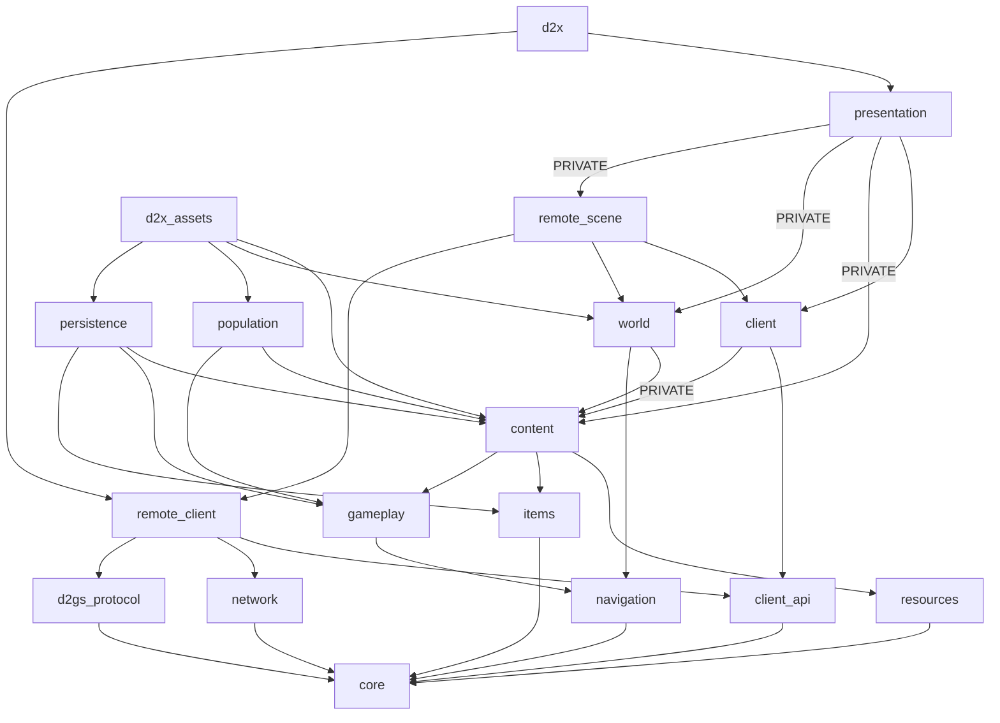

# 代码结构与依赖

更新：2026-10-07。以当前 [CMakeLists.txt](../../CMakeLists.txt) 和源码为准。产品只运行 D2GS 联机；Local 客户端、GameSession、Simulation、SkillRuntime 和 InventoryService 已删除，d2x_session 构建目标也已移除。完整功能与未实现项见[联机计划](MULTIPLAYER.md)和[联网模块](../modules/NETWORK.md)，交付证据见[项目基线](../../BASELINE.md)。

## 模块分工

路径相对 src/，库目标省略 d2x_ 前缀。

| 目录／目标 | 当前职责 |
| --- | --- |
| core／core | ID、坐标、字节、随机数与指纹，头文件值工具 |
| resources／resources | MPQ、TXT、DS1／DT1／DCC／DC6／COF 解码 |
| content／content | 当前 MPQ 只读定义、原文案、人物／技能／物品显示公式、统一声音配置 |
| world/navigation、room_activation／navigation | 碰撞、寻路与房间空间索引 |
| world／world | 地图配方、原预设／迷宫／野外生成、静态物件和出口 |
| world/population／population | 独立资源工具的人口计划报告；不向联机副本生成怪物 |
| gameplay／gameplay | 显示、几何、技能等级和资源工具所需的纯计算；保留存档与原表所需值类型，无本地宿主或执行器 |
| gameplay/items／items | 定义、装备类别／显示计算及错误文案，无库存事务执行器 |
| persistence／persistence | 独立 D2S v96 编解码与原子文件写入；CharacterSaveData 定义在 persistence/character_save.hpp |
| contracts、client/*_client.hpp／client_api | UI 只读值和语义命令 |
| client／client | 库存值、探索状态、人物及任务纯显示投影 |
| network／network、d2gs_protocol | Realm 生命周期、独立网络推进、原协议编解码与快照 |
| client/remote_*／remote_client、remote_scene | 原服单位／物品副本、地图适配及移动／战斗／库存请求 |
| presentation／presentation | 唯一世界绘制、动画、UI 手势、面板、声音、资源和显示插值 |
| app、main／d2x | 联机局前与窗口、设备输入、凭据／偏好、现有调试管道 |
| asset_tool／d2x_assets | 独立原资源、地图／掉落报告和只读存档摘要 |

目录不是库边界。gameplay 的剩余纯函数不读取 MPQ、设备或 GPU，联机显示由 content 用当前 MPQ 准备输入；资源报告中的随机选择不会给游戏生成掉落或奖励。任务身份、原保存槽和阶段值保留给显示与 D2S 编码，本地任务转换／奖励入口已删除。

## 实际依赖方向

箭头表示直接链接；PRIVATE 依赖不进入公开接口。

客户端不链接 persistence；presentation 不链接会话或本地执行器。Win32 凭据、调试传输、崩溃记录和文件替换留在外围，纯数据与编码保留 Windows／Linux C++20 路径。

## 运行链与修改入口

设备／已有调试输入 → FrameInput → SceneController → I*Client → RemoteUiClients → RemoteControl／RemoteCombat／RemoteInventory → RealmSession → D2GS。回包形成只读快照；RemoteScene 投影当前帧世界及动画、位置和公共声音事件，SceneView／SceneAssets／SceneAudio 消费同一显示规则。普通 ESC／面板／失焦不暂停原服；显式测试 pause/resume 只冻结客户端表现。

地图继续沿 WorldCatalog／MapRecipe → loadRegion → Map／Grid／WorldObject，原服房间引用决定活动地图。权威单位、战斗、消耗、升级、任务奖励和存档由原服执行，客户端显示碰撞、预测和提示不结算这些结果。

| 修改内容 | 当前入口 |
| --- | --- |
| 原表或资源格式 | resources → content |
| 地图／出口 | content/world → world → remote_town |
| 原服单位／技能／物品行为 | d2gs_protocol／remote_world → remote_control／combat／inventory → remote_ui_clients |
| 世界、动画、声音 | SceneView、ActorAnimationCatalog／State、SoundCatalog／SceneAudio |
| 人物／技能／任务提示 | client/character_projection、quest_projection → content 显示公式 |
| 面板与输入 | presentation／SceneController，语义命令交原服端口 |
| 独立 D2S 诊断 | persistence/character_save.hpp、d2s_*、asset_tool |

保留原 MPQ、reference、旧压缩包、mvp 和用户文件。原版规则／格式证据与当前支持范围分开维护；历史离线运行结果不认证联机功能。多 agent 协作仍应按领域文件归属分工，公共接口、CMake 和存档编码由集成方收尾。
