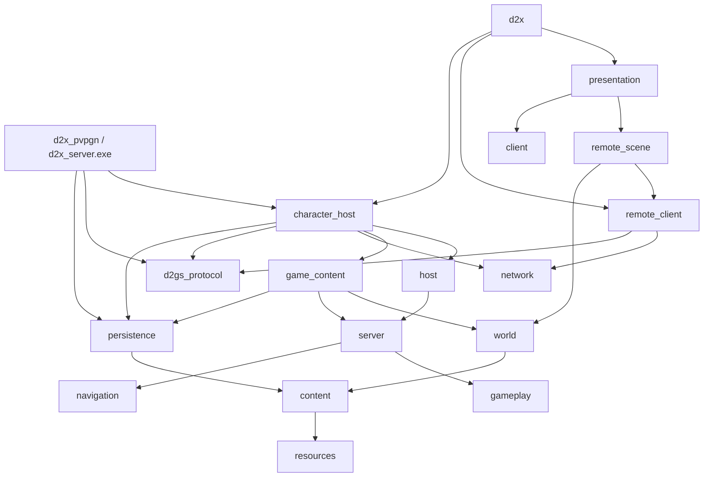

# 代码结构与依赖

更新：2026-10-10。源码入口以CMake为准；客户端和独立服务端分别构建／打包，当前产物与历史有限证据见[基线](../../BASELINE.md)，功能顺序见[总计划](MULTIPLAYER.md)。构建完成不代表运行验收。

## Agent速览

**一套客户端，两种权威来源。** Single Player／自研TCP/IP使用自研宿主，原服使用D2GS；入局共用D2GS请求与同一客户端副本。TCP/IP按原版直连游戏端口并交换本机角色字节，选角复用内部内存MCP；账号Realm路径继续使用远端MCP。单机是内存字节传输，断线不切换成本地权威。

| 大模块（相对src/） | 放什么／不能放什么 |
| --- | --- |
| `app`／`server_main` | 程序组合、平台输入、启停与调试；不实现另一套玩法 |
| `presentation`／`client` | UI、动画、声音、只读副本与请求；不裁决命中、库存、奖励或保存 |
| `network` | 原协议、连接、字节传输与客户端会话；不决定游戏规则 |
| `hosting` | 内容准备、协议适配、角色存储、实例调度；调用内核，不在会话里结算玩法 |
| `server` | 权威领域状态、命令、25Hz执行、事务和可靠事实；不读取MPQ／文件／socket／设备／GPU／Win32 |
| `gameplay`／`core` | 显式输入的规则计算、纯值和基础工具；不依赖会话、UI或隐式全局世界 |
| `world`／`resources`／`content` | 导航、原地图生成、MPQ读取与定义；内核仅使用导航及已准备纯值，不调用内容加载 |
| `persistence` | 原D2S编解码与文件保存工具，由hosting使用；TCP/IP本地租约及回传校验也在hosting，network／表现不读写角色存档 |

**服务端三层边界：** hosting把原包转为绑定玩家的类型化命令，并从MPQ准备规则；server校验资格、执行领域操作、提交事实；hosting把事实编码成原回包，并持有保存／传输边界。`GameInstance`和`GameSystems`只组装，`runtime/simulation`只安排执行顺序，不成为万能游戏会话。

**状态各有唯一主人：** PlayerStore持角色持久值与玩家状态，AreaStore持区域／碰撞，monsters持活动非玩家实体，companions持伙伴控制关系，social持队伍关系；skills／missiles／effects分别持动作、弹体、效果。combat结算伤害，death处理死亡与奖励协作，transactions提交跨领域人物／物品变更。索引、客户端副本和诊断都不是第二份权威。

修改时先找状态所属领域，通过窄Ports协作；不把GameSystems、网络会话或内容加载器传给玩法。共享算法不共享运行态，协议值不等于磁盘值。新内容沿“MPQ准备 → 领域资格／执行 → 事务／事实 → 原包投影”接入，未实现路径明确拒绝。

快速定位：[领域目录与提交约定](../modules/SERVER_SYSTEMS.md)、[数据流](DATA_FLOW.md)、[原包入口](../modules/SERVER_PROTOCOL.md)、[存档边界](../modules/SAVES.md)。编码及头文件依赖见[编码规范](../development/CODING.md)，验证授权和方法见[测试指南](../development/TESTING.md)。下文保留详细目录和链接关系，不另维护第二份架构清单。

## 模块分工

路径相对src/；客户端可组装嵌入宿主，独立控制台进程也可复用同一宿主与内核。两种组合均保持库与状态边界。

| 模块 | 职责 |
| --- | --- |
| core、resources、content | 跨平台值工具，MPQ／原图／表读取，准备只读定义 |
| world/native_map、generated_area | 同一原生地图生成与房间reveal；宿主保留发包顺序，客户端按原包重放 |
| network/byte_transport、tcp_stream、memory_transport | IByteTransport字节流；TCP与有锁有界内存FIFO；连接代次隔离旧字节 |
| network/realm_session、protocol | 唯一MCP／D2GS编码、解码、握手、worker、客户端稳定快照；原服另有账号认证 |
| client/remote_* | 两种服务端共用的世界／库存副本、地图、请求、预测与I*Client投影 |
| presentation | 唯一RealmFrontend、SceneController、SceneView、RemoteScene及原资源／面板／动画／声音 |
| server/game_messages | 仅宿主与内核使用的内部身份、命令和投影；不是网络协议或客户端契约 |
| server/game_instance、area_store、player_store、movement | 组合根、区域／玩家唯一所有权、入场值组装与移动执行；无MPQ／GPU／文件／socket |
| server/runtime | 类型化命令、穷尽分派、系统组合／窄依赖、固定步顺序、只读规则和有界事件出口 |
| server/systems/* | 独立领域State／Ports／操作；已执行范围与保留Scaffold分开，详见[内核子系统](../modules/SERVER_SYSTEMS.md) |
| hosting/game_host | 多实例槽位、代次、绑定、25Hz固定步、暂停与内部快照 |
| hosting/game_content、character_creation、character_rules | MPQ输入准备、初始角色／物品、入局规则指纹；不负责客户端绘制 |
| hosting/embedded_realm | 内存端点、selector、分帧与断开／调度组装，不实现具体玩法 |
| server_main、hosting/pvpgn_server | 独立控制台组合根；D2CS房间／票据、D2DBS角色锁／保存、游戏监听与停服，不实现另一套玩法 |
| network/protocol/pvpgn | D2CS／D2DBS八字节头有界分帧，与客户端MCP／D2GS分帧分离 |
| hosting/detail | 与传输无关的多连接服务组合、MCP角色／游戏、D2GS生命周期和管理接口 |
| hosting/protocol | C2S／S2C目录、阶段／长度检查、按领域具名分派与显式stub；扩展约定见[服务端协议](../modules/SERVER_PROTOCOL.md) |
| hosting/native_game_wire、native_item_wire | 原入局／状态／移动／物品包编码；JM磁盘位流不作网络包 |
| hosting/administration、app/debug/server_commands | 类型化宿主管理与外围JSON适配；不增加私有游戏消息 |
| hosting/character_store、character_directory | 服务端目录名册、稳定选择、角色租约、替换检测、原子保存与删除；目录值不暴露给UI |
| gameplay/character/persistent_character | 纯角色持久值；不带路径、表现、网络或整局运行态 |
| persistence | 沿用master支持范围的D2S v96编码／校验；CharacterSaveData为上述值的别名 |
| app/frontend | 连接选择、Single Player自动建房、窗口／输入／宿主调度与开发管理；不读写D2S，不另设世界循环 |
| asset_tool | 独立MPQ／地图／存档只读诊断 |

## 依赖方向

客户端和表现库不链接host、server或persistence；客户端EXE经嵌入宿主链接存储库，独立EXE经同一character_host连接权威内核。server／host不链接content、resources、raylib或network；独立目标不链接presentation／raylib，但项目配置仍包含其他客户端目标，尚无仅服务端依赖配置开关。C++20／CMake保留Windows／Linux路径，独立进程目前仅Windows构建，Linux未认证。目标、包目录及部署统一见[PvPGN服务端](../development/PVPGN_SERVER.md)。

## 生命周期

原服与自研均由FrameInput → SceneController → RemoteUiClients／RemoteControl／Combat／Inventory → RealmSession发送原包。回包进入同一RemoteWorld／RemoteTown／RemoteScene，再由公共UI、动画和声音消费。单机仅在组装入口建立内存字节连接；移除了LocalGame／GameClients／GameScene及其CMake目标。

嵌入宿主在应用帧中泵入字节并调用GameHost.advance；内核命令有界FIFO、绑定玩家、校验实例／区域代次和内部序号。每实例独立时钟／区域／玩家表／随机／ID；代次在槽位复用时递增。未来并发调度由宿主承担，不向GameInstance加入窗口或网络工作。

独立进程由控制台循环泵送后端及游戏字节，调用同一NativeRealmHost.advance。NativeRealmService的admitExternal接受已校验D2CS票据与DBS角色值，externalSave连接DBS保存确认；不创建本地CharacterStore租约。后端等待串行、故障恢复和关闭约束由部署页维护，不与嵌入宿主文件保存保证混为一谈。

角色在原MCP选中时取得整局租约，创建游戏前完成内容和网络入局数据准备；失败不覆盖原档。退局收到原0x69后先保存，再销毁实例并发原0xB0。保存失败保留实例和锁，终止失败的连接并显示原因，应用关闭或重新连接时可重试保存。F11是宿主检查点；Ctrl+F11先完整准备存档，再让同一原协议客户端重新入局。细节与范围见[存档](../modules/SAVES.md)。

地图、规则、存储和原包适配不得继续聚集到GameInstance。后续在既有server/systems骨架内逐领域实现，runtime/simulation只维护顺序，不承载玩法；旧GameSession及其全能执行器不恢复。参考仓库、MPQ、mvp、旧包和用户存档保留。
