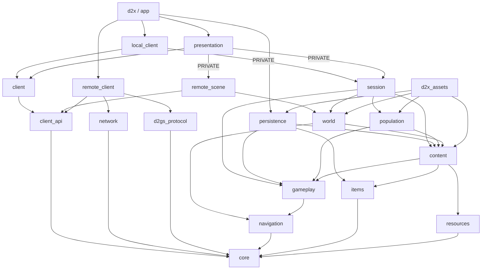

# 代码结构与依赖

依据：当前 [CMakeLists.txt](../../CMakeLists.txt) 和源码。本文负责现有模块分工、依赖和状态所有权；详细接口由 [模块基线](../README.md#模块边界) 维护。开发方向已转为仅支持 D2GS 联机，功能顺序见 [全面联机计划](MULTIPLAYER.md)，单机退场及依赖调整见 [结构改造方案](REFACTOR_PLAN.md)。M0–M1 已开始实施，表现库仍有本地会话依赖；源码与运行包的差异统一见 [项目基线](../../BASELINE.md)。

已有本地玩法按组合、值类型和领域服务组织：人物、怪物、佣兵通过公共战斗能力接入，控制策略独立；技能接收显式来源和参数，通过世界端口执行。没有要求所有对象继承同一个可写基类。本地分支仍是单操控人物、单活区宿主；联机通过 RealmSession 和 Remote 客户端适配消费原服状态，接口迁移未覆盖全部场景查询。下文本地权威结构描述源码现状，不是继续支持单机的要求。

**目录不等于 CMake 库边界。** `gameplay/session/` 等目录属于权威组装库；只有 `d2x_gameplay` 目标可视为不依赖 MPQ、设备和 GPU 的玩法库。

## 1. 模块分工

下表路径均相对 `src/`；目标完整名称为 `d2x_` 加表内名称，应用目标除外。

| 目录 / CMake 目标 | 主要职责 | 优先阅读 |
| --- | --- | --- |
| `core/` / `core` | ID、坐标、字节、随机数与指纹；仅头文件接口库 | `id.hpp`、`math.hpp`、`random_seed.hpp` |
| `resources/` / `resources` | MPQ 访问、TXT 解析及 DS1／DT1／DCC／DC6／COF 等文件解码 | `archive.*`、`formats.*`、`dcc.cpp`、`data_table.*` |
| `content/` / `content` | 把原表转换为物品、技能、怪物、NPC、世界等只读定义；保留原表供适配查询；物品及角色／技能显示计算使用显式输入 | `classic_data.*`、`lod_data.cpp`、各领域子目录 |
| `world/navigation.*`、`room_activation.cpp` / `navigation` | 碰撞网格、寻路和房间空间索引，不读取 MPQ | `Grid`、`RoomLayout` |
| `world/`（除导航和人口计划）/ `world` | 地图配方、预设／迷宫／野外生成、资源拼接、静态物件和出口连接 | `region_catalog.cpp`、`region.*`、`map_assembly.*`、`maze/`、`outdoor/` |
| `world/population.*` / `population` | 内容与地图 → 怪物生成计划；不分配实体 ID | `planPopulation`、`PopulationPlan` |
| `gameplay/items/` / `items` | 唯一物品／容器状态和事务；借用装备、需求、属性／战斗贡献、派生及已有技能授予筛选 | `InventoryService`、`operations.hpp`、`equipment_loadout.*`、`equipment_contributions.*`、`skill_sources.*` |
| `gameplay/` 中模拟与规则目录 / `gameplay` | 角色、战斗、技能、怪物 AI、状态效果、消耗品、掉落及第一幕任务规则 | `character/progression.*`、`character/learning.*`、`simulation/`、`model/`、`combat/`、`units/`、`player/control.*`／`frame.*`、`npc/hireling_controller.cpp`、`skills/`、`monsters/`、`rewards/` |
| `gameplay/session/`、`gameplay/npc/` 中宿主适配 / `session` | 命令分发、区域生命周期、内容查询、NPC 服务、任务与奖励、库存及保存协调 | `session.hpp`、`session.cpp`、`session_*.cpp`、`npc/` |
| `persistence/` / `persistence` | 原 D2S v96 编解码、内容校验、文件锁、替换与备份 | `save_codec.hpp`、`d2s_*.cpp`、`save_file.cpp` |
| `contracts/`、`client/*_client.hpp` / `client_api` | 人物／库存／角色／任务／NPC 投影、窄领域意图及可替换客户端入口 | `ActorView`、`InventoryView`、`CharacterView`、`QuestView`、NPC 视图及五个 `I*Client` 接口 |
| `client/inventory_view.cpp`、`automap_exploration.cpp` / `client` | 库存值查询与占格命中，不链接会话 | `InventoryView` 查询函数 |
| `client/local_*_client.*` / `local_client` | 绑定本地受控人物，映射本人及可见场景视图，转发原命令／预览 | `LocalActorClient`、`LocalInventoryClient`、`LocalCharacterClient`、`LocalQuestClient`、`LocalNpcClient` |
| `network/tcp_stream.*` / `network` | 独立 DNS／TCP、有限队列、连接取消和期限；Asio 仅实现层使用 | [联网模块](../modules/NETWORK.md) |
| `network/protocol/` / `d2gs_protocol` | SID／MCP framing、旧账号认证、1.13c D2GS 逻辑包／Huffman；认证依赖只读原文件及独立 BNCSutil 子集 | `wire.hpp`、`auth.hpp`、`d2gs_stream.hpp` |
| `network/realm_session.*` / `remote_client` | 无 UI 的账号／Realm／选角／大厅／入退局会话；输出 OnlineView 与只读服务端副本，并保留有界有序包 | `RealmSession`、`contracts/online.hpp` |
| `client/remote_town.*` / `remote_scene`、`presentation/remote` | 共同原生地图与服务端锚点绑定、服务端单位显示及网络意图；复用SceneView的完整UI、原图命中／标签／高亮和共同FrameInput，不创建本地模拟 | `RemoteTown`、`RemoteScene`、`RemoteUiClients` |
| `presentation/frontend/`、`app/frontend.*` | 原图主菜单／登录／服务器选角／建局：表现只返回意图，app 拥有并轮询远端会话；菜单 command 调用相同底层 | `RealmFrontend`、`FrontendIntent`、`debug/online_commands.*` |
| `presentation/` / `presentation` | 屏幕命中与手势、面板、场景绘制、GPU／音频资源及展示状态 | `controller.*`、`scene_view.*`、`scene_assets.*`、功能子目录 |
| `main.cpp`、`app/` / `d2x` | 参数、角色前端、窗口、设备输入、固定步主循环、保存入口、本机调试与崩溃记录 | `app/application.cpp`、`app/input.cpp`、`app/debug/` |
| `asset_tool.cpp` / `d2x_assets` | 独立资源查询、导出、预览、地图／掉落报告及存档摘要工具 | `asset_tool.cpp` |

需要特别区分：`gameplay/session` 和 `gameplay/npc` 的宿主适配编入 `d2x_session`；`npc/hireling_controller.cpp` 是不读内容／会话的纯控制策略，编入 `d2x_gameplay`，只借用已解析能力；宿主适配可依赖内容与地图；`d2x_gameplay` 才是隔离 MPQ、窗口和 GPU 的规则库。任务身份／显示／原保存槽由 `quest/id.hpp` 和 `catalog.hpp` 分工，`content/quest/quest_data.*` 统一绑定 MPQ 文字／原图与法杖配方及材料角色；`quest/acts/` 登记各幕 NPC、交谈、事件及日志规则，`session_act_two.cpp` 继续协调第二幕专用物件演出。本人三难度 `quests` 与非日志 `questPreludes` 属角色，客户端投影不包含任务簿；D2S 任务编码在 `persistence/d2s_quests.*`，详见[任务系统](../gameplay/quests/SYSTEM.md)。本批 Windows Release 与有限 NPC／临时存档冒烟通过，未重打包；准确范围见任务系统。

## 2. 实际依赖方向

箭头表示左侧目标依赖右侧目标。下图列出内部直接链接；`presentation`、`session` 等名称均省略 `d2x_` 前缀。



外部依赖集中在少数目标，版本／提交固定于 [Dependencies.cmake](../../cmake/Dependencies.cmake) 与 [Networking.cmake](../../cmake/Networking.cmake)：

| 依赖 | 直接链接目标 | 用途 |
| --- | --- | --- |
| StormLib（`storm`）| `d2x_resources`，`PRIVATE` | MPQ 读取与打包 |
| raylib | `d2x_presentation`（`PUBLIC`）、`d2x_assets` | 窗口、绘图、音频和资源预览 |
| nlohmann/json 3.11.3 | `d2x`，`PRIVATE` | 客户端设置及调试协议 |
| Windows `advapi32`、`dbghelp` | `d2x`，`PRIVATE` | 本机管道权限与崩溃记录 |
| Asio 1.30.2、Threads；Windows `ws2_32`／`mswsock` | `d2x_network`，`PRIVATE` | DNS、TCP 与连接计时 |
| BNCSutil 认证子集动态库 | `d2x_d2gs_protocol`，`PRIVATE` | CheckRevision、key proof、旧式账号哈希；Windows 版本读取封装在此依赖 |

内部链接大多为 `PUBLIC`，消费者会获得传递依赖；`local_client → session` 与 `presentation → session` 为实现依赖 `PRIVATE`，`client_api` 只依赖 `core`。这里是链接图，并非所有头文件包含关系；例如 `CharacterSaveData` 位于 `gameplay/session/`，存档库包含这个值类型，但不链接 `d2x_session`。

`content → gameplay` 是原表适配为规则类型的依赖，`gameplay` 不反向读取内容。`persistence → content` 用于按当前物品／技能等定义校验存档。`resources` 负责原文件读取，`content` 负责规则含义适配，两者分工不同。

## 3. 状态归属与运行流程

| 状态 | 管理者 | 边界 |
| --- | --- | --- |
| 窗口、设备、MPQ 档案、当前存档路径 | `app` | 档案借给会话和表现层；GPU／音频对象先于设备销毁 |
| 内容目录、区域地图、静态物件、非当前区域状态、会话随机流 | `GameSession` | 按需加载当前区域与直接连续邻区，已访区域缓存保留 |
| `WorldState`：玩家、当前 `AreaState`、弹体、怪物与临时效果 | `Simulation`，由会话独占 | 借用会话内稳定的 `Grid`／`RoomLayout`，不持有档案或 GPU |
| 物品实例与容器归属 | `InventoryService`，由会话持有 | 转移通过事务；会话提供访问权限、角色需求和世界碰撞查询 |
| 死亡掉落结算记录 | 会话内 `LootSystem` | 按实体 ID 防重复结算，使用真实怪物身份 |
| 面板、相机、手势、展示计时、GPU／音频缓存 | `SceneController`、`SceneView`／`SceneAssets` | 已迁移的人物、库存、角色、NPC／任务及地图界面读值投影、提交意图；其余场景查询仍有兼容入口 |
| 角色保存值数据 | `CharacterSaveData`／`CharacterRecord` | 显式采集持久字段；值类型不再包含完整运行人物，活世界和临时动作不入 D2S |

一次普通操作经过：

```text
app/input.cpp 读取设备 → FrameInput
  → SceneController 命中／手势 → I*Client → Local*Client
  → 权威命令 / PlayerFrameInput → GameSession 提交与 advance
  → Simulation / InventoryService → 投影与 GameEvent → SceneView
```

`app/application.cpp` 以 25 Hz 累积器调用 `advance(fixedStep)`；连续方向／跑步意图由 LocalActorClient 绑定人物 ID 后交给 `setPlayerInput`。`tick(0)` 保留零时间提交／发布兼容语义；应用初始化／恢复仍通过 `setRunning` 等宿主接口。具体顺序见 [会话基线](../modules/SESSION.md)。

单机与联机的区别在权威端：单机的 `Local*Client` 直接提交给本进程 `GameSession`，联机的 `Remote*Client`／`RemoteControl` 提交给 `RealmSession`，由 D2GS 执行并回传状态。单机当前没有通过 TCP 或原 D2GS 协议运行；本地参考 OpenDiablo2 的 `LocalClientConnection::Open` 虽然创建 `GameServer`，双向消息同样只是调用对端函数，不要求套接字或独立进程。

两种模式已共用面板、底栏、库存／NPC UI、弹体表现、输入快照、原帧命中、高亮和姓名标签。世界控制与角色动画组装仍保留 `SceneController`／`SceneView` 的本地入口和 `RemoteScene` 的远端入口，尚未完全合并；远端位置插值、预测取消和回包校正必须保留。进一步复用应统一客户端世界视图与意图入口，再由本地／远端适配器执行，不能让联机调用本地模拟代替原服结算。

地图链是 `WorldCatalog → planWorld / MapRecipe → loadRegion → Map / Grid / WorldObject`；怪物链是 `planPopulation → pendingSpawns → 附近房间实例化`。切区把当前 `AreaState` 移回会话缓存，再把目标区状态交给模拟，避免同时保留两份活状态。区域加载由会话切换入口触发，不是房间级后台流式加载。

保存链是 `GameSession::characterSave → encodeSave → writeFileAtomically`；读取先 `decodeSave`，再由 `GameSession::restore` 校验并建立新局。格式与边界见 [SAVES.md](../modules/SAVES.md)。Windows 文件替换分支位于 `persistence/save_file.cpp`，属于文件 I/O；D2S 编码及纯玩法不需要 Win32。

鼠标移动、库存、角色学习分别经过对应 I*Client／Local*Client，结果由 ActorView、InventoryView 和 CharacterView 返回。NPC／任务／商店／佣兵及地图界面也已有投影入口；攻击施法、地面与世界单位／物件显示及其他资源查询仍保留部分兼容链。当前表现目标尚不能作为完全独立的联网客户端。

技能当前入口已收窄为 `SkillRuntime`、按单位 ID 的来源求值及权威世界／武器端口；具体行为不再实现 `Simulation` 成员，内容导入、学习元数据、求值结果、运行值和表现描述分开。怪物生成头已拆为生成指令，完整词缀留在活动怪物，奖励只传值快照。当前文件分工和本轮验证见 [技能基线](../modules/SKILL_RUNTIME.md) 与 [怪物基线](../modules/MONSTERS.md)。

## 4. 修改工作的落点

| 工作 | 通常需要协同的模块 |
| --- | --- |
| 原表字段／资源解码 | `resources → content`；只有文件格式变化才改解码器 |
| 新地图或出口 | `content/world → world → session_exits`，表现层只读地图 |
| 怪物或技能 | `content/monsters、skills → gameplay → session`；图像／声音接 `presentation/actors、world、audio` |
| 物品、装备或 NPC 交易 | `content/items、npc → items → session/npc`；界面接 `presentation/inventory、npc` |
| 任务 | `quest/state` 与任务规则、`session` 触发／奖励、日志／对白；涉及持久字段再同步 `persistence` |
| 纯 UI | `presentation`，需要新行为时新增命令／会话校验，避免直接修改玩法状态 |
| 角色保存 | `character_save.hpp → session_character_save / session_restore → persistence/d2s_*` |

多人协作时按领域文件分工；`session.hpp`、`model/*`、`CMakeLists.txt` 与存档接口由集成方统一修改。MPQ 参数继续动态导入，已核实的固定引擎规则与内容字段分别记录；未核实资源或规则明确暂缓。


## 目录与头文件边界

- `content/{items,monsters,skills,character,npc,world,quest}` 负责原表适配，根层保留公共目录与字符串入口。
- `presentation/{inventory,hud,npc,actors,world,graphics,audio}` 负责相应表现、控制与资源；根层保留场景组装和总控制器。
- `world/{outdoor,maze}` 负责地图家族，人口计划与导航使用各自 CMake 目标。
- `app/debug` 保存本机调试传输，Win32 不进入玩法或存档位流编码。
- `GameSession` 通过不透明实现隔离私有状态；完整查询和部分 friend 写入仍是兼容边界。公开共享值类型改动仍会引起消费者重编，未测量增量构建耗时。
- 新功能沿领域入口扩展，UI 只提交意图；内容适配先提供类型化事实，玩法不反向读取 MPQ。随机流、25 Hz 固定步、命令和结算顺序不得因整理文件改变。

## 后续边界

剩余场景投影、复杂事务、来源消费与宿主收口见 [重构方案](REFACTOR_PLAN.md)。独立网络／Realm 会话、局前流程、远端单位／房间／位置副本与营地绑定／显示已构建打包，通过双账号营地互见／移动及角色重入有限冒烟，见 [联网模块](../modules/NETWORK.md)；完整地图和玩法回包消费者未完成。本地服务端多玩家所有权不属于当前 D2GS 接入路线，设计及验收条件见 [参考项目](REFERENCE_DESIGN.md) 和 [联机计划](MULTIPLAYER.md)。
