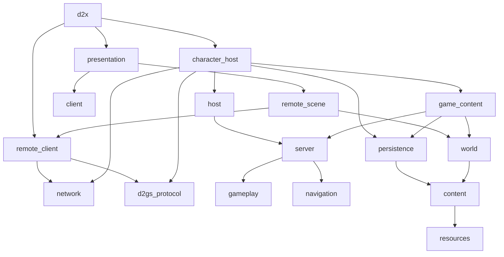

# 代码结构与依赖

更新：2026-10-08。源码入口以CMake为准；Windows Release已构建打包，有限冒烟及历史证据见[基线](../../BASELINE.md)，功能顺序见[总计划](MULTIPLAYER.md)。

## 模块分工

路径相对src/；客户端与自研服务端在同一产品进程组装，库与状态边界分别成立。

| 模块 | 职责 |
| --- | --- |
| core、resources、content | 跨平台值工具，MPQ／原图／表读取，准备只读定义 |
| world/native_map、generated_area | 同一原生地图生成与房间reveal；宿主保留发包顺序，客户端按原包重放 |
| network/byte_transport、tcp_stream、memory_transport | IByteTransport字节流；TCP与有锁有界内存FIFO；连接代次隔离旧字节 |
| network/realm_session、protocol | 唯一MCP／D2GS编码、解码、握手、worker、客户端稳定快照；原服另有账号认证 |
| client/remote_* | 两种服务端共用的世界／库存副本、地图、请求、预测与I*Client投影 |
| presentation | 唯一RealmFrontend、SceneController、SceneView、RemoteScene及原资源／面板／动画／声音 |
| server/game_messages | 仅宿主与内核使用的内部身份、命令和投影；不是网络协议或客户端契约 |
| server/game_instance、area_store、player_store、movement | 组合根、区域／玩家唯一所有权、入场值组装与移动执行；无MPQ／GPU／文件／socket |
| server/runtime | 类型化命令、穷尽分派、系统组合／窄依赖、固定步顺序、只读规则和有界事件出口 |
| server/systems/* | 独立领域State／Ports／操作；已执行范围与保留Scaffold分开，详见[内核子系统](../modules/SERVER_SYSTEMS.md) |
| hosting/game_host | 多实例槽位、代次、绑定、25Hz固定步、暂停与内部快照 |
| hosting/game_content、character_creation、character_rules | MPQ输入准备、初始角色／物品、入局规则指纹；不负责客户端绘制 |
| hosting/embedded_realm | 内存端点、selector、分帧与断开／调度组装，不实现具体玩法 |
| hosting/detail | 与传输无关的多连接服务组合、MCP角色／游戏、D2GS生命周期和管理接口 |
| hosting/protocol | C2S／S2C目录、阶段／长度检查、按领域具名分派与显式stub；扩展约定见[服务端协议](../modules/SERVER_PROTOCOL.md) |
| hosting/native_game_wire、native_item_wire | 原入局／状态／移动／物品包编码；JM磁盘位流不作网络包 |
| hosting/administration、app/debug/server_commands | 类型化宿主管理与外围JSON适配；不增加私有游戏消息 |
| hosting/character_store、character_directory | 服务端目录名册、稳定选择、角色租约、替换检测、原子保存与删除；目录值不暴露给UI |
| gameplay/character/persistent_character | 纯角色持久值；不带路径、表现、网络或整局运行态 |
| persistence | 沿用master支持范围的D2S v96编码／校验；CharacterSaveData为上述值的别名 |
| app/frontend | 连接选择、Single Player自动建房、窗口／输入／宿主调度与开发管理；不读写D2S，不另设世界循环 |
| asset_tool | 独立MPQ／地图／存档只读诊断 |

## 依赖方向

客户端和表现库不链接host、server或persistence；产品可执行文件经嵌入宿主链接存储库。server／host不链接content、resources、raylib或network。C++20／CMake保持Windows／Linux；平台凭据、调试管道与原子替换留外围。当前还没有独立服务器程序或仅服务器的CMake配置。

## 生命周期

原服与自研均由FrameInput → SceneController → RemoteUiClients／RemoteControl／Combat／Inventory → RealmSession发送原包。回包进入同一RemoteWorld／RemoteTown／RemoteScene，再由公共UI、动画和声音消费。单机仅在组装入口建立内存字节连接；移除了LocalGame／GameClients／GameScene及其CMake目标。

嵌入宿主在应用帧中泵入字节并调用GameHost.advance；内核命令有界FIFO、绑定玩家、校验实例／区域代次和内部序号。每实例独立时钟／区域／玩家表／随机／ID；代次在槽位复用时递增。未来并发调度由宿主承担，不向GameInstance加入窗口或网络工作。

角色在原MCP选中时取得整局租约，创建游戏前完成内容和网络入局数据准备；失败不覆盖原档。退局收到原0x69后先保存，再销毁实例并发原0xB0。保存失败保留实例和锁，终止失败的连接并显示原因，应用关闭或重新连接时可重试保存。F11是宿主检查点；Ctrl+F11先完整准备存档，再让同一原协议客户端重新入局。细节与范围见[存档](../modules/SAVES.md)。

地图、规则、存储和原包适配不得继续聚集到GameInstance。后续在既有server/systems骨架内逐领域实现，runtime/simulation只维护顺序，不承载玩法；旧GameSession及其全能执行器不恢复。参考仓库、MPQ、mvp、旧包和用户存档保留。
