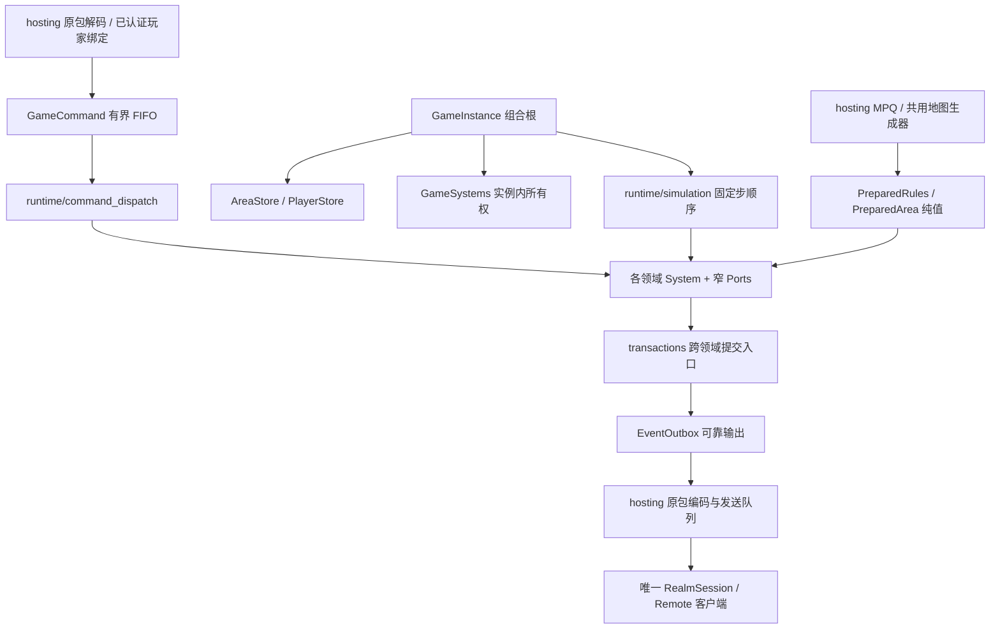

# 自研游戏内核与子系统

更新：2026-10-08。本文维护内核的源码入口、所有权和扩展约定；功能顺序见[总计划](../architecture/MULTIPLAYER.md)，原包入口见[服务端协议](SERVER_PROTOCOL.md)。Windows Release已构建打包；目录、移动固定步及骨架诊断有有限冒烟，证据与限制见[基线](../../BASELINE.md#当前运行包与有限冒烟)。新领域仍为骨架。

## 当前范围

原有玩家入场和行走继续由权威内核执行。新增26个领域骨架，共28项目录；每个新领域具有独立State、只读read、类型化请求／操作和显式Ports。它们已经由GameSystems持有、加入CMake；有固定步入口的系统接入调度，用户命令接入穷尽式分派。骨架函数返回NotImplemented，不扣费、不分配实体、不消耗随机、不产生成功事件。

命令目录中的Scaffold在入队前被拒绝，不因有一个函数入口就宣称Queued。3A加点、3B学习、41复活已作为协议到类型化命令的接线例子，最终仍返回NotImplemented；其他原包继续保留既有具名stub。当前没有新增战斗、生成物品／怪物、掉落、NPC服务或多人游戏功能。

## 组合与所有权

GameInstance只组装实例级区域、玩家、ID、随机、命令、系统、调度和输出；不实现物品、怪物、技能或任务规则。PlayerStore负责玩家入场值组装；MovementSystem保留已有寻路／碰撞执行。GameHost负责实例句柄、暂停、固定步预算、参与者快照和宿主端口，发布时遍历参与者，不硬编码唯一收件人。当前认证／建房仍只准入一个玩家，不代表已经实现多人加入。

GameSystems只供组合／分派／调度使用，不传入领域函数。它的构造函数一次性为各系统注入本领域的Ports；领域入口只接收业务参数，调用另一个系统时不必重新拼装对方的依赖。跨域读取为const，可以提交协作请求的引用明确列出；没有字符串服务定位器、万能可变世界对象或能够调用UI／MPQ／socket的回调。

构造函数只保存依赖引用，不访问或调用尚未构造完的同伴；所有系统就绪后才准入玩家并执行命令。GameInstance／GameSystems禁止复制和移动，依赖的规则、玩家、区域和输出先构造、后析构；系统析构不回调同伴。调度线程串行访问实例。跨阶段工作应提交类型化请求或事实，不能通过互相调用执行函数形成递归结算链。

GameSettings按实例保存地图种子和难度，通过只读端口供区域、人口和掉落使用。当前单人创建时由宿主取自选中角色；未来新参与者不能用自己的存档覆盖房间配置。随机流、EntityIds、命令和可靠事件队列也都按实例隔离。

PersistentCharacter在PlayerStore中唯一持有，包含库存、人物记录、任务、尸体和铁魔等持久数据。items只持有不属于角色的世界物品；trade／merchant保存句柄／报价版本，不复制角色背包。spatial是派生查询，attributes保存失效标记；均不另建可写的位置／人物基础属性真值。companions拥有归属和控制关系，活动实体归monsters。公开read只读，不能从UI取得可写状态。

## 领域目录

除players、movement外，路径均为src/server/systems/<目录>/system.hpp／system.cpp，表内操作均为骨架。

| 目录 | 拥有的运行态／职责 | 操作边界 |
| --- | --- | --- |
| players | PlayerStore中的角色持久值、位置、移动状态和命令序号 | 入场组装；持久导出仍由GameHost交宿主存储 |
| movement | 原有路线、走跑及碰撞执行，数据归PlayerStore | execute／step／suspend |
| world | 区域驻留、准备请求；AreaStore唯一拥有准备后的碰撞 | requestArea／install／step；不生成地图 |
| spatial | 派生空间索引；查询玩家、怪物、物件、弹体及世界物品 | query／step；不移动实体 |
| items | 世界物品，沿用ItemInstance／InventoryState | create／resolve；生成不等于提交或放入背包 |
| inventory | 容器访问、摆放／装备／使用／金币请求 | execute／close；不拥有第二份库存 |
| attributes | 装备／被动／状态派生总值与失效集合 | evaluate／step；不修改人物基础值 |
| crafting | 方块、镶嵌、注入、打孔、个性化事务意图 | execute；复用既有纯意图类型 |
| loot | 掉落选择与来源结算记录 | plan／step；沿用LootRequest／LootPlan，不写死概率 |
| population | 区域人口、已准入spawn key | admit／step；保留MonsterIdentity及显式实现类型 |
| monsters | 活动非玩家实体、身份、位置和版本 | admit／requestMove／remove／step；与人口生成、AI决策分离 |
| ai | 目标、决策时间与控制器 | step；产生动作，不直接结算伤害 |
| skills | 选技／热键／施放及持续动作 | execute／requestCast／step；AI使用实体来源请求，不伪装成玩家 |
| missiles | 弹体实体和寿命 | spawn／step；碰撞后向combat提交结算请求 |
| effects | 状态效果、来源、持续时间 | apply／step；原状态定义由宿主准备 |
| combat | 命中／减免／伤害结算请求 | enqueue／step；死亡转移归death |
| death | 死亡发生标识、复活／尸体回收 | execute／step；不直接重做掉落或发经验 |
| companions | 雇佣兵／召唤物／铁魔归属 | summon／execute／step；不复制活动实体 |
| objects | 门、箱、祭坛及任务物件状态 | admit／execute／step；掉落／效果／任务各归其领域 |
| npc | 对话会话和对白确认 | execute／close；商店、雇佣、工艺、旅行各自分派 |
| merchant | 商品句柄、报价版本和买卖／鉴定／维修请求 | execute；成交走事务边界 |
| quests | 游戏级任务状态；个人进度仍归人物记录 | execute／step；资格与奖励不可由客户端授予 |
| progression | 分配属性／技能、经验／升级来源结算 | execute／award／step |
| travel | 退出点、传送点、门户、NPC旅行的待迁移状态 | execute／step；异步准备后再提交换区 |
| social | 队伍、关系、敌意及聊天请求 | execute；不依赖UI |
| trade | 双方报价、同意状态及交换版本 | execute／cancelFor；背包／金币不在此复制 |
| transactions | 跨域计划、版本前置条件、提交身份 | prepare／commit；当前没有原子提交实现 |
| replication | 每个收件人的兴趣与可见实体集合 | admit／step；只投影，原字节编码留hosting |

目录在runtime/subsystems.inc维护身份、阶段和实现范围。目录注册用于组合与诊断，不等于玩法能力；目前仅players、movement标walking-slice。每种怪物／技能不预先创建一个空类，后续按原行为数据扩展各领域。

## 命令与固定步

GameCommand由服务端产生sequence、来源area及areaGeneration，负载为MovementCommand及13种领域Request的variant。实例绑定由GameHost校验，操作者从PlayerStore构造ActorContext，不信任客户端传来的玩家身份。入队校验玩家、区域身份和代次、递增序号、实现范围和256条容量；固定步执行前再次核对来源区域，防止两个不同区域代次相同而误执行旧命令。未实现请求不占FIFO、不更新acceptedSequence。

runtime/command_dispatch为每个负载显式映射SystemId与领域入口，没有默认成功分支。CommandStatus区分Queued、Applied、NotImplemented、Stale、Conflict等结果。PlayerSnapshot.command只保存最近执行结果，movementSequence单独触发原移动回复；最近结果可以被覆盖，不能用作物品／交易的可靠完成通知。

runtime/simulation固定顺序为：区域／人口 → 属性 → 初次空间索引 → 伙伴／AI → 技能 → 玩家移动／怪物 → 更新空间索引 → 弹体／效果／战斗 → 死亡 → 物件／任务 → 掉落／成长 → 旅行 → 投影。此处是执行位置的骨架，不宣称已核实原版全部结算细节；真实规则接入时须按依赖明确调整顺序。没有用毫秒或渲染delta执行新玩法，所有步沿用25Hz。

只有声明step的领域被调度，inventory等服务在命令／事务边界按需调用。调度记录每个step返回的Complete／NotImplemented／Blocked，不把stub标成完成。当前各新系统都不产生状态变化；未来Blocked的依赖处理由相应领域明确实现，不能把诊断记录当自动依赖调度器。

FrameFacts是有界的本步临时事实，只允许后续阶段消费；每步开始清空。需要在下一步继续处理的请求必须留在所属系统pending状态，不能靠临时事实延后。可靠通知进入EventOutbox，不能依赖FrameFacts或覆盖式快照。

## 内容、事务与输出

PreparedRules持有不可变的物品、技能、状态、宝物类纯值定义，Ports只暴露本领域需要的部分。空指针表示尚未准备，不能触发默认参数或伪造定义。当前行走内容准备仍只提供原有CharacterDefinition与碰撞，新增规则集合尚未加载；其余原表契约随对应领域细化，不能将ClassicData／Archives整体注入内核。

区域边界已提供GameHost.pendingAreas／installArea，结果带GameHandle及PrepareArea请求身份。world的请求／安装仍为stub；后续由宿主消费准备需求，调用同一个NativeMapGenerator，按调度线程提交纯AreaDefinition并核对过期请求。客户端仍根据原LOADACT／房间包调用同一地图生成代码，不读宿主世界对象。

transactions的Plan已有TransactionId、RevisionGuard及物品转移／奖励／双人交换载荷，prepare和commit均返回NotImplemented。它是扩展入口，尚未实现锁定、回滚、物化物品或复合人物写入；后续按领域补齐类型化计划，规则留在发起领域，提交层只负责一致性。不得因为结构名为Plan就认为已实现原子性。

实现提交时必须一起处理：目标／所有权／版本再校验、所有参与者资源及空间资格、事件容量预留、随机及ID的提交语义、去重，以及完整成功后的状态／事件发布。失败不得部分扣费、移物、推进随机或记录已领奖；不能先改库存再发现输出队列已满。掉落发生标识、任务奖励资格和交易版本均由服务端产生，不能以客户端重试次数结算。

EventOutbox目前具备256批／4096事实的有界发布、有序批号、只读查询及累计确认，不能覆盖未确认输出。GameHost.pendingEvents返回副本；hosting成功完成原包编码并接入可靠发送流程后才能acknowledgeEvents。当前骨架没有发布新事件，通用原包投影／消费尚未实现；现有行走仍使用已有原移动编码。所有接收者过滤、加入基线、实体删除及跨区顺序须随replication具体实现，不能私自把EventBatch发给客户端。

## 扩展与诊断

新增玩法按“准备原表纯值 → 领域状态／请求／规则 → 事务与失败边界 → 原S2C投影 → 开放命令”接入。先完整实现依赖与输出，再更改Scaffold状态；不能只修改目录让半个事务进入执行队列。玩家离开、换区、死亡时涉及的对话／交易／同行者清理，应由相应领域入口组合，不恢复一个全能GameSession。

named pipe的server-systems只读返回28项目录、phase、scope和lastStep。lastStep=null表示尚未执行或该系统没有固定步入口，不表示完成；新增领域正常显示not-implemented。server-status.command表示最近实际命令结果，替代原来仅描述移动的字段；server-protocol仍负责原包覆盖与计数。这些诊断只在宿主管理端，不参与客户端世界同步。

PersistentCharacter、D2S v96编码、存档语义和规则指纹本轮未扩展。新系统运行态不写入D2S；以后恢复尸体／铁魔／佣兵／任务时必须复用既有持久模型并显式定义恢复边界，不能静默迁移或把空运行态覆盖回完整存档。
