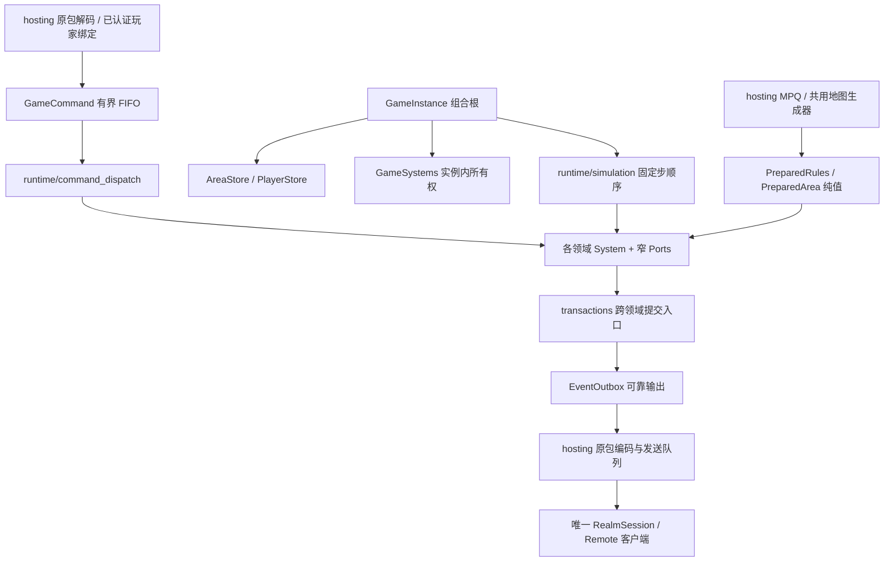

# 自研游戏内核与子系统

更新：2026-10-09。本文维护内核入口、所有权和扩展约定；功能顺序见[总计划](../architecture/MULTIPLAYER.md)，原包入口见[服务端协议](SERVER_PROTOCOL.md)。此前行走及骨架包有有限冒烟，见[基线](../../BASELINE.md#当前运行包与有限冒烟)；女巫／六项基础有历史有限冒烟；女巫／亚马逊30项及通用十项已构建，列出的自研／原服路径有有限运行证据，具体范围与限制见基线。

## 当前范围

玩家入场、行走、库存／装备、人物成长、世界换区、多人投影、普通近战、女巫及亚马逊技能、掉落／消耗、玩家死亡、普通物件／NPC和五幕27项个人任务／奖励／旅行由权威内核执行。26个领域加玩家／移动形成28项目录；各自具有独立State、read、类型化请求及显式Ports，由GameSystems持有。inventory规划物品，attributes计算总值，progression规划成长，transactions提交人物事务；World管理区域准备／驻留，Travel提交位置／区域过渡，replication派生可见参与者，social只实现同局聊天。其他规则保持NotImplemented；总体未完成，当前范围以本页、[库存](INVENTORY.md)、[人物](CHARACTER.md)和[ACT1](../gameplay/quests/ACT1.md)为准。

命令目录中的Scaffold在入队前被拒绝，不因有函数入口就宣称Queued。3A／3B成长、13的UNIT_TILE及15同局聊天已执行领域入口；传送点、本人门户、普通物件／NPC与城镇服务已接；Warriv／Meshif双向跨幕及任务门户旅行已接；队伍、敌意和交易仍为stub。普通攻击／选技／热键／停止已接skills；人口准入已准备的第一幕普通／精英／首领怪物。世界物品生成与普通掉落已接items／loot，不能据此宣称全部来源规则完成。

## 组合与所有权

GameInstance只组装实例级区域、玩家、ID、随机、命令、系统、调度和输出，并提供参与者准入／进入／移除入口；不实现物品、怪物、技能或任务规则。PlayerStore唯一拥有角色值和每人不可变EquipmentRules／CharacterRules，防止后来加入的职业复用房主经验表或物品ID。MovementSystem保留既有寻路／碰撞执行。GameHost负责句柄代次、暂停、固定步预算和参与者快照。NativeRealmHost共享只读MPQ内容、管理房间／地形并每帧只推进一次；每个NativeRealmService持有自己的协议会话、角色名册版本及存档租约。

GameSystems只供组合／分派／调度使用，不传入领域函数。它的构造函数一次性为各系统注入本领域的Ports；领域入口只接收业务参数，调用另一个系统时不必重新拼装对方的依赖。跨域读取为const，可以提交协作请求的引用明确列出；没有字符串服务定位器、万能可变世界对象或能够调用UI／MPQ／socket的回调。

构造函数只保存依赖引用，不访问或调用尚未构造完的同伴；所有系统就绪后才准入玩家并执行命令。GameInstance／GameSystems禁止复制和移动，依赖的规则、玩家、区域和输出先构造、后析构；系统析构不回调同伴。调度线程串行访问实例。跨阶段工作应提交类型化请求或事实，不能通过互相调用执行函数形成递归结算链。

GameSettings按实例保存地图种子和难度，由建房选中角色提供；后来加入者采用房间配置，不能用自己的存档覆盖它。随机流、EntityIds、命令和可靠事件按实例隔离；玩家ID不因离开而复用。最多256个宿主实例、每局1–8人；暂停私有一人局不影响其他实例，共享房间不随客户端ESC／失焦暂停。

PersistentCharacter在PlayerStore中唯一持有，包含库存、人物记录、任务、尸体和铁魔等持久数据。items只持有不属于角色的世界物品；trade／merchant保存句柄／报价版本，不复制角色背包。spatial是派生查询，attributes只读已提交Totals；均不另建可写的位置／人物基础属性真值。companions拥有归属和控制关系，活动实体归monsters。公开read只读，不能从UI取得可写状态。

## 领域目录

除players、movement外，路径均为src/server/systems/<目录>/system.hpp／system.cpp；inventory另有planning／placement／equipment规则文件。除明确注明的切片外，表内操作为骨架。

| 目录 | 拥有的运行态／职责 | 操作边界 |
| --- | --- | --- |
| players | PlayerStore中的角色持久值、位置、移动状态和命令序号 | 入场组装；持久导出仍由GameHost交宿主存储 |
| movement | 原有路线、走跑及碰撞执行，数据归PlayerStore | execute／step／suspend |
| world | 区域驻留、准备请求、原生出口／边界／物件身份；AreaStore唯一拥有碰撞 | 请求合并／过期结果拒绝／失败记录／可见邻区；不生成地图，Sleeping保留值不卸载 |
| spatial | 派生空间索引；查询玩家、怪物、物件、弹体及世界物品 | query／step；不移动实体 |
| items | 世界物品，沿用ItemInstance／InventoryState | create／resolve；生成不等于提交或放入背包 |
| inventory | 容器访问、摆放／装备／数量规划 | execute已接移动／交换／装备／切组／合堆／入书；新增地面拾取／丢弃、金币丢弃、卷轴／书本鉴定、药水和仓库授权／关闭，库存仍归PlayerStore |
| attributes | 纯派生计算与当前Totals只读查询 | calculate／evaluate；提交前同步求值，无dirty队列；已接支持的临时状态，完整被动仍待恢复 |
| crafting | 方块／镶嵌与原38任务加工事务 | execute／pending／install；hosting准备不可变输出，前置任务资格由quests负责 |
| loot | 掉落选择与来源结算记录 | plan／step；沿用LootRequest／LootPlan，不写死概率 |
| population | 区域人口、已准入spawn key | admit／step；保留MonsterIdentity及显式实现类型 |
| monsters | 活动非玩家实体、身份、位置和版本 | admit／requestMove／remove／step；与人口生成、AI决策分离 |
| ai | 目标、决策时间与控制器 | step；产生动作，不直接结算伤害 |
| skills | 选技／热键／施放及持续动作 | execute／requestCast／step；AI使用实体来源请求，不伪装成玩家 |
| missiles | 弹体实体和寿命 | spawn／step；碰撞后向combat提交结算请求 |
| effects | 状态效果、来源、持续时间 | apply／step；原状态定义由宿主准备 |
| combat | 命中／减免／伤害结算请求 | enqueue／step；死亡转移归death |
| death | 死亡发生标识、复活／尸体回收 | execute／step；死亡终态及击杀奖励去重；经验委托progression，已接死亡结算、城镇复活与本人尸体回收 |
| companions | 雇佣兵／召唤物／铁魔归属 | summon／execute／step；不复制活动实体 |
| objects | 门、箱、祭坛及任务物件状态 | admit／execute／step；掉落／效果／任务各归其领域 |
| npc | 对话会话和对白确认 | execute／close；商店、雇佣、工艺、旅行各自分派 |
| merchant | 商品句柄、报价版本和买卖／鉴定／维修请求 | execute；成交走事务边界 |
| quests | 游戏级任务状态；个人进度仍归人物记录 | execute／step；资格与奖励不可由客户端授予 |
| progression | 属性／技能分配、经验封顶／升级规划 | execute／award已接；经CharacterEdit提交，step无额外改写 |
| travel | 自然边界／UNIT_TILE、门户及NPC待过渡状态 | walk／execute／step／cancel；按来源校验原邻接或NPC资格、活人、来源代次、碰撞及路线；先可靠事实再改区域／位置。已接传送点、本人回城门、五幕任务门户和Warriv／Meshif旅行；完整特殊场景及队伍锁仍待实现 |
| social | 同局聊天请求；队伍、关系、敌意为骨架 | 原15聊天形成ChatFact，提交时捕获收件人；其他操作未实现 |
| trade | 双方报价、同意状态及交换版本 | execute／cancelFor；背包／金币不在此复制 |
| transactions | 跨域计划、版本前置条件、提交身份 | prepare／commit已接单人物InventoryEdit／CharacterEdit原子提交；已接地面转移／尸体／任务奖励；双人交换仍为stub |
| replication | 每个收件人的兴趣与可见玩家集合 | visible／step；按本人区域及准备好的直接自然邻区过滤，普通怪物使用本区RoomLayout邻室及直接邻区距离过滤；完整房间兴趣仍待实现；编码留hosting |

目录在runtime/subsystems.inc维护身份、阶段和范围。players／movement为walking-slice，inventory为inventory-slice，attributes／progression／transactions为character-slice，World／Travel为world，replication／social为multiplayer；范围表示已接切片，不代表该领域全部规则完成。population／monsters／ai／skills／missiles／combat／death为combat-slice。items／loot／merchant为inventory，effects为character，objects／npc／quests为world；companions已接Hydra、诱饵／女武神及血乌奖励罗格，完整雇佣服务／通用请求仍明确拒绝；spatial／trade仍为scaffold；crafting已接方块／镶嵌及原38任务加工，命令按具名意图检查。

## 命令与固定步

GameCommand由服务端产生sequence、来源area及areaGeneration，负载为MovementCommand及13种领域Request的variant。实例绑定由GameHost校验，操作者从PlayerStore构造ActorContext，不信任客户端传来的玩家身份。入队校验玩家、区域身份和代次、递增序号、实现范围和256条容量；固定步执行前再次核对来源区域，防止两个不同区域代次相同而误执行旧命令。未实现请求不占FIFO、不更新acceptedSequence。

runtime/command_dispatch为每个负载显式映射SystemId与领域入口，没有默认成功分支。CommandStatus区分Queued、Applied、NotImplemented、Stale、Conflict等结果。PlayerSnapshot.command只保存最近执行结果，movementSequence单独触发原移动回复；最近结果可以被覆盖，不能用作物品／交易的可靠完成通知。

Travel独立于人物事务：自然边界按原room连接和统一坐标确认接触面，沿既有速度逐步走过接缝；瓦片出口按原13/type=5绑定World分配的UNIT_TILE，接近后进入唯一反向出口，保留LvlWarp的ExitWalk偏移。区域、来源generation、移动意图序号在提交前复验，库存／成长命令不会取消路线；新移动／旅行、退役和离开取消旧过渡。完整TravelFact进入Outbox后才提交区域／位置／新路线，失败不半换区。多重反向出口、原任务锁入口及未核实资格明确暂缓。

runtime/simulation固定顺序为：区域／人口 → 属性 → 初次空间索引 → 伙伴／AI → 技能 → 玩家移动 → 库存恢复／地面恢复与过期 → 怪物／空间索引 → 弹体／效果／战斗 → 死亡 → NPC／商店／加工 → 物件／任务 → 掉落／成长 → 旅行 → 投影。P5补merchant／crafting／items.step调度，不依赖界面操作推进维护。此处不宣称已核实原版全部结算细节；规则接入按生产者／消费者依赖调整。所有步沿用25Hz，不用渲染delta执行玩法。

只有具有运行维护工作的领域被调度，transactions／social在命令边界按需规划／提交。World在准备需求存在时返回Blocked，Travel等待准备或接近路线时返回Blocked，replication更新派生兴趣后Complete；其余stub不产生状态变化。Blocked只描述相应领域，其他阶段／实例继续运行。

FrameFacts是有界的本步临时事实，只允许后续阶段消费；每步开始清空。需要在下一步继续处理的请求必须留在所属系统pending状态，不能靠临时事实延后。可靠通知进入EventOutbox，不能依赖FrameFacts或覆盖式快照。

## 内容、事务与输出

SkillRules只持有公共SkillRuleSpec数值和程序参数，不持有动画／声音资源路径。hosting从当前MPQ的SkillSpec准备rules()纯值；resolveSkill、伤害／耗蓝／持续时间、序列时序和有依据的弹体纯计算供两端调用。服务端skills／missiles／effects负责世界状态与调度，combat负责权威命中／伤害，客户端仅从原包及本人已知属性生成表现。原版公共职责和每项技能分派见[女巫技能](../gameplay/skills/SORCERESS.md#30项公共职责核对)及[亚马逊技能](../gameplay/skills/AMAZON.md#30项职责核对)，不能把D2Game整套执行器解释为客户端共享接口。

PreparedRules持有不可变纯值；全局ItemCatalog共享同一宿主只读内容，每位PlayerState持有自己的EquipmentRules／CharacterRules／MeleeRules／SkillRules。hosting/game_content与character_content从MPQ准备碰撞、职业、各等级物品属性、经验、学习、基础被动及难度抗性；内核不持有ClassicData／Archives或MPQ回调。普通攻击动画和区域人口由hosting/combat_content准备；hosting/skill_content准备女巫全部主动技能、SC／序列动画、三类支配及Hydra，以及亚马逊武器／状态／序列／宠物规则；hosting/companion_content准备女武神原MonEquip装备；其他职业与宝物类契约仍未准备；空规则明确Unavailable，新增或跨人转移物品须显式准备新身份对应属性，不能套用旧缓存。

区域交接由GameHost.pendingAreas／installArea／failArea提供，结果带GameHandle及PrepareArea身份。World合并同目的请求，最多16项在途；来源须为原生邻接，失败地区明确Unavailable，不重复生成或替换地图。宿主prepareWorldArea调用同一NativeMapGenerator准备原房间／碰撞／出口／边界及objects.txt中立碰撞，按调度线程交纯值。按玩家及直接自然邻区派生Active／Sleeping；当前不驱逐已准备区域，地图随实例释放，导航借用保持有效。客户端按原03／07／08及位置包调用同一生成器，不接收地图对象。

transactions的Plan含TransactionId、库存／人物双RevisionGuard、InventoryEdit／CharacterEdit及候选PersistentCharacter／Totals。inventory和progression只改临时值；事务prepare重算总值、装备失效标志和资源，commit复验身份／区域、双版本及发生标识，先插入完整不可变Outbox批，再以不抛异常的值交换提交库存／人物／总值／revision。经验最后发生标识按玩家仅在成功后更新；事务身份递增，旧计划拒绝，无无界集合。跨人转移／通用Reward／双人交换仍为stub；经验及邪恶洞穴奖励由CharacterEdit提交，地面转移／尸体通过WorldEdit及对应计划提交，不假装通用Reward完成。随机物品由hosting读取MPQ准备，领域仅安装值；实例实体ID单调分配不复用，失败可留下空号，不回退为已存在身份。

实现提交时必须一起处理：目标／所有权／版本再校验、所有参与者资源及空间资格、事件容量预留、随机及ID的提交语义、去重，以及完整成功后的状态／事件发布。失败不得部分扣费、移物、推进随机或记录已领奖；不能先改库存再发现输出队列已满。掉落发生标识、任务奖励资格和交易版本均由服务端产生，不能以客户端重试次数结算。

EventOutbox有256批／4096事实容量及有序累计确认。InventoryFact保留当次稀疏物品值，CharacterFact保留前后人物／Totals，TravelFact保留提交区域／位置，ChatFact保留提交时收件人。NativeRealmHost集中路由：库存／人物／换区仅本人，聊天仅已捕获的同局连接。每位接收者完整编码后一次提交字节队列；失败明确终止该连接、移出投影并保留可恢复存档租约，再确认已送达或明确退役的批，不向其他连接重复发送。Area受众按同实例可见区域及单位过滤；未实现事实明确拒绝。玩家／世界／怪物增量由独立player_replication／world_replication／monster_replication编码；只发别人穿戴外观，不发背包、Cursor、私人箱或人物属性。

普通攻击／弓弩／左手动作／投掷药瓶统一进入skills.weapon与missiles／combat；隐藏Kick由普通桶OperateFn5调用skills.objectKick，左右键选择不变，objects／loot仍持有破坏和掉落；Unsummon由原程序入口执行，四项卷轴／书本由inventory和travel复用原事务。来源资格、释放复验、公共函数及限制见[通用十项](../gameplay/skills/GENERAL.md)。

## 怪物战斗与生命周期

hosting交付人口纯值、RoomLayout、组件与populationDeferred；population按区域代次／spawn key准入，monsters唯一持活动实体、生命、路线和特殊运行值。ai只决策并提交窄动作，skills持开始／释放与中断代次，missiles／effects分别持运动／接触和状态时钟；combat最多4096待命中动作，每个来源最多一个。死亡、掉落、经验与任务仍由对应领域消费事实，不借AI代办。

源码入口见[怪物模块](MONSTERS.md)；规则准备、随机／事务／背压及生命周期见[怪物COMMON](../gameplay/monsters/COMMON.md)。[怪物目录](../gameplay/monsters/README.md)唯一链接五幕覆盖、精英／首领、人口、表现与证据，不在本页复制范围或历史运行清单。替身当前适用于邪恶洞穴及第二至第五幕的缺失敌对类型，真实身份保留，中立不替换；具体准入条件以COMMON及源码为准。

## 女巫全技能执行

当前内核已接女巫26项主动及4项被动，逐项范围、原版证据和未认证边界见[女巫技能](../gameplay/skills/SORCERESS.md)。技能、法力、伤害、碰撞、动画、冷时长／难度下限、召唤身份及期限由hosting准备当前MPQ纯值，协同取基础等级，支配取有效等级；不把旧GameSession带回内核。

- `skills/casting`拥有SC／seq12／seq6时序、延迟、待释放及Inferno通道。开始和释放复验活人、区域代次、选择、目标、城镇许可与资源；Inferno转向仅广播目标，不重扣启动蓝或重启节拍。
- `missiles/launch`／`programs`按行为族管理直线、带电、环射、冰封球、连锁、地面火、陨石与暴风雪；子弹节点、视觉事实和伤害请求一起准备。`combat/spell_damage`逐目标执行抗性、ColdMastery、冷时长、Static下限、NextDelay与击退，保留结果和游标，不在背压时重掷。
- `effects`持有状态／恢复、周期和有界反击队列；护盾在伤害减免前计算，装甲事件按命中／尝试／ReturnFire分离。Enchant跨玩家采用最多两份CharacterEdit成组提交；友方单位状态单独由effects持有，晚入局状态可查询。
- `companions`管理原三头Hydra生命周期和AI；monsters仍拥有单位／生命／路线，controlled入口准备受控单位，死亡不发敌怪经验或掉落。Hydra不跟随跨区。
- 远程心灵传动依旧走inventory／objects／travel的真实资格、距离和事务；Teleport同区位置与扣蓝一起提交。已释放弹体在施法者死亡后可继续，换区／断线清理；未释放动作取消。

hosting仅对原ClientSend弹体编码73；该标志不等同常规创建广播，Blaze／FireWall／Meteor／Blizzard的创建及子火段由原动作／状态重建，不重复发送73。普通本人4C／4D按原PlrMsg省略，其他可见客户端仍接收；当前未接晚入视野弹体重同步。4C／4D派生普通投射、连锁、Inferno及Hydra，A3呈现ThunderStorm，A7／A9呈现单位状态，67/action20呈现原击退，11／2C呈现叠层／附加音效。私有资源仍用1F，同区传送15，命中0C。原服与自研客户端只有传输来源差异，所有新增表现写入同一RemoteScene／ClientMissile程序。

运行态施法、弹体、状态、反击和召唤不写D2S。击杀回生命／法力由death捕获并在奖励重试中只提交一次。充能及装备触发接独立来源、事务与effects队列，准确范围和专用程序暂缓只见[库存](INVENTORY.md)。晚入局恢复单位和状态，不重播历史施法／弹体。PvP、跨区弹体、其他幕怪物及女巫／亚马逊之外的职业未完整实现，不能据此宣称完整战斗系统。

## 亚马逊武器、被动与伙伴

24项主动／6项被动均已接；本轮已构建打包，列出的路径完成有限冒烟和原服回归。完整逐项原回调、共享算法和边界见[亚马逊技能](../gameplay/skills/AMAZON.md)。`skills/weapon`持有武器资格、接近、原Jab／Impale序列和Strafe／Fend回滚释放；`inventory/weapon_cost`及transactions原子提交弹药、数量／耐久、法力和公开事实；`missiles/weapon`管理武器弹体、引导／穿透／毒云／地面火，`combat`使用原六通道快照、命中和目标修正，`effects/amazon`管理内视与慢速箭。接触命中结果只掷一次传给combat；范围回调与箭本体使用不同发生标识，背压不重复扣费／掷伤。

女武神使用类型化 `companions::Preparation／Prepared` 内容队列；hosting读取当前MPQ并沿现有物品生成准备纯值，结果绑定请求及预留种子。装备revision、等级、基础技能及来源区域变化拒绝迟到结果，自然资源恢复不会取消准备。companions控制诱饵期限／替换、女武神AI／同行／换区／主人退出，monsters唯一拥有实体／生命／路线／装备；统一分配实例ID，不使用玩家物品原ID，不发敌怪经验／掉落。

replication的宠物归属投影独立于房间兴趣；hosting按原13字节7A同步名册，死亡／退役删除归属，晚入局重建。原9D传怪物装备，A7／A8／A9传伪装及单位状态属性；客户端仍从原表和同一原包消费者绘制。宠物头像、完整装备附加触发、PvP与完整伙伴受击动作尚未完成；运行态伙伴／装备及内容准备不写角色D2S。

## 扩展与诊断

新增玩法按“准备原表纯值 → 领域状态／请求／规则 → 事务与失败边界 → 原S2C投影 → 开放命令”接入。先完整实现依赖与输出，再更改Scaffold状态；不能只修改目录让半个事务进入执行队列。玩家离开、换区、死亡时涉及的对话／交易／同行者清理，应由相应领域入口组合，不恢复一个全能GameSession。

named pipe的server-systems只读返回28项目录、phase、scope和lastStep。lastStep=null表示尚未执行或该系统没有固定步入口，不表示完成；未接领域正常显示not-implemented，已接切片以scope为准。server-status.command表示最近实际命令结果，替代原来仅描述移动的字段；server-protocol仍负责原包覆盖与计数。这些诊断只在宿主管理端，不参与客户端世界同步。

PersistentCharacter与D2S v96格式保持既有模型，库存位置／Cursor／固定武器组通过既有编码保存；宿主规则语义升至admission-v27/native-wire113c/d2s96/act3-5-quests，具体见[存档](SAVES.md)。事务身份／revision／Outbox运行态不写D2S；以后扩展尸体／铁魔／佣兵／任务时仍须复用持久模型并显式定义恢复边界，不能静默迁移或把空运行态覆盖回完整存档。

## 管理诊断与收尾边界

`runtime/diagnostics`定义纯值快照；`server/diagnostics`在固定步边界只读汇总玩家、容器、近邻怪物、AI、施法、弹体、伤害与旅行状态。路径查询使用当前权威碰撞，不移动角色。`app/debug/server_snapshot`负责JSON，内核不引用调试管道、Win32或JSON。

EventOutbox保存1024条已成功发布事实的紧凑环形历史；GameInstance保存512条命令接收／执行记录，诊断序号与原命令序号分开。读取不消费Outbox，不改变确认、容量、随机流或规则。结果有first／last／gap及截断数量，不能将有界历史当作完整审计日志。GameHost的调试暂停覆盖普通菜单／失焦策略，逐帧推进仍只通过原固定步；恢复自动策略会同步清理应暂停的活动意图。资源恢复走transactions，怪物生成走内容准备／population，不直接改客户端状态。调用方式见[调试管道](../development/DEBUG_PIPE.md)。

原02／04中的type 5出口靠近交给MovementSystem，执行时复验当前区域、GUID及50格范围，路线终点为原出口的可行走到达点；靠近后既有客户端再提交13，Travel才换区。其他type的单位靠近仍明确NotImplemented。

宿主地图准备同时建立原房间范围索引及MPQ Populate标志，供人口与复制兴趣使用。原574–582物件预设回调标记不是Objects.txt实体；现由 hosting/object_content 准备真实物件，具体范围见世界物件基础。缺资源／规则计入 AreaMetadata.objectDeferred，不发送伪造物件。

## 地面物品与普通怪物掉落

loot捕获来源、受益者与准备身份，hosting读取当前MPQ并迁用master的resolveMonsterLoot／planItemLoot；items持有安装后的世界物品，inventory规划拾取／丢弃，transactions同时提交人物和地面草稿。内核不读Archives，世界物品不写角色D2S；掉落选择与准备／安装语义见[LOOT](../gameplay/items/LOOT.md)，原图／回包见[PRESENTATION](../gameplay/items/PRESENTATION.md)。

items维护落地代次、自恢复和过期；inventory接近拾取绑定落地代次，提交时读取最新属性句柄，不把自恢复造成的revision变化视为一次新落地。跨所有权时钟见[DURABILITY](../gameplay/items/DURABILITY.md)，距离／合并／生命周期见[GROUND](../gameplay/items/GROUND.md)，随机、容量和可靠输出边界见[物品COMMON](../gameplay/items/COMMON.md)。诊断item-spawn复用同一内容准备与安装入口；具体未完成范围与历史有限证据由物品专题维护。

## 资源、药水与效果

gameplay/units/resources／restoration、CombatEffectSet与职业药水倍率从master迁入；effects按25Hz拥有定时状态／恢复时钟，资源上限、装备恢复与被动回蓝读取人物总值。跑动耗尽耐力改用步行速度，命中／防御判断读取实际走跑状态；原nomanaregen才抑制自然回蓝，毒伤不代替该状态。人物总值职责见[属性](../gameplay/characters/ATTRIBUTES.md)。

inventory/consumption准备数量、腰带位置和效果计划；effects预先准备状态，transactions先发布完整事实再交换人物／物品／效果草稿。恢复计算、原状态与到期规则统一见[腰带与消耗品](../gameplay/items/BELT_AND_CONSUMABLES.md)，不在本页重复维护药剂参数。effects.heal同样规划NPC治疗；NPC请求入口见[城镇交互](../gameplay/npc/INTERACTIONS.md)，治疗规则与范围见消耗品页。

hosting以原1F同步资源／派生属性，以A7／A8／A9同步已提交状态并为晚入视野者重建；effects不持客户端状态，运行时钟不写D2S。反击、护盾、诅咒与持续伤害按对应技能程序登记，未接执行器明确拒绝，不能仅显示状态当作完整效果；已接与未完成程序见[技能目录](../gameplay/skills/README.md)。调试快照提供effects、restoration、loot待处理数及暂缓原因；历史运行结论只见[物品证据](../gameplay/items/EVIDENCE.md)与基线。

## 死亡与尸体

服务端 death 分为死亡结算、复活和拾回规划；transactions 原子提交人物、库存、尸体元数据及地面物品。沿用 master 的装备／Cursor 转尸体、腰带收缩、金币惩罚和掉落、难度经验损失及同局 75% 经验返还规则。生命归零后等待当前 MPQ 死亡动画，原 41 请求回本幕城镇并恢复资源；原 13 只授权本人尸体，依需求反复装备，再尝试空装备位／腰带／背包，余物保留原尸体。carry1与重复方块不能绕过；尸体回收不套地面合书／合堆。经验在尝试物品前只结算一次，与原sub_6FC80440一致。复活／接近拾尸／拾取在背压时保留意图，复验人物、区域代次与走跑意图；死亡落地发布GroundDropFact，身份和世界版本容量有前置检查。对象身份不复用。

原 59／8E／0D 与 9D 公开尸体和外观，客户端未修改。普通库存命令不能访问尸体容器。D2S v96 沿用旧单机及本地 D2MOO PlrSave2 的第一具非空尸体写档规则：局内最多 16 具，不覆盖旧尸体；存档投影只保留最早的非空尸体，清除仅同局有效的可返还经验，重入移至城镇。规则指纹 admission-v27/native-wire113c/d2s96/act3-5-quests。多尸体保存并非完整多尸体快照，PvP／硬核死亡尚未扩展。

## 世界物件基础

hosting/object_content 沿用旧单机 configureWorldObject、Act 1 人口生成、箱子初始化和神殿选择；运行时 objects 只持准备好的规则和状态。门切换时同步服务端碰撞，关门复验玩家／怪物占位；原生交互距离和靠近路径复用 interaction_geometry。普通箱子、木桶、可搜寻尸体走 loot 的内容准备队列，钥匙消耗与地面物品安装由同一库存事务提交；准备失败保留物件。神殿支持资源恢复和常见定时属性效果，水井支持资源恢复与补充次数；原 51 增量发送状态及 InteractType，进入视野重新投影，客户端未改。

574–579 神殿、580–581 箱子及 582 秘法符号恢复为真实原物件。旧单机缺少的分幕及神殿回调参考本地 D2MOO Objects.cpp，实际属性和图形仍读取当前 MPQ。普通人口生成仍以已有 Act 1 范围为限。陷阱箱、爆炸桶、特殊神殿、任务物件及复杂门行为未声明完成，明确拒绝而不发放忽略条件的奖励。世界物件、掉落和商店均不进入角色 D2S。

## NPC 与城镇服务

`hosting/npc_content` 从原生地图预置与 MonStats 准备中立 NPC，包括第一幕InitFn54凯恩标记；不生成敌对替身。NPC 子系统管理同区域、活人、距离／视线与交谈身份、首次介绍确认；介绍键沿现有 D2S 字段保存。对白编号从当前 TBL 反查，缺少文本则不编造。静态城镇NPC与五幕任务对白已接；第五幕囚犯使用独立逃离路径，动态任务NPC通过world窄入口准入。完整闲逛AI／中立战斗及雇佣服务未迁移。

content/npc/vendor_stock迁用master的planVendorStock／vendorItem，hosting/merchant_content从MPQ准备物品与报价，merchant唯一拥有NPC货架／个人赌博及准备身份。NPC交谈与原请求复验后交transactions，先提交物品／金币事实再发送原回执；客户端报价不授权扣款。刷新、回购、批量、维修与鉴定规则见[经济](../gameplay/items/ECONOMY.md)，客户端手势见[NPC交易](../gameplay/npc/TRADE.md)，物品位流及2A成功码见[PRESENTATION](../gameplay/items/PRESENTATION.md)。NPC对话沿原AC／27／2F／31。

私人仓库与方块授权归inventory，由真实物件及原请求建立，关闭／死亡／换区／失去交互资格后撤销。容器权限见[STORAGE](../gameplay/items/STORAGE.md)与[CUBE](../gameplay/items/CUBE.md)，金币存取见[GOLD](../gameplay/items/GOLD.md)；不以页面打开代替服务端授权。玩家交易权威仍为独立trade scaffold。

## 任务与旅行

quests按幕持有实例事件／机关时钟、个人观察、目标资格和内容准备；PlayerStore唯一持有个人任务记录。五幕27项个人主流程与古代人／巴尔控制器已接入，实际实体、区域、门户和存档仍归既有领域；代码入口、资格／重试及各幕范围统一见[任务系统](../gameplay/quests/SYSTEM.md)，不在GameInstance中增加任务执行器。

travel另持有带菜单代次的传送点授权与回城门对；objects独立管理物件模式／碰撞／动画时钟，world独立准备目的地。operation23首次中性启动只解锁并发送原0x0E，mode1／2再次点击才发送0x63。原49复验授权GUID、原每轴10／女巫22距离及MPQ目录中的已激活目的地；准备内容后再次复验授权代次、区域、人物意图与碰撞落点。level0／同区域关闭取消旧过渡，换区、死亡及离线撤销授权。hosting准备真实DS1传送点落点，公共Grid.nativeSpawn执行有界原扫描，不退回一般出生点。当前规则、原版依据与未完成依赖只维护在[物件／传送点](../gameplay/world/OBJECTS.md#自研传送点)。

回城物品代码和技能号从当前 MPQ 解析，原20使用物品或原右键物品技能都走同一创建入口。卷轴数量／书本charges和门对替换原子提交；城镇落点取原地图标记，图形、范围和开启时间读Objects原59，缺落点或资源拒绝且不消耗。每人一对门，原51／60／82投影，两个GUID的客户端生命周期一并管理；原22更新物品技能数量。本人野外进城保留门，城镇返回野外移除，离线移除；门不进存档。当前没有队伍资格权威，因此只允许主人使用，不猜测共享权限。

NPC旅行接受时捕获交谈身份，允许原客户端随后0x30关闭；目的地准备完成后再次复验真实NPC距离／视线、资格与新交谈身份，完成幕记录与TravelFact一起提交。已接五幕任务门禁与跨幕资格；古代人活动期间成功创建回城门会通知quests重置战斗。组队奖励传播、队友门户和完整特殊旅行仍有缺口，具体任务例外见各幕专题。

## 原请求与领域协作

原0x27由inventory规划来源、目标和消耗，鉴定属性及数量在同笔事务提交，规则见[IDENTIFICATION](../gameplay/items/IDENTIFICATION.md)。原0x50的钱包／地面共同提交见[GOLD](../gameplay/items/GOLD.md)。原0x51／0x7B的热键绑定、清除与技能来源见[通用技能](../gameplay/skills/GENERAL.md)；发送成功不能代替领域执行。

merchant固定步清理已关闭／死亡／换区／离线交谈的货架与待准备状态，切换NPC发送旧货架移除；生命周期与成交复验见[经济](../gameplay/items/ECONOMY.md)。尸体公开装备缓存清理须跳过已恢复到本人或可见人物装备的GUID，避免地面缓存清理误删人物外观。掉落安装中的唯一物品记账／物件完成状态预分配见[LOOT](../gameplay/items/LOOT.md)，不得在权威提交后再分配导致半成状态。

宿主monster-damage／monster-kill复用monsters.damage，在正常固定步贯通death／progression／loot／quests；限定存活参与者当前区域，原服不可使用。不绕过人口统计，不直接设置任务完成。

移动规划与玩家／怪物路线推进共用Grid.nativeMovementSegment的原生碰撞语义，避免路线可达却被另一套分段检查卡住；弹体及视线仍使用各自语义。门户准备显式使用objects类别，读取MPQ原59范围／模式／帧数；原13在hosting按已发布门户GUID提交TravelRequest，普通物件领域不以“找不到物件”猜测门户。

公共属性准备与D2S校验的Properties函数13依据及百分比最大耐久规则见[AFFIXES](../gameplay/items/AFFIXES.md)，不在本页复制属性实现清单。当前包／有限运行证据见[基线](../../BASELINE.md#当前运行包与有限冒烟)，物品历史范围见[EVIDENCE](../gameplay/items/EVIDENCE.md)。
