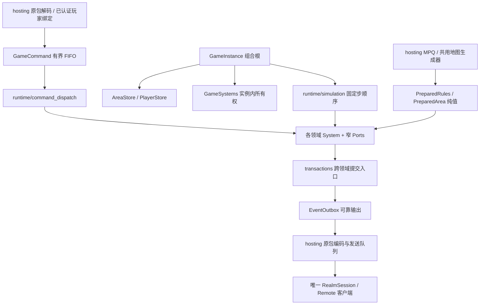

# 自研游戏内核与子系统

更新：2026-10-08。本文维护内核入口、所有权和扩展约定；功能顺序见[总计划](../architecture/MULTIPLAYER.md)，原包入口见[服务端协议](SERVER_PROTOCOL.md)。此前行走及骨架包有有限冒烟，见[基线](../../BASELINE.md#当前运行包与有限冒烟)；本批已完成Windows Release构建、打包及有限冒烟，具体范围与限制见基线。

## 当前范围

玩家入场、行走、库存／装备、人物成长、世界换区、多人投影、普通近战及女巫主动技能切片、掉落／消耗、玩家死亡、普通物件／NPC、邪恶洞穴奖励与旅行基础由权威内核执行。26个领域加玩家／移动形成28项目录；各自具有独立State、read、类型化请求及显式Ports，由GameSystems持有。inventory规划物品，attributes计算总值，progression规划成长，transactions提交人物事务；World管理区域准备／驻留，Travel提交位置／区域过渡，replication派生可见参与者，social只实现同局聊天。其他规则保持NotImplemented；总体未完成，当前范围以本页、[库存](INVENTORY.md)和[人物](CHARACTER.md)为准。

命令目录中的Scaffold在入队前被拒绝，不因有函数入口就宣称Queued。3A／3B成长、13的UNIT_TILE及15同局聊天已执行领域入口；传送点、本人门户、普通物件／NPC与城镇服务已接；NPC旅行、队伍、敌意和交易仍为stub。普通攻击／选技／热键／停止已接skills；人口仅准入已准备的普通近战怪物。世界物品生成与普通掉落已接items／loot，不能据此宣称全部来源规则完成。

## 组合与所有权

GameInstance只组装实例级区域、玩家、ID、随机、命令、系统、调度和输出，并提供参与者准入／进入／移除入口；不实现物品、怪物、技能或任务规则。PlayerStore唯一拥有角色值和每人不可变EquipmentRules／CharacterRules，防止后来加入的职业复用房主经验表或物品ID。MovementSystem保留既有寻路／碰撞执行。GameHost负责句柄代次、暂停、固定步预算和参与者快照。NativeRealmHost共享只读MPQ内容、管理房间／地形并每帧只推进一次；每个NativeRealmService持有自己的协议会话、角色名册版本及存档租约。

GameSystems只供组合／分派／调度使用，不传入领域函数。它的构造函数一次性为各系统注入本领域的Ports；领域入口只接收业务参数，调用另一个系统时不必重新拼装对方的依赖。跨域读取为const，可以提交协作请求的引用明确列出；没有字符串服务定位器、万能可变世界对象或能够调用UI／MPQ／socket的回调。

构造函数只保存依赖引用，不访问或调用尚未构造完的同伴；所有系统就绪后才准入玩家并执行命令。GameInstance／GameSystems禁止复制和移动，依赖的规则、玩家、区域和输出先构造、后析构；系统析构不回调同伴。调度线程串行访问实例。跨阶段工作应提交类型化请求或事实，不能通过互相调用执行函数形成递归结算链。

GameSettings按实例保存地图种子和难度，由建房选中角色提供；后来加入者采用房间配置，不能用自己的存档覆盖它。随机流、EntityIds、命令和可靠事件按实例隔离；玩家ID不因离开而复用。最多256个宿主实例、每局1–8人；暂停私有一人局不影响其他实例，共享房间不随客户端ESC／失焦暂停。

PersistentCharacter在PlayerStore中唯一持有，包含库存、人物记录、任务、尸体和铁魔等持久数据。items只持有不属于角色的世界物品；trade／merchant保存句柄／报价版本，不复制角色背包。spatial是派生查询，attributes只读已提交Totals；均不另建可写的位置／人物基础属性真值。companions拥有归属和控制关系，活动实体归monsters。公开read只读，不能从UI取得可写状态。

## 领域目录

除players、movement外，路径均为src/server/systems/<目录>/system.hpp／system.cpp；inventory另有planning／placement／equipment规则文件。除明确注明的切片外，表内操作为骨架。

| 目录 | 拥有的运行态／职责 | 操作边界 |
| --- | --- | --- |
| players | PlayerStore中的角色持久值、位置、移动状态和命令序号 | 入场组装；持久导出仍由GameHost交宿主存储 |
| movement | 原有路线、走跑及碰撞执行，数据归PlayerStore | execute／step／suspend |
| world | 区域驻留、准备请求、原生出口／边界／物件身份；AreaStore唯一拥有碰撞 | 请求合并／过期结果拒绝／失败记录／可见邻区；不生成地图，Sleeping保留值不卸载 |
| spatial | 派生空间索引；查询玩家、怪物、物件、弹体及世界物品 | query／step；不移动实体 |
| items | 世界物品，沿用ItemInstance／InventoryState | create／resolve；生成不等于提交或放入背包 |
| inventory | 容器访问、摆放／装备／数量规划 | execute已接移动／交换／装备／切组／合堆／入书；新增地面拾取／丢弃、金币丢弃、卷轴／书本鉴定、药水和仓库授权／关闭，库存仍归PlayerStore |
| attributes | 纯派生计算与当前Totals只读查询 | calculate／evaluate；提交前同步求值，无dirty队列；已接支持的临时状态，完整被动仍待恢复 |
| crafting | 方块、镶嵌、注入、打孔、个性化事务意图 | execute；复用既有纯意图类型 |
| loot | 掉落选择与来源结算记录 | plan／step；沿用LootRequest／LootPlan，不写死概率 |
| population | 区域人口、已准入spawn key | admit／step；保留MonsterIdentity及显式实现类型 |
| monsters | 活动非玩家实体、身份、位置和版本 | admit／requestMove／remove／step；与人口生成、AI决策分离 |
| ai | 目标、决策时间与控制器 | step；产生动作，不直接结算伤害 |
| skills | 选技／热键／施放及持续动作 | execute／requestCast／step；AI使用实体来源请求，不伪装成玩家 |
| missiles | 弹体实体和寿命 | spawn／step；碰撞后向combat提交结算请求 |
| effects | 状态效果、来源、持续时间 | apply／step；原状态定义由宿主准备 |
| combat | 命中／减免／伤害结算请求 | enqueue／step；死亡转移归death |
| death | 死亡发生标识、复活／尸体回收 | execute／step；死亡终态及击杀奖励去重；经验委托progression，已接死亡结算、城镇复活与本人尸体回收 |
| companions | 雇佣兵／召唤物／铁魔归属 | summon／execute／step；不复制活动实体 |
| objects | 门、箱、祭坛及任务物件状态 | admit／execute／step；掉落／效果／任务各归其领域 |
| npc | 对话会话和对白确认 | execute／close；商店、雇佣、工艺、旅行各自分派 |
| merchant | 商品句柄、报价版本和买卖／鉴定／维修请求 | execute；成交走事务边界 |
| quests | 游戏级任务状态；个人进度仍归人物记录 | execute／step；资格与奖励不可由客户端授予 |
| progression | 属性／技能分配、经验封顶／升级规划 | execute／award已接；经CharacterEdit提交，step无额外改写 |
| travel | 自然边界／UNIT_TILE的待过渡状态 | walk／execute／step／cancel；校验原邻接、活人、来源代次、碰撞及路线；先可靠事实再改区域／位置。已接传送点和本人回城门；任务锁及NPC旅行未实现 |
| social | 同局聊天请求；队伍、关系、敌意为骨架 | 原15聊天形成ChatFact，提交时捕获收件人；其他操作未实现 |
| trade | 双方报价、同意状态及交换版本 | execute／cancelFor；背包／金币不在此复制 |
| transactions | 跨域计划、版本前置条件、提交身份 | prepare／commit已接单人物InventoryEdit／CharacterEdit原子提交；已接地面转移／尸体／任务奖励；双人交换仍为stub |
| replication | 每个收件人的兴趣与可见玩家集合 | visible／step；按本人区域及准备好的直接自然邻区过滤，普通怪物使用本区RoomLayout邻室及直接邻区距离过滤；完整房间兴趣仍待实现；编码留hosting |

目录在runtime/subsystems.inc维护身份、阶段和范围。players／movement为walking-slice，inventory为inventory-slice，attributes／progression／transactions为character-slice，World／Travel为world，replication／social为multiplayer；范围表示已接切片，不代表该领域全部规则完成。population／monsters／ai／skills／missiles／combat／death为combat-slice。items／loot／merchant为inventory，effects为character，objects／npc／quests为world；spatial／crafting／companions／trade仍为scaffold，命令按具名意图检查。

## 命令与固定步

GameCommand由服务端产生sequence、来源area及areaGeneration，负载为MovementCommand及13种领域Request的variant。实例绑定由GameHost校验，操作者从PlayerStore构造ActorContext，不信任客户端传来的玩家身份。入队校验玩家、区域身份和代次、递增序号、实现范围和256条容量；固定步执行前再次核对来源区域，防止两个不同区域代次相同而误执行旧命令。未实现请求不占FIFO、不更新acceptedSequence。

runtime/command_dispatch为每个负载显式映射SystemId与领域入口，没有默认成功分支。CommandStatus区分Queued、Applied、NotImplemented、Stale、Conflict等结果。PlayerSnapshot.command只保存最近执行结果，movementSequence单独触发原移动回复；最近结果可以被覆盖，不能用作物品／交易的可靠完成通知。

Travel独立于人物事务：自然边界按原room连接和统一坐标确认接触面，沿既有速度逐步走过接缝；瓦片出口按原13/type=5绑定World分配的UNIT_TILE，接近后进入唯一反向出口，保留LvlWarp的ExitWalk偏移。区域、来源generation、移动意图序号在提交前复验，库存／成长命令不会取消路线；新移动／旅行、退役和离开取消旧过渡。完整TravelFact进入Outbox后才提交区域／位置／新路线，失败不半换区。多重反向出口、原任务锁入口及未核实资格明确暂缓。

runtime/simulation固定顺序为：区域／人口 → 属性 → 初次空间索引 → 伙伴／AI → 技能 → 玩家移动／怪物 → 更新空间索引 → 弹体／效果／战斗 → 死亡 → 物件／任务 → 掉落／成长 → 旅行 → 投影。此处是执行位置的骨架，不宣称已核实原版全部结算细节；真实规则接入时须按依赖明确调整顺序。没有用毫秒或渲染delta执行新玩法，所有步沿用25Hz。

只有声明step的领域被调度，inventory／transactions／social在命令边界按需规划／提交。World在准备需求存在时返回Blocked，Travel等待准备或接近路线时返回Blocked，replication更新派生兴趣后Complete；其余stub不产生状态变化。Blocked只描述相应领域，其他阶段／实例继续运行。

FrameFacts是有界的本步临时事实，只允许后续阶段消费；每步开始清空。需要在下一步继续处理的请求必须留在所属系统pending状态，不能靠临时事实延后。可靠通知进入EventOutbox，不能依赖FrameFacts或覆盖式快照。

## 内容、事务与输出

PreparedRules持有不可变纯值；全局ItemCatalog共享同一宿主只读内容，每位PlayerState持有自己的EquipmentRules／CharacterRules／MeleeRules／SkillRules。hosting/game_content与character_content从MPQ准备碰撞、职业、各等级物品属性、经验、学习、基础被动及难度抗性；内核不持有ClassicData／Archives或MPQ回调。普通攻击动画和区域人口由hosting/combat_content准备；hosting/skill_content准备女巫三个案例的技能、SC动画和支配曲线；其余技能施放／状态／宝物类契约仍未准备；空规则明确Unavailable，新增或跨人转移物品须显式准备新身份对应属性，不能套用旧缓存。

区域交接由GameHost.pendingAreas／installArea／failArea提供，结果带GameHandle及PrepareArea身份。World合并同目的请求，最多16项在途；来源须为原生邻接，失败地区明确Unavailable，不重复生成或替换地图。宿主prepareWorldArea调用同一NativeMapGenerator准备原房间／碰撞／出口／边界及objects.txt中立碰撞，按调度线程交纯值。按玩家及直接自然邻区派生Active／Sleeping；当前不驱逐已准备区域，地图随实例释放，导航借用保持有效。客户端按原03／07／08及位置包调用同一生成器，不接收地图对象。

transactions的Plan含TransactionId、库存／人物双RevisionGuard、InventoryEdit／CharacterEdit及候选PersistentCharacter／Totals。inventory和progression只改临时值；事务prepare重算总值、装备失效标志和资源，commit复验身份／区域、双版本及发生标识，先插入完整不可变Outbox批，再以不抛异常的值交换提交库存／人物／总值／revision。经验最后发生标识按玩家仅在成功后更新；事务身份递增，旧计划拒绝，无无界集合。跨人转移／通用Reward／双人交换仍为stub；经验及邪恶洞穴奖励由CharacterEdit提交，地面转移／尸体通过WorldEdit及对应计划提交，不假装通用Reward完成。随机物品由hosting读取MPQ准备，领域仅安装值；实例实体ID单调分配不复用，失败可留下空号，不回退为已存在身份。

实现提交时必须一起处理：目标／所有权／版本再校验、所有参与者资源及空间资格、事件容量预留、随机及ID的提交语义、去重，以及完整成功后的状态／事件发布。失败不得部分扣费、移物、推进随机或记录已领奖；不能先改库存再发现输出队列已满。掉落发生标识、任务奖励资格和交易版本均由服务端产生，不能以客户端重试次数结算。

EventOutbox有256批／4096事实容量及有序累计确认。InventoryFact保留当次稀疏物品值，CharacterFact保留前后人物／Totals，TravelFact保留提交区域／位置，ChatFact保留提交时收件人。NativeRealmHost集中路由：库存／人物／换区仅本人，聊天仅已捕获的同局连接。每位接收者完整编码后一次提交字节队列；失败明确终止该连接、移出投影并保留可恢复存档租约，再确认已送达或明确退役的批，不向其他连接重复发送。Area受众按同实例可见区域及单位过滤；未实现事实明确拒绝。玩家／世界／怪物增量由独立player_replication／world_replication／monster_replication编码；只发别人穿戴外观，不发背包、Cursor、私人箱或人物属性。

## 普通近战切片

hosting/combat_content复用旧单机的planPopulation、怪物战斗／经验导入、AnimData／COF和loadSkillAnimations结果，向AreaDefinition交付人口纯值、RoomLayout及明确的populationDeferred。当前准入Fallen／Zombie／Skeleton／Brute／CorruptRogue／Goatman／CorruptLancer普通阶级且具备原始物理A1、移动和死亡时序的怪物；常规区域对缺规则类型明确暂缓；邪恶洞穴使用用户授权的沉沦魔敌对替身，保留真实怪物／精英身份供任务与掉落，战斗数值采用当前MPQ普通沉沦魔，不宣称原类型或精英行为完成；中立单位不替换。人口按区域代次与spawn key只准入一次，不因离开视野重生。现阶段整个已准备区域一次准入，怪物仅在有同区活跃玩家时移动；完整房间活动、动态拥挤和跨区AI尚未接入。

monsters唯一持有怪物生命、路线、动作间隔、真实身份和死亡发生标识。ai使用各家族原参数中的接近／攻击概率，提交移动或skills请求，不扣血；三个新家族的具体迁移见下节。其他家族游走、惊恐、呼喊、Brute特殊行为等完整AI仍待迁移。skills持有每个角色至多一个待接近请求和当前动作；点选普通攻击会接近，原地攻击不会自动移动，移动／换区／断线取消未命中的动作并保留攻击间隔。停止请求清待接近路线，装备变更在动作间隔内拒绝。攻击目标及命中帧再次校验活人、同实例／同区域、城镇、距离及碰撞射线。

combat保留至多4096个待命中动作，每个来源至多一个，使用旧单机拆出的accuracy、attack_timing、damage_resolution纯计算；普通物理伤害沿原基础伤害、目标种类加成和致命攻击顺序。伤害以1/256计量，按来源等级／命中／目标防御计算，玩家跑动命中与格挡规则沿旧计算。输出容量不足时不推进伤害随机流。怪物扣血先发布HitFact；玩家扣血由transactions.damage将私有LifeFact与公开HitFact成组发布后更新生命及人物revision，不复制整份库存重算装备。

death协调怪物死亡后的经验奖励，首次处理捕获人物身份及奖励金额，成功提交或经验封顶后才标记已结算；背压重试不重复领奖。原经验表及人物经验加成来自准备数据，当前奖励仅归同区活着的击杀者，未实现队伍分配或多人难度缩放。玩家死亡停止移动／攻击；death已接装备／Cursor转尸体、金币／经验惩罚、原41复活及本人拾回，规则见死亡小节。怪物死亡另向loot提交真实来源，并向quests提交人口击杀；尚无完整精英／任务掉落及其他任务执行。

当前可执行的是skill 0普通单武器物理近战。本节之外的其他武器技能、远程／投掷、双持，以及带元素／毒、吸血／吸魔、压碎／撕裂或击杀回资源的攻击显式NotImplemented，不忽略这些属性后结算。完整受击恢复、格挡动作、耐久消耗、临时效果及额外被动待后续切片。选技验证原表被动／左右手资格并保存；不支持的选中技能不能回落到普通攻击。

hosting/native_combat_wire只负责原AC指派、67移动、69死亡模式、6C怪物攻击、6D停位、4C／4D玩家动作和0C受击，生命私有增量走原1F。收件人先建立单位基线，再接收可靠动作／受击事实；不广播私人属性或引用未指派目标。晚加入者获得当前位置／生命／死亡状态；加入时已进行的攻击暂不重播，下一次动作正常同步。普通近战没有修改客户端原有解码、游戏内输入、世界及场景表现；整个未提交范围的客户端差异和逐项确认边界见[客户端契约](CLIENT.md#本批客户端边界)。

## Act 1普通怪物案例

三个新增家族直接参照master的`corrupt_rogue_ai.cpp`、`goatman_ai.cpp`、`corrupt_lancer_ai.cpp`及`monster_ai.cpp`／`monster_wander.cpp`迁移；本轮没有重新从reference研究这些行为。原`MonStats`难度参数、物理A1／命中／防御／生命／抗性与经验继续由既有content导入。`combat_content`仅准入普通、非首领、非远程、无未实现元素攻击且原A1／死亡时序齐备的怪物；需要跑步的两个家族另要求原RN时序。真实身份保留，不用沉沦魔行为冒充。

| 家族 | 当前决策 |
| --- | --- |
| CorruptRogue，近战堕落罗格 | 按难度距离阈值和原aip选择停顿、步行或跑动；跑动使用75＋原速度加成，到达阈值后再决策；接触后按原概率攻击 |
| Goatman，羊头人 | 接近概率、攻击概率和失败后的原帧数停顿；已接受接近持续执行 |
| CorruptLancer，持枪堕落罗格 | 远距必跑并保留charged标记；近距按原接近／走跑概率；带标记的下一次接触攻击不再重掷攻击概率，成功提交才消耗标记 |

`gameplay/monsters/melee_decision`接收已准备参数、距离／接触、难度、局部标记及随机状态，返回动作与下一状态；不持有Enemy、GameSession或世界查询。`server/ai/melee_families`管理等待、目标和持续接近，提交monsters／skills请求；攻击因输出容量不足失败时不提交决策随机或冲锋标记。接近期间沿旧0.7秒重新寻路间隔，不逐帧重掷走跑；目标切换、死亡、离开区域会清理当前追击状态，死亡控制器移除。

monsters拥有路线及其目标／到达距离／速度／走跑标记。移动速度沿旧单机`session.cpp::monsterMoveSpeed_`：`(Velocity * 256 * percentage / 100) * 25 / 4096`，固定点先截断；普通基础百分比75，跑动加成来自家族决策。原67回包携带真实百分比，走路action=1、跑动action=23，客户端原消费者无需改动。此修正也覆盖此前四种怪物，避免服务端以裸Velocity推进却让客户端按固定100%播放。

当前仍仅普通物理近战、已有命中／伤害和经验闭环；没有怪物远程、元素／毒、特殊技能、受击恢复、精英／首领、房间活动完整调度、动态拥挤或跨区追击。Act 1旧实现的其他行为继续按族恢复，不能把本节视为全部Act 1怪物完成。公共提取方式和原版分层证据集中见[参考设计](../architecture/REFERENCE_DESIGN.md#6-d2moo的公共层究竟共用什么)。本轮没有客户端源码改动；当前切片已入运行包，有限冒烟范围见基线。

## 女巫主动技能案例

当前支持火弹（Fire Bolt）、火球（Fire Ball）、传送（Teleport）。技能身份从当前MPQ导入，不把Skills编号或伤害／耗蓝写死；角色技能加成和Fire Mastery用有效等级，协同只用保存中的基础等级。`hosting/skill_content`为每名角色准备不可变SkillRules；既有`gameplay/skills/resolve`继续计算，普通SC时序提取到`cast_timing`，读取原动画和FCR。

- `skills/casting`管理开始、动作帧释放、间隔和延迟。施放时验证角色／区域代次、选择、等级、目标、城镇许可与法力；动作帧复验存活、目标与法力。移动、旅行、离开和死亡取消未释放动作，已经释放的弹体不随下一次移动撤销。输出容量不足保留释放意图，既不扣蓝也不消耗ID／随机数。
- `missiles`拥有直线弹体、25Hz寿命／速度、原碰撞尺寸／掩码及墙面裁剪；Fire Bolt命中一个怪物，Fire Ball在碰撞点按旧单机整子格半径捕获目标，直接目标不会再额外伤害一次。随机伤害在释放成功时确定；范围目标在碰撞时固定，重试不重掷、不重新扩大目标集。
- `combat/spell_damage`按当前难度怪物火抗减伤，逐目标保留提交游标；生命／死亡仍由monsters提交，击杀经验复用death／progression。没有技能中的独立生命、经验或掉落执行器。
- `travel::teleport`使用同区域的传送资格和玩家碰撞判定；`transactions/resources`同时提交位置与扣蓝事实，再变更PlayerStore。弹体创建也经此扣蓝边界，失败不留下半次施法。传送不借用换区加载，也不穿越区域代次。

三个已实现案例的规则来源是master的`session_skills`、`skills/casting`／`release`／`projectile_launch`／`utility_effects`以及`combat`／`missile_effects`；未为这三个案例重新研究reference或恢复旧GameSession；另为后续公共计算边界查阅了D2MOO冰封球回调，见总计划。新执行器只使用准备后的纯值。

客户端保持原有一套代码。获用户单独授权后，client_missile_view把确定性的环形散射／爆发、整数转向和墙面裁剪改为公共纯函数调用；传参、帧相位与处理顺序保留。墙面裁剪已同时由当前服务端直线弹体调用，环形函数为后续冰封球恢复提供入口。hosting把实际技能ID／等级写入4C／4D，扣蓝用本人1F，传送用公开15，命中／死亡使用既有0C／69。普通火弹／火球的客户端视觉已由施法动作派生，服务端不再额外发送会重复造弹体的73。晚入局仍只恢复单位基线，不重播正在飞行的弹体或已开始的施法。

范围只包含女巫的上述技能与已准入怪物；没有PvP、跨区弹体、充能／触发、伤害状态、同行者传送及完整受击打断。施法者死亡后已释放弹体可继续存在，但离开连接／区域则清理。带击杀回生命／法力的攻击技能暂拒绝，不能忽略尚未实现的属性；其他技能仍NotImplemented。运行态施法／弹体／影响目标集不写存档。当前切片已入运行包，有限冒烟范围见基线。

## 扩展与诊断

新增玩法按“准备原表纯值 → 领域状态／请求／规则 → 事务与失败边界 → 原S2C投影 → 开放命令”接入。先完整实现依赖与输出，再更改Scaffold状态；不能只修改目录让半个事务进入执行队列。玩家离开、换区、死亡时涉及的对话／交易／同行者清理，应由相应领域入口组合，不恢复一个全能GameSession。

named pipe的server-systems只读返回28项目录、phase、scope和lastStep。lastStep=null表示尚未执行或该系统没有固定步入口，不表示完成；未接领域正常显示not-implemented，已接切片以scope为准。server-status.command表示最近实际命令结果，替代原来仅描述移动的字段；server-protocol仍负责原包覆盖与计数。这些诊断只在宿主管理端，不参与客户端世界同步。

PersistentCharacter与D2S v96格式保持既有模型，库存位置／Cursor／固定武器组通过既有编码保存；宿主规则语义升至admission-v16，具体见[存档](SAVES.md)。事务身份／revision／Outbox运行态不写D2S；以后扩展尸体／铁魔／佣兵／任务时仍须复用持久模型并显式定义恢复边界，不能静默迁移或把空运行态覆盖回完整存档。

## 管理诊断与收尾边界

`runtime/diagnostics`定义纯值快照；`server/diagnostics`在固定步边界只读汇总玩家、容器、近邻怪物、AI、施法、弹体、伤害与旅行状态。路径查询使用当前权威碰撞，不移动角色。`app/debug/server_snapshot`负责JSON，内核不引用调试管道、Win32或JSON。

EventOutbox保存1024条已成功发布事实的紧凑环形历史；GameInstance保存512条命令接收／执行记录，诊断序号与原命令序号分开。读取不消费Outbox，不改变确认、容量、随机流或规则。结果有first／last／gap及截断数量，不能将有界历史当作完整审计日志。GameHost的调试暂停覆盖普通菜单／失焦策略，逐帧推进仍只通过原固定步；恢复自动策略会同步清理应暂停的活动意图。资源恢复走transactions，怪物生成走内容准备／population，不直接改客户端状态。调用方式见[调试管道](../development/DEBUG_PIPE.md)。

原02／04中的type 5出口靠近交给MovementSystem，执行时复验当前区域、GUID及50格范围，路线终点为原出口的可行走到达点；靠近后既有客户端再提交13，Travel才换区。其他type的单位靠近仍明确NotImplemented。

宿主地图准备同时建立原房间范围索引及MPQ Populate标志，供人口与复制兴趣使用。原574–582物件预设回调标记不是Objects.txt实体；现由 hosting/object_content 准备真实物件，具体范围见世界物件基础。缺资源／规则计入 AreaMetadata.objectDeferred，不发送伪造物件。

## 地面物品与普通怪物掉落

`loot`在死亡奖励结算时捕获原怪物身份、受益角色、MF/GF和独立种子；零经验死亡也会提交掉落准备。宿主内容适配复用旧单机`resolveMonsterLoot`／`planItemLoot`与原物品生成步骤，读取当前MPQ，不在内核持有Archive或回调。准备队列有界，同一来源只接受一次，失败不重新取种子；成功结果进入`items`统一持有的地面库存。地面不写角色D2S，拾取后的物品沿既有D2S v96编码保存。

`inventory/ground`规划角色库存、金币和地面余量；`transactions`同时校验角色及世界revision，发布不可变事实后一次交换全部草稿。拾取校验同区、1.8格距离、原0x0801视线及空Cursor，支持Cursor、自动腰带、背包和既有合堆规则；空间不足保留地面剩余量。任务物品暂缓，不绕过任务携带资格。物品属性的各级准备值随所有权转移，新装备可沿现有属性汇总及装备资格检查工作。

宿主以原9C地面位流和0A清除同步可见集合，晚入局和换区重建基线；个人入包沿既有9C／9D。客户端未新增自研分支。`item-spawn`采用相同准备和地面安装入口。独立服务端多实例、原NoDrop人数修正、任务专属掉落及精英／首领结算不在当前普通怪物范围内。本轮按用户最新要求不运行冒烟；构建结果不能替代运行验证。

## 资源、药水与效果

迁回master的`gameplay/units/resources`／`restoration`、`CombatEffectSet`和药水职业倍率纯函数。`effects`按25Hz持有每个玩家的生命／法力恢复队列及持续状态；资源上限、被动回蓝、装备生命恢复和耐力规则继续使用人物总值。跑动耗尽耐力后采用步行速度，命中／防御判断同步使用实际走跑状态。

背包原20、腰带原26使用请求验证所有权与revision。`inventory/consumption`准备数量变化、腰带同列下移和效果计划；人物／物品事务成功后才交换预先分配的效果状态。生命／法力药水沿旧单机顺序队列恢复，到满值清空余量；回复药水即时按上限百分比恢复，耐力／解毒／解冻药水按MPQ状态、持续时间、清除状态和属性执行。同状态药水延长剩余时间；死亡及到期移除复用原纯状态集合。效果不写D2S，属性变化及资源上限限制仍由transactions提交。

宿主原1F同步资源／派生属性，原A7／A9同步本人及可见玩家状态，晚入视野重建；内核不持有客户端状态。通用效果入口对尚未接执行器的反击、物理护盾和诅咒AI明确拒绝，不能仅显示状态却遗漏效果；反应计算及完整持续伤害仍待后续切片。调试快照增加effects、restoration、loot待处理数／暂缓原因。当前包已有限运行生命药水恢复与神殿状态到期；其他恢复／药水边界仍待运行，证据见基线。

## 死亡与尸体

服务端 death 分为死亡结算、复活和拾回规划；transactions 原子提交人物、库存、尸体元数据及地面物品。沿用 master 的装备／Cursor 转尸体、腰带收缩、金币惩罚和掉落、难度经验损失及同局 75% 经验返还规则。生命归零后等待当前 MPQ 死亡动画，原 41 请求回本幕城镇并恢复资源；原 13 拾回只授权本人尸体，装备依需求反复尝试，余物进入腰带／背包，容量不足保留尸体。对象身份不复用。

原 59／8E／0D 与 9D 公开尸体和外观，客户端未修改。普通库存命令不能访问尸体容器。D2S v96 沿用旧单机及本地 D2MOO PlrSave2 的第一具非空尸体写档规则：局内最多 16 具，不覆盖旧尸体；存档投影只保留最早的非空尸体，清除仅同局有效的可返还经验，重入移至城镇。规则指纹 admission-v16。多尸体保存并非完整多尸体快照，PvP／硬核死亡尚未扩展。

## 世界物件基础

hosting/object_content 沿用旧单机 configureWorldObject、Act 1 人口生成、箱子初始化和神殿选择；运行时 objects 只持准备好的规则和状态。门切换时同步服务端碰撞，关门复验玩家／怪物占位；原生交互距离和靠近路径复用 interaction_geometry。普通箱子、木桶、可搜寻尸体走 loot 的内容准备队列，钥匙消耗与地面物品安装由同一库存事务提交；准备失败保留物件。神殿支持资源恢复和常见定时属性效果，水井支持资源恢复与补充次数；原 51 增量发送状态及 InteractType，进入视野重新投影，客户端未改。

574–579 神殿、580–581 箱子及 582 秘法符号恢复为真实原物件。旧单机缺少的分幕及神殿回调参考本地 D2MOO Objects.cpp，实际属性和图形仍读取当前 MPQ。普通人口生成仍以已有 Act 1 范围为限。陷阱箱、爆炸桶、特殊神殿、任务物件及复杂门行为未声明完成，明确拒绝而不发放忽略条件的奖励。世界物件、掉落和商店均不进入角色 D2S。

## NPC 与城镇服务

`hosting/npc_content` 从原生地图预置与 MonStats 准备中立 NPC，保留原身份；不生成敌对替身。NPC 子系统管理同区域、活人、城镇与距离资格、首次介绍确认；介绍键沿现有 D2S 字段保存。对白编号从当前 TBL 反查，缺少对应文本则不编造。NPC 暂时静止，任务对白仅接邪恶洞穴 Akara；旧单机闲逛 AI 与佣兵服务未迁移。

`content/npc/vendor_stock` 迁用 master 的 `planVendorStock` 和 `vendorItem`。内容工作位于宿主，商店库存由 merchant 持有，个人库存仍只有 PlayerStore 一份。请求先进入有界准备队列；宿主捕获当前库存／人物 revision、任务折扣与降价属性后准备报价，领域提交前再次复验。客户端报价不作为扣款依据。买入、售出、普通耐久／投掷堆叠修理、Cain 鉴定与金币变动经 transactions 原子提交，再发送原 9C／9D、属性包及 2A 回执；有限库存移除对所有看店者同步，永久货物保留。库存按实例内 NPC 首次打开等级生成，尚无离城刷新和回购；赌博、Shift 批量购买、充能技能补充明确暂缓。

NPC 对话使用原 AC／27／2F／31；商店回执布局及成功码核对本地 D2MOO `SCmd.cpp`、`SUnitNpc.cpp`，买入 result=0、卖出=1、修理=2。客户端代码不变。

个人仓库授权归 inventory，打开真实 stash 物件后才允许原 page=4 的存取、交换、合堆与金币存取；关闭、死亡、离开区域或交互距离撤销授权。所有容量来自既有容器／MPQ，金币上限复用原 `stashGoldLimit`。未授权页面不能绕过领域校验。方块、玩家交易保持原有未实现边界。

## 邪恶洞穴与旅行基础

quests 持有实例清场统计与个人观察进度，CharacterRecord 持有按难度的个人阶段及奖励位。沿 master 的 denAdvanceOnTalk／Entry／Clear／ClaimReward 纯函数：进入洞穴推进个人阶段，人口系统全部准入且剩余为零才记录清场，清场时在洞穴内的角色获得领取资格。调试生成怪物不计数；未准入及碰撞失败人口仍算剩余，不能跳过后发奖。Akara 原64／65／71／76对白依阶段发送，领取奖励位与一个余技能点通过同一人物事务提交，迟到／重复确认拒绝。原28发送个人任务位，5D发送原任务状态和剩余数；状态号与本地 D2MOO A1Q1 的 StatusCycler 对照。任务完成位、奖励及技能点沿既有D2S编码，不新增格式。

travel 另持传送点授权与回城门对，不把旅行规则放回 GameInstance。传送点只能由真实 operation=23 物件在原交互距离解锁，原49必须匹配当前授权GUID与已解锁目的地；准备目的地后复验区域代次、碰撞及人物意图，再发送TravelFact。人物事务更新当前难度传送点，原63发送历史；换区、死亡与离线清理授权。

回城物品代码和技能号从当前 MPQ 解析，原20使用物品或原右键物品技能都走同一创建入口。卷轴数量／书本charges和门对替换原子提交；城镇落点取原地图标记，图形、范围和开启时间读Objects原59，缺落点或资源拒绝且不消耗。每人一对门，原51／60／82投影，两个GUID的客户端生命周期一并管理；原22更新物品技能数量。本人野外进城保留门，城镇返回野外移除，离线移除；门不进存档。当前没有队伍资格权威，因此只允许主人使用，不猜测共享权限。

此项未覆盖其他第一幕任务、组队奖励传播、任务提醒图标、Akara重置与亚瑞特山顶任务联动；后者回城明确拒绝。邪恶洞穴替身不是完整Act 1怪物实现。当前包已有限验证洞穴击杀统计、奖励保存和本人回城门往返；野外传送点解锁／旅行等仍待运行，证据见基线。

## 六项收敛补充

单件鉴定由 inventory 接收原 0x27，内容准备按 MPQ 的鉴定卷轴／Books 配对提供消耗规则。目标识别属性与卷轴数量／书本次数在同一库存事务提交，随后重算属性并沿原物品包更新。重复鉴定、无次数、非本人可访问目标及非空 Cursor 拒绝。

原 0x50 丢金币同时规划钱包扣款与地面金堆；金堆类型和最大堆数从 ItemCatalog 准备，碰撞／地面容量失败不扣款。原 0x51 绑定已有 F1–F8 热键，复验技能／左右手资格，写人物记录并发送原 0x7B；入场及 D2S 恢复沿同一编码。绑定不取消当前施法，未实现的技能执行仍显式拒绝。

普通商店出售覆盖背包、装备及 Cursor 原件，修订号封顶拒绝；凯恩鉴定同步原 identified 标志。merchant固定步清理已关闭／死亡／换区／离线交谈的货架与待准备状态，切换NPC时发送旧货架移除；尸体公开装备缓存清理跳过已恢复到本人或可见人物装备的GUID。掉落安装预先分配唯一物品记账与物件完成状态，提交权威后仅交换已准备值，避免已扣钥匙／落地后才分配记账。

宿主 monster-damage／monster-kill 复用 monsters.damage，并在正常固定步贯通 death／progression／loot／quests；限定存活参与者当前区域，原服不可使用。不绕过人口统计，不直接设置任务完成。

移动规划与玩家／怪物路线推进共用Grid.nativeMovementSegment的原生碰撞语义，避免路线可达却被另一套分段检查卡住；弹体及视线仍使用各自语义。门户准备显式使用objects类别，读取MPQ原59范围／模式／帧数；原13在hosting按已发布门户GUID提交TravelRequest，普通物件领域不以“找不到物件”猜测门户。

公共item_properties与D2S额外属性校验补Properties函数13：按当前MPQ stat字段投影百分比最大耐久；本地D2MOO ItemMods::ITEMMODS_PropertyFunc13为依据。原网络已保存属性的客户端消费未改。实际包／运行证据及限制统一见[基线](../../BASELINE.md#当前运行包与有限冒烟)，本轮不是完整六项原版规则验收。
